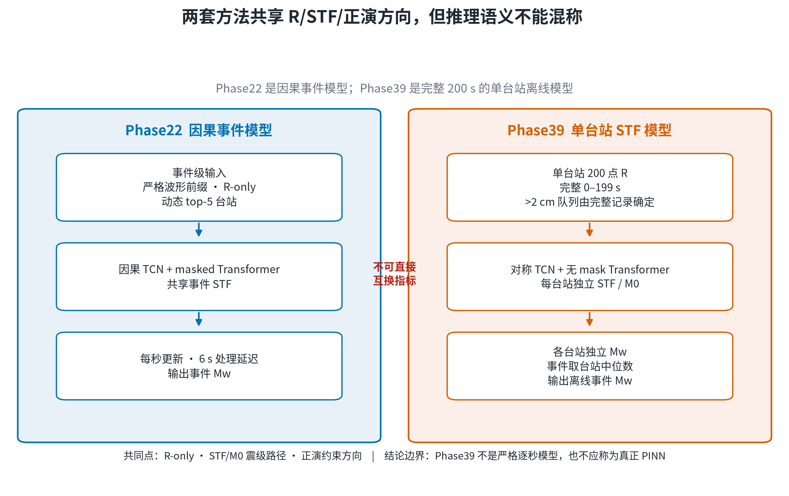
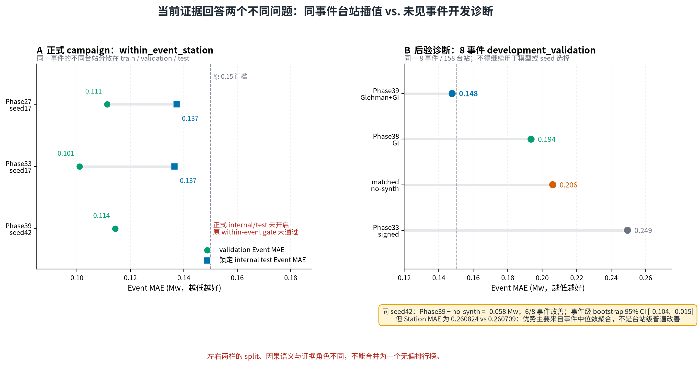
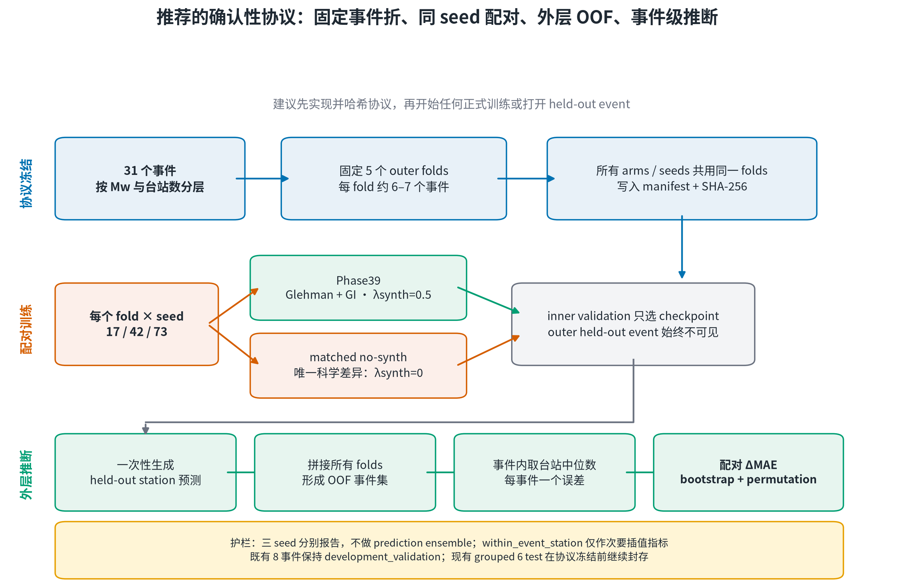

# PINN_Mag 当前证据与确认性事件级评估计划

> 状态：2026-07-28 中文预览报告。本文档只整理既有证据并提出下一步协议；没有启动新训练、没有打开现有 grouped 6 个 test 事件，也没有把反复使用的外部 8 事件重新用于模型选择。

## 执行摘要

当前最稳妥的结论不是“Phase39 已经获胜”，而是：

- **Phase33** 仍是 `within_event_station` 指标下证据最完整的锁定模型，内部 Event MAE 为 **0.136534**。该划分衡量同一事件内的未见台站插值，不能证明对新地震事件的泛化。
- **Phase39** 的正式 validation 在 seed42 为 **0.114334**，但没有通过原三重 gate，因此正式 internal/external stage 没有开启。
- 单独的后验八事件开发评估中，Phase39 Event MAE 为 **0.147737**，优于同 seed42 的 matched no-synth **0.206115**。这使 Phase39 成为当前最值得确认的候选，但八事件已经反复使用，只能标为 `development_validation`。
- 下一步应先冻结 **事件级配对 grouped CV**，不再直接调网络。

| 当前角色 | 模型 | Event MAE | 能回答的问题 |
|---|---|---:|---|
| 锁定同事件 incumbent | Phase33 seed17 | 0.136534 | 同事件未见台站插值 |
| 未见事件开发候选 | Phase39 seed42 | 0.147737 | 八事件后验开发诊断 |
| 下一步对照 | Phase39 vs matched no-synth | Δ=-0.058378 | 正演约束是否改善事件级泛化 |
| 最终论文模型 | 尚未确定 | — | 需要冻结事件级协议和新外部确认 |

## 1. 两套方法必须分开叙述

[PDF 版本](figures/01_method_family_boundary.pdf)

Phase22 与 Phase39 都使用 R、STF/M0 震级路径和正演约束方向，但它们不是同一推理系统。

| 维度 | Phase22 | Phase39 |
|---|---|---|
| 推理单位 | 事件 | 单台站，事件后聚合 |
| 输入语义 | 严格波形前缀 | 完整 0–199 s |
| 台站策略 | 动态 top-5 | 完整记录 >2 cm 后验入选 |
| 时序网络 | causal TCN + masked Transformer | 对称 TCN + 无 mask Transformer |
| STF | 事件共享 | 每台站独立 |
| 结果 | 逐秒事件 Mw，6 s 处理延迟 | 200 s 离线台站 Mw 中位数 |
| 准确称呼 | 因果事件模型 | 正演约束 R-only 多任务神经网络 |

因此，Phase39 的 `0.147737` 不能写成 Phase22 风格的严格逐秒动态 top-5 结果，也不应把该网络称为真正 PINN。

## 2. 当前证据分层

[PDF 版本](figures/02_evidence_landscape.pdf)

左栏与右栏回答不同问题：

- 正式 campaign 的 `within_event_station` validation/test 把同一事件的不同台站分到不同集合，主要测量事件内台站插值。
- Fable 八事件结果来自同一 `cm0`、8 事件、158 台站的后验开发评估。它揭示旧 gate 可能与未见事件目标错位，但不能追认最终模型。

八事件同 seed42 配对结果为：

| 指标 | Phase39 Glehman+GI | matched no-synth | 差异 |
|---|---:|---:|---:|
| Event MAE | 0.147737 | 0.206115 | -0.058378 |
| Station MAE | 0.260824 | 0.260709 | +0.000115 |
| 改善事件数 | 6/8 | — | — |
| Fable 审计 bootstrap 10k 95% CI | [-0.103548, -0.015489] | — | — |
| 穷举 bootstrap 分布复核 | [-0.103548, -0.014948] | — | — |
| exact sign-flip p | 0.046875 | — | — |

Phase39 的优势主要出现在“台站预测取事件中位数”之后；Station MAE 略差于 no-synth。论文若保留该结果，必须写成**事件聚合层面的开发证据**，不能写成所有台站都更准。

支持性 grouped-event 探索实验在外部八事件均值上 3/3 seeds 改善，平均 Δ 为 -0.035653，但其预注册 grouped validation 只有 2/3 改善且平均变差，外部置信区间也跨零。它支持继续确认，不构成最终证明。

## 3. Phase23–39 的最小修改轨迹

| Phase | 唯一主要变量 | 结论 |
|---:|---|---|
| 23 | 恢复初稿模型并改为总矩/形状分解 STF 头 | 内部失败 |
| 24–25 | monotonic cosine；asinh 双动态范围 stem | validation 失败 |
| 26–27 | 事件均衡采样；全数据事件逆频率加权 | Phase27 内部 Event MAE 0.137287 |
| 28–31 | mag loss、事件权重指数、moment skip、dropout | 均未通过 validation gate |
| 32 | 四损失相对权重搜索 | W10 内部 0.175297，方向搁置 |
| 33 | 删除 `L_shape` | 锁定同事件 incumbent，内部 0.136534 |
| 34 | 删除 MSE/synth/mag 的消融 | synth 在旧 validation 上不稳定 |
| 38 | `global_invariant` 整条波形极性不变性 | 原 gate 失败 |
| 39 | `horizontal_projected → glehman_scalar` | 原 gate 失败；后验开发证据最佳 |

这条轨迹说明：旧 gate 能筛选同事件台站插值，却不能可靠回答“新事件上正演损失是否有用”。

## 4. 推荐的确认性协议

[PDF 版本](figures/03_confirmatory_protocol.pdf)

推荐先冻结一个 5 折事件级协议，再执行正式训练：

1. **固定 outer folds**：31 个事件按目录震级和可用台站数分层，形成 5 个约 6–7 事件的外层 fold。fold 与分层统计写入 manifest 并哈希；所有 arms、seeds 共用同一划分。
2. **严格 matched arms**：Phase39 为 Glehman scalar + global invariant + `lambda_synth=0.5`；no-synth 除 `lambda_synth=0` 外完全一致。
3. **相同 seed 配对**：只使用 17/42/73。每个 seed 分别生成 OOF 结果，不做 prediction ensemble；seed 不再同时改变事件划分。
4. **内层只选 checkpoint**：inner validation 只使用 outer-train 事件，不能接触当前 fold 的 held-out event。
5. **一次性 outer inference**：每个事件只在其 held-out fold 中产生一次 OOF 预测；先保存台站预测，再按事件取台站 Mw 中位数。
6. **事件级配对推断**：主估计量为 `Δ = MAE_Phase39 − MAE_no-synth`；报告每个 seed 的 Δ、事件级 bootstrap CI、paired permutation/sign-flip，并做 leave-one-event-out influence。
7. **最终单模型**：确认模型族后，再用冻结 validation 在 17/42/73 中选一个 seed；不平均、不 ensemble，最后才进入新的外部事件或预注册的 untouched test。

当前 grouped 实验中未打开的 6 个 test 事件必须继续封存，直到协议、实现测试、arm diff、fold manifest 和统计脚本全部冻结并留 SHA。

## 5. 建议的判定语言

| 结果 | 建议表述 |
|---|---|
| Δ<0 且 95% CI 上界<0，seed 方向稳定 | 正演约束在预注册事件级评估中得到确认 |
| Δ<0 但 CI 跨 0 | 方向支持，但证据不足，不能宣布确认 |
| Δ≥0 | 当前 matched 配方不支持未见事件增益 |
| within-event 改善、outer 不改善 | 仅支持同事件台站插值 |
| outer 改善、Station MAE 不改善 | 明确写成事件聚合层面的增益 |

不论结果如何，八事件 `development_validation` 都不能升级为最终盲测。

## 6. 当前可以与不可以支持的主张

**目前可以支持：**

- Phase33 是同事件台站插值指标下证据最完整的锁定模型。
- Phase39 是当前未见事件开发证据下最值得确认的候选。
- 旧 `within_event_station` gate 对未见事件目标存在明显错位风险。
- Phase39 相对同 seed no-synth 的八事件优势主要发生在事件中位数层面。

**目前不能支持：**

- Phase39 已被无偏确认为论文最终模型。
- 正演损失已在新外部数据上得到最终证明。
- Phase39 是严格实时、严格逐秒或端到端因果模型。
- Phase39 是真正 PINN。
- 八事件结果可以继续用于网络、阈值或 seed 选择。

## 7. 数据与复现

- [证据指标表](evidence_metrics.csv)
- [事件级配对统计](paired_effects.csv)
- [建议协议机器可读草案](proposed_protocol.json)
- [发布清单与 SHA-256](publication_manifest.json)
- [可复现生成器](../../../scripts/plotting/plot_phase39_evidence_confirmatory_report_zh.py)
- [Phase22 已发布结果](../../results/phase22-causal-forward-guided-station-subset/README.md)
- [Phase27 中文完整图集](../../results/phase27-manuscript-stf-event-loss-weighted-zh/README.md)

- 报告 commit：`7fbb7a7bbe3d747cc031449eb0df54a85840541b`
- 数据快照 SHA-256：`2e1fa4c12fc1eb03ffc8bf9235491f0886d4b0d360ebcb3486baca4d948cfd6a`
- 报告角色：`development_evidence_and_protocol_draft`
