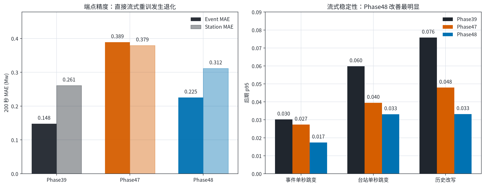
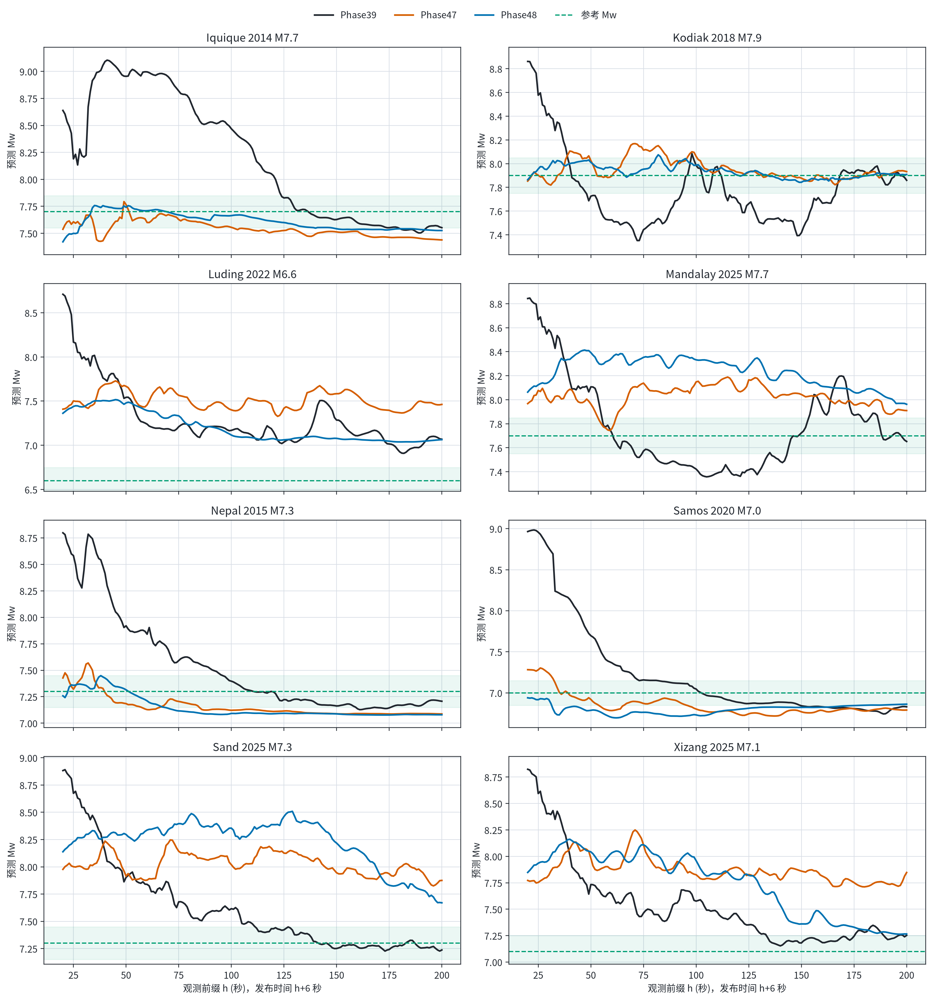
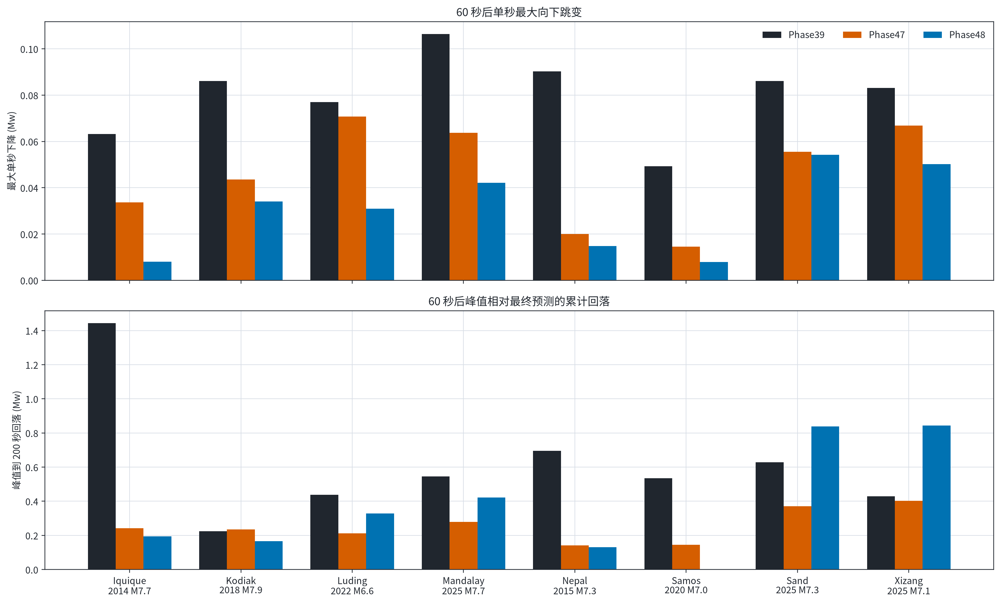

# Phase39、Phase47、Phase48 八事件流式回放

> 评估对象在读取八事件前已固定。八事件没有进入训练，但已被多轮开发反复使用，因此本文是 `development_validation_posthoc`，不是新的无偏盲测。

## 结论

- **Phase48 的流式稳定性确实明显改善**：后期事件单秒跳变 p95 从 Phase39 的 0.030194 降到 0.017425 Mw（-42.3%）；历史改写 p95 从 0.075795 降到 0.033224（-56.2%）。
- **但八事件端点精度退化**：Event MAE 为 Phase39 0.147737、Phase47 0.388822、Phase48 0.225277 Mw。Phase48 比 Phase39 增加 +0.077540 Mw，只改善 3/8 个事件。
- **Phase47 不适合作为替代模型**：它虽然比 Phase39 略稳，但 Event MAE 增至 0.388822 Mw，只改善 1/8 个事件。
- 当前证据支持的判断是：直接流式重训学会了“少跳动”，尤其 Phase48；但同时损失了未见事件的震级校准。现阶段应保留 Phase39 作为八事件端点基线，不能用 Phase47/48 替换它。

## 1. 精度与稳定性权衡

[PDF 图件](figures/01_accuracy_stability_tradeoff.pdf)

| 指标 | Phase39 | Phase47 | Phase48 |
|---|---:|---:|---:|
| 200 s Event MAE | 0.147737 | 0.388822 | 0.225277 |
| 200 s Station MAE | 0.260824 | 0.379396 | 0.311512 |
| 后期 Event step p95 | 0.030194 | 0.027365 | 0.017425 |
| 后期 Station step p95 | 0.059837 | 0.039514 | 0.033134 |
| 后期历史改写 p95 | 0.075795 | 0.047952 | 0.033224 |
| 持续进入 ±0.15 Mw 的事件数 | 5/8 | 1/8 | 2/8 |

## 2. 八事件逐秒轨迹

[PDF 图件](figures/02_event_trajectories.pdf)

每个时刻都用真实可获得的原始 E/N 数据旋转成 R，并以 `B x 1 x h` 的变长前缀重新预测一条完整非负 STF；观测前缀为 20–200 秒，发布时间为 `h+6 s`。三种模型均使用同一 158 台站 cohort。

| 事件 | 参考 Mw | Phase39 200 s（误差） | Phase47 200 s（误差） | Phase48 200 s（误差） | Phase48 持续收敛 |
|---|---:|---:|---:|---:|---:|
| Iquique 2014 M7.7 | 7.7 | 7.552 (0.148) | 7.439 (0.261) | 7.526 (0.174) | >200 s |
| Kodiak 2018 M7.9 | 7.9 | 7.860 (0.040) | 7.933 (0.033) | 7.908 (0.008) | 84 s |
| Luding 2022 M6.6 | 6.6 | 7.068 (0.468) | 7.463 (0.863) | 7.064 (0.464) | >200 s |
| Mandalay 2025 M7.7 | 7.7 | 7.652 (0.048) | 7.910 (0.210) | 7.962 (0.262) | >200 s |
| Nepal 2015 M7.3 | 7.3 | 7.207 (0.093) | 7.087 (0.213) | 7.079 (0.221) | >200 s |
| Samos 2020 M7.0 | 7.0 | 6.830 (0.170) | 6.791 (0.209) | 6.862 (0.138) | 182 s |
| Sand 2025 M7.3 | 7.3 | 7.238 (0.062) | 7.875 (0.575) | 7.670 (0.370) | >200 s |
| Xizang 2025 M7.1 | 7.1 | 7.253 (0.153) | 7.847 (0.747) | 7.266 (0.166) | >200 s |

Phase48 主要改善 Kodiak、Samos，以及 Luding 的很小一部分误差；但 Sand、Mandalay、Nepal 明显变差。Phase47 对 Luding、Sand、Xizang 出现明显高估。

## 3. 为什么仍会先升后降

[PDF 图件](figures/03_revision_diagnostics.pdf)

非负 STF 只保证**同一次前向预测内部**的矩率不为负，并不保证相邻时刻的两条完整 STF 互相包含。每增加一秒，模型仍会重算全部 STF 形状和总矩，因此总矩和 Mw 可以向上或向下修正。Phase47/48 的时间一致性损失把单秒跳变压小了，但没有施加严格单调约束，也没有完全消除较慢的累计回落。

| 事件 | P39 最大单秒下降 | P47 | P48 | P39 峰值→最终回落 | P47 | P48 |
|---|---:|---:|---:|---:|---:|---:|
| Iquique 2014 M7.7 | 0.063 | 0.034 | 0.008 | 1.443 | 0.242 | 0.194 |
| Kodiak 2018 M7.9 | 0.086 | 0.044 | 0.034 | 0.225 | 0.236 | 0.166 |
| Luding 2022 M6.6 | 0.077 | 0.071 | 0.031 | 0.438 | 0.212 | 0.329 |
| Mandalay 2025 M7.7 | 0.106 | 0.064 | 0.042 | 0.546 | 0.279 | 0.421 |
| Nepal 2015 M7.3 | 0.090 | 0.020 | 0.015 | 0.696 | 0.141 | 0.131 |
| Samos 2020 M7.0 | 0.049 | 0.015 | 0.008 | 0.535 | 0.145 | 0.000 |
| Sand 2025 M7.3 | 0.086 | 0.056 | 0.054 | 0.628 | 0.372 | 0.839 |
| Xizang 2025 M7.1 | 0.083 | 0.067 | 0.050 | 0.429 | 0.403 | 0.844 |

上表都从 60 秒后计算。`最大单秒下降`描述突然跳变；`峰值→最终回落`描述许多小步累积后的总修正。后者即使每一步很小，也可能在图上表现为明显“先升后降”。

## 4. Checkpoint 与证据限制

- Phase47 seed73 epoch19 通过严格恢复门槛：最大关键指标差 1.03e-04，checkpoint SHA-256 为 `045388c621467249b8bb5efea081fd015e478e7e62ddffca85be247f9620ad17`。
- 原 Phase48 epoch188 checkpoint 没有被 runner 保留。本文使用固定的数值接近重建版，SHA-256 为 `8be2470122aaa6e81b379c9a73f9fefbece2e660b0ac9885978c9f8c7d98dbee`；它与原 epoch188 的最大关键指标差 0.003346，selection score 差 0.019053，原严格恢复门槛未通过。因此 Phase48 外部结果只能看作重建版的支持性诊断。
- Phase39 200 秒端点复现通过：最大台站差 2.86e-06 Mw。
- internal test 与 grouped test 本轮均未打开；八事件不得再用于选择 seed、checkpoint、阈值或下一轮权重。

## 5. 可下载工件

- [逐事件逐秒输出](event_predictions.csv)
- [逐秒总体指标](horizon_metrics.csv)
- [逐事件 200 秒对比](endpoint_event_comparison.csv)
- [逐台站 200 秒输出](endpoint_station_predictions.csv)
- [持续收敛时间](event_convergence.csv)
- [逐事件跳变与回落诊断](trajectory_diagnostics.csv)
- [完整逐台站逐秒输出（gzip）](station_predictions.csv.gz)
- [机器可读发布摘要](summary.json)
- [原始评估摘要](evaluation_summary.json)
- [发布清单与 SHA-256](publication_manifest.json)
- [冻结评估器](../../../scripts/evaluation/evaluate_phase49_posthoc_direct_streaming.py)
- [可复现绘图脚本](../../../scripts/plotting/plot_phase49_posthoc_direct_streaming_zh.py)

原始三组 STF rate 立方体保留在正式 run 目录，不提交 GitHub；其 SHA-256 已写入评估摘要。全仓回归：`811 passed, 1 skipped in 51.10s`。
