# Phase39 逐秒波形前缀收敛报告

> 固定 Phase39 Glehman scalar + global invariant、seed42 checkpoint；不训练、不调网络、不换 seed、不调整 0.15 Mw 判据。

## 结论

总体事件等权 MAE 从 **188 秒观测时长**起持续不高于 0.15 Mw，对应最早可发布时间 **193 秒**。

在完整 200 秒时，事件等权 MAE 为 **0.147737 Mw**，与既有 Phase39 外部结果一致；八个事件中有 **5/8** 落在 ±0.15 Mw 误差带内。按“进入后每秒一直保持到 200 秒”的严格定义，共有 **5/8** 个事件在窗口内完成个体收敛。

200 秒端点复现门槛通过：逐站最大差异为 `2.86e-06 Mw`，事件中位数最大差异为 `0 Mw`。

另外，Phase39 在 `within_event_station` internal test 的完整 200 秒最终结果为：
台站级 MAE **0.119336 Mw**，30 个事件的台站中位数 MAE **0.152287 Mw**。
这部分衡量同一事件的未见台站插值，不是未见事件泛化。

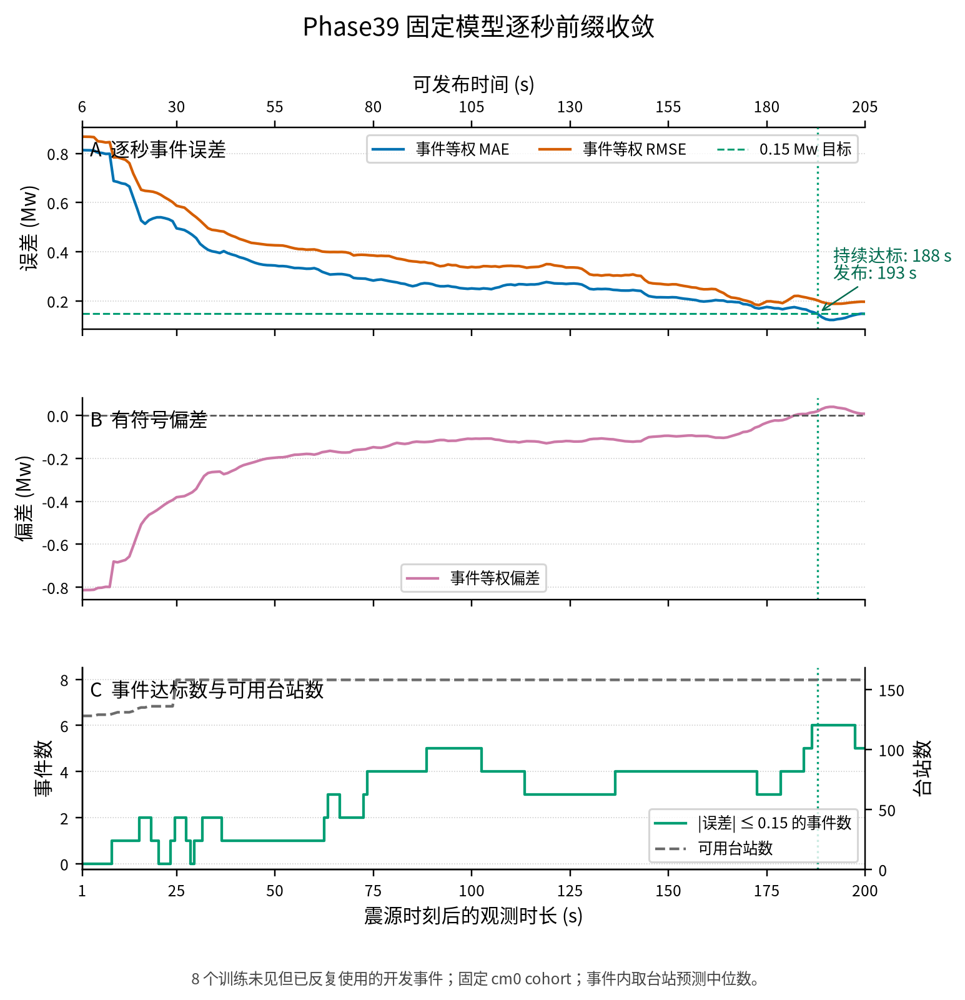

[PDF 图件](figures/01_overall_metrics.pdf)

## 200 秒最终结果：internal test 散点

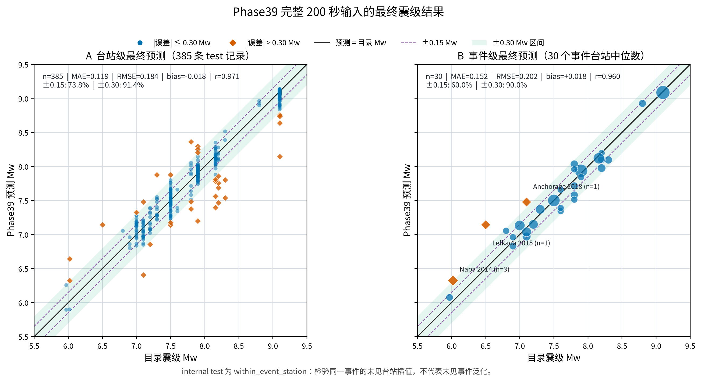

[PDF 图件](figures/04_internal_test_endpoint_scatter.pdf)

| 聚合层级 | 数量 | MAE | RMSE | Bias | Pearson r | ±0.15 Mw | ±0.30 Mw |
|---|---:|---:|---:|---:|---:|---:|---:|
| 台站 | 385 | 0.119336 | 0.183978 | -0.017577 | 0.971344 | 73.8% | 91.4% |
| 事件中位数 | 30 | 0.152287 | 0.202476 | +0.017611 | 0.960438 | 60.0% | 90.0% |

Phase39 对每个台站输出一个最终 Mw；事件级最终结果不是另一个模型输出，
而是同一事件所有 test 台站预测的中位数。事件等权 MAE 高于台站 MAE，
是因为每个事件在事件指标中权重相同，而台站指标会让多台站事件贡献更多记录。

事件中位数误差最大的三个事件是 Lefkada 2015（`+0.641 Mw`，1 个 test 台站）、
Anchorage 2018（`+0.377 Mw`，1 个 test 台站）和 Napa 2014
（`+0.302 Mw`，3 个 test 台站）。散点图中的点大小表示该事件的 test 台站数。

<!-- phase39-train-test-horizons:start -->
## 训练集与 internal test：五个严格变长前缀

这组图固定 Phase39 seed42，不重新训练。每个时刻输入真正的 `B×1×h` R 波形前缀，
每次独立预测完整 STF，不继承上一秒状态；发布时刻为 `h+6` 秒。

| 观测/发布 | Train Station MAE | Train Event MAE | Test Station MAE | Test Event MAE |
|---|---:|---:|---:|---:|
| 30/36 s | 0.642057 | 0.865545 | 0.620840 | 0.846883 |
| 60/66 s | 0.796787 | 0.614526 | 0.826998 | 0.793068 |
| 90/96 s | 0.778692 | 0.527585 | 0.816442 | 0.615656 |
| 120/126 s | 0.645364 | 0.391759 | 0.663417 | 0.397671 |
| 200/206 s | 0.097553 | 0.033940 | 0.119336 | 0.152287 |

短前缀结果不是逐步改善：Phase39 只用完整 200 秒训练，30--120 秒属于分布外输入。
到 200 秒时，Train Event MAE 为 **0.033940 Mw**，Test Event MAE 为 **0.152287 Mw**。

### 30 秒

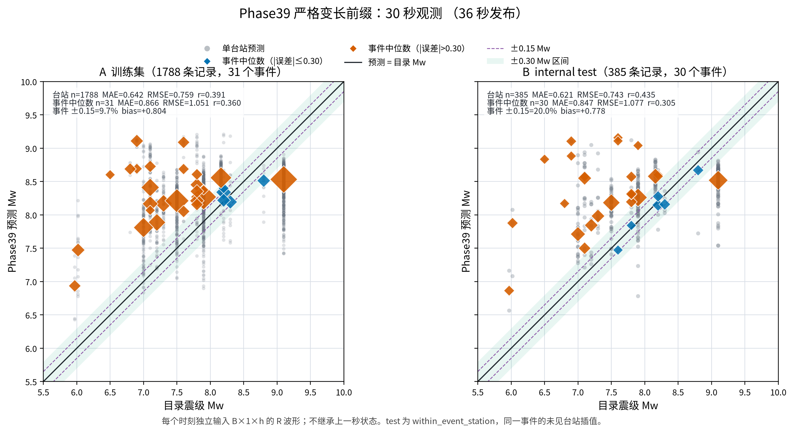

[PDF 图件](figures/05_train_test_prefix_030s.pdf)

### 60 秒

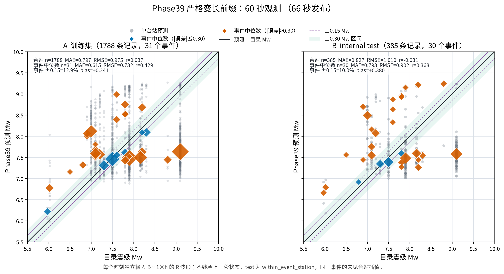

[PDF 图件](figures/06_train_test_prefix_060s.pdf)

### 90 秒

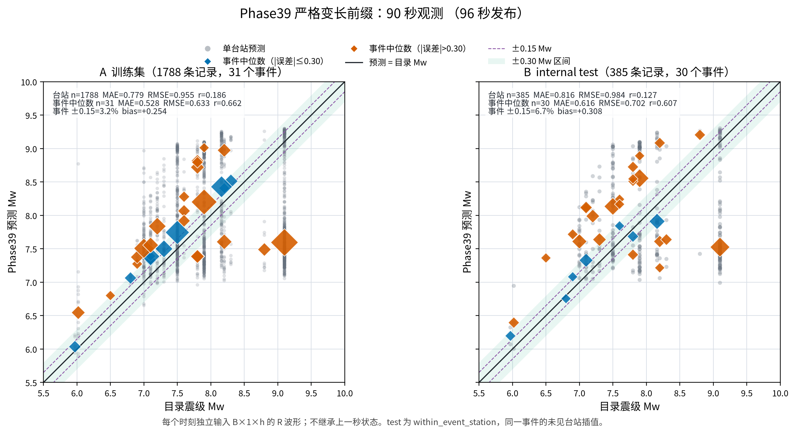

[PDF 图件](figures/07_train_test_prefix_090s.pdf)

### 120 秒

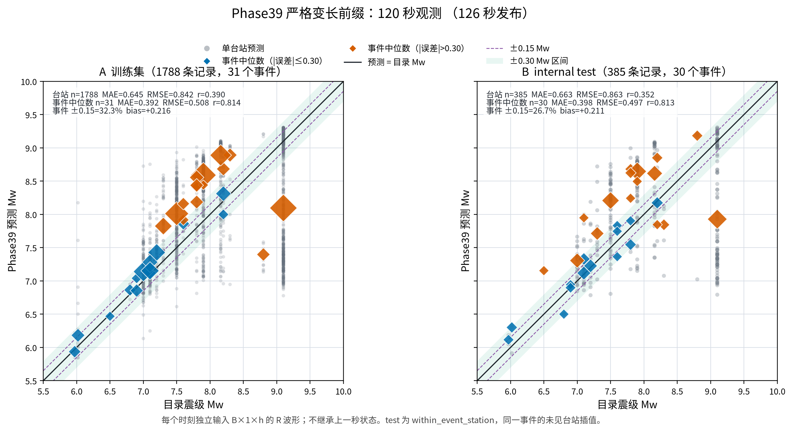

[PDF 图件](figures/08_train_test_prefix_120s.pdf)

### 200 秒

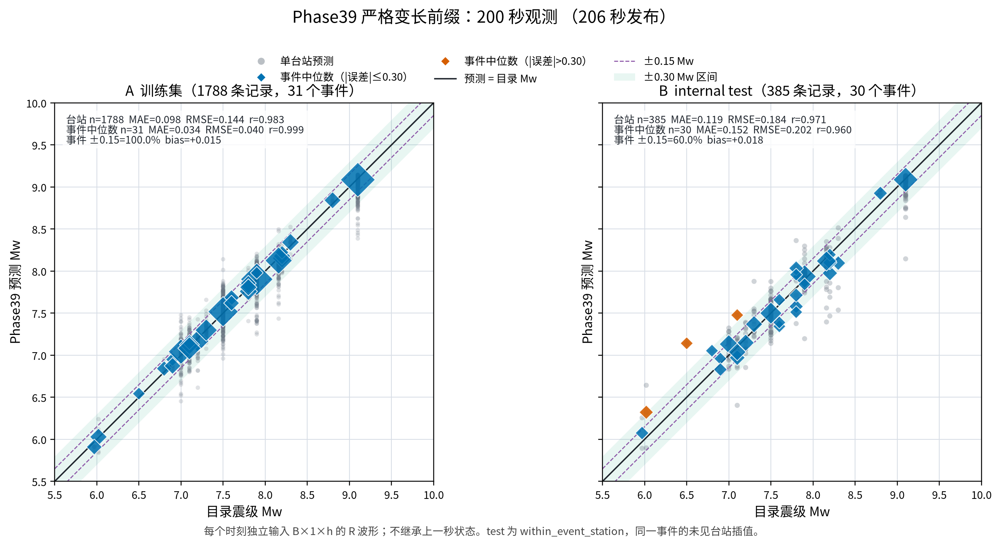

[PDF 图件](figures/09_train_test_prefix_200s.pdf)

<!-- phase39-train-test-horizons:end -->

<!-- phase39-pgd-horizons:start -->
## Phase39 与三种 PGD：五个时间节点

PGD 基线使用同一 train/test 台站 cohort，在每个发布时间仅用当时可获得的原始 E/N/U 数据
重新计算 3D PGD，再分别应用 Crowell、Melgar、Ruhl 标度律。没有额外 PGD 振幅筛选。
Phase39 仍为 R-only 严格变长前缀，因此这是方法基线比较，不是相同输入分量的消融。

| Train 观测/发布 | Phase39 | Crowell | Melgar | Ruhl |
|---|---:|---:|---:|---:|
| 30/36 s | 0.865545 | 0.654048 | 1.032228 | 1.249312 |
| 60/66 s | 0.614526 | 0.449960 | 0.762402 | 0.949486 |
| 90/96 s | 0.527585 | 0.317136 | 0.533189 | 0.691510 |
| 120/126 s | 0.391759 | 0.264231 | 0.437258 | 0.577064 |
| 200/206 s | 0.033940 | 0.179509 | 0.279440 | 0.384837 |

| Test 观测/发布 | Phase39 | Crowell | Melgar | Ruhl |
|---|---:|---:|---:|---:|
| 30/36 s | 0.846883 | 0.721756 | 1.049073 | 1.277298 |
| 60/66 s | 0.793068 | 0.454355 | 0.654506 | 0.817451 |
| 90/96 s | 0.615656 | 0.366572 | 0.527353 | 0.680082 |
| 120/126 s | 0.397671 | 0.317033 | 0.430926 | 0.553882 |
| 200/206 s | 0.152287 | 0.228853 | 0.283626 | 0.387929 |

internal test 上，Crowell 在 30--120 秒的事件 MAE 均低于未做前缀训练的 Phase39；
200 秒时 Phase39 为 **0.152287 Mw**，优于 Crowell 的 **0.228853 Mw**。
Melgar 和 Ruhl 在早期整体存在明显负偏差。

### 30 秒方法比较

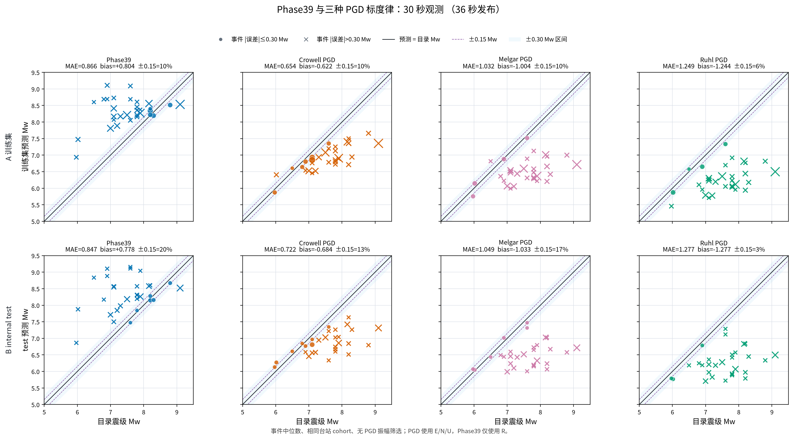

[PDF 图件](figures/10_phase39_pgd_comparison_030s.pdf)

### 60 秒方法比较

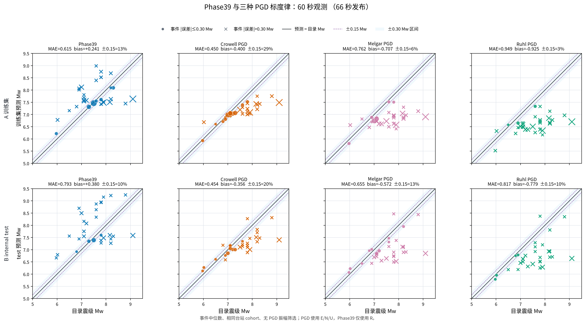

[PDF 图件](figures/11_phase39_pgd_comparison_060s.pdf)

### 90 秒方法比较

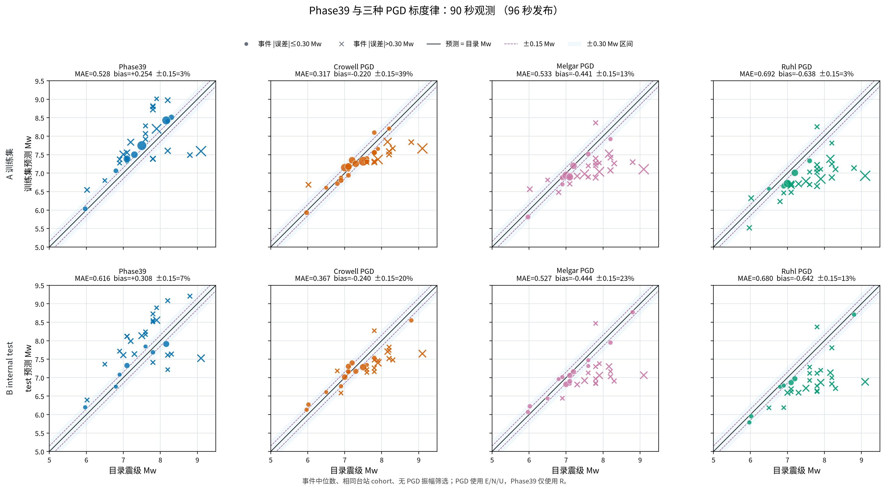

[PDF 图件](figures/12_phase39_pgd_comparison_090s.pdf)

### 120 秒方法比较

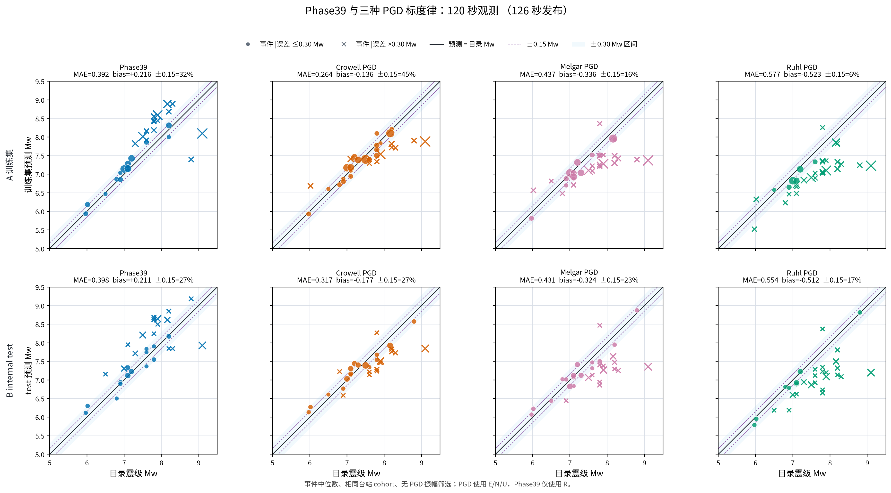

[PDF 图件](figures/13_phase39_pgd_comparison_120s.pdf)

### 200 秒方法比较

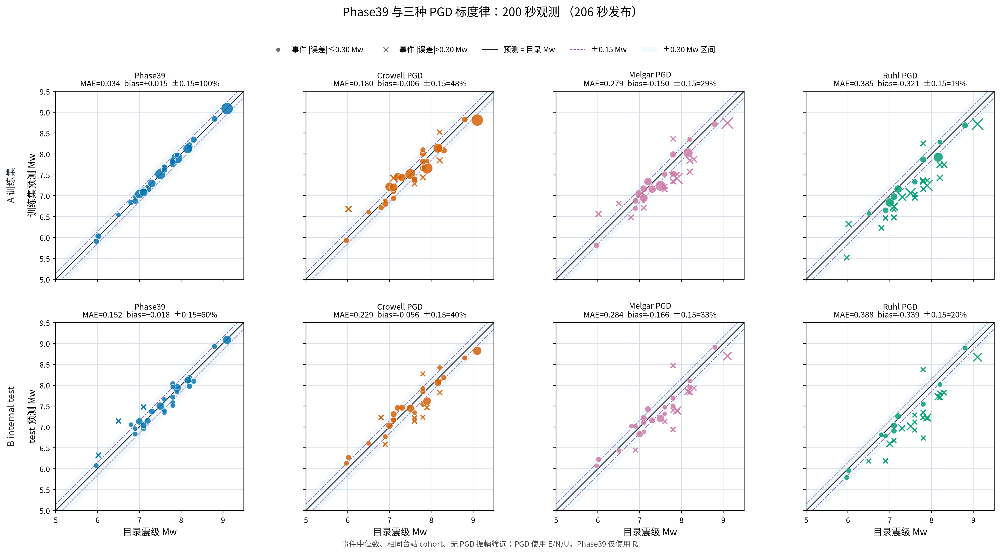

[PDF 图件](figures/14_phase39_pgd_comparison_200s.pdf)

<!-- phase39-pgd-horizons:end -->

## 八个事件轨迹

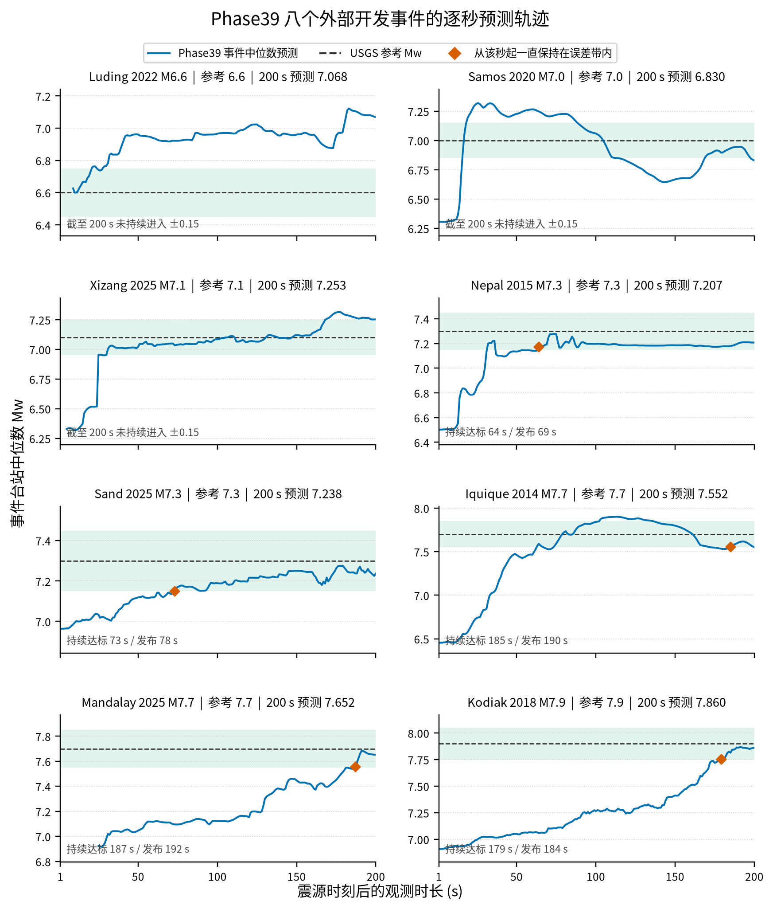

[PDF 图件](figures/02_event_trajectories.pdf)

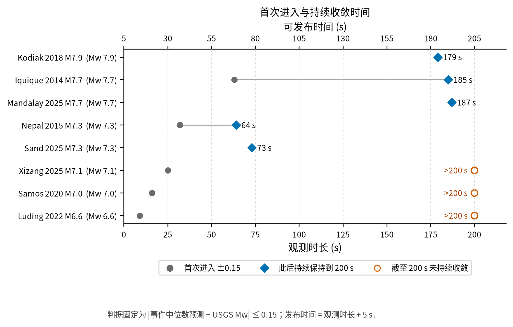

[PDF 图件](figures/03_convergence_times.pdf)

## 事件级结果

| 事件 | 参考 Mw | 200 s 预测 | 200 s 绝对误差 | 首次进入 | 持续收敛观测时长 | 可发布时间 | 台站数 |
|---|---:|---:|---:|---:|---:|---:|---:|
| Luding 2022 M6.6 | 6.6 | 7.068 | 0.468 | 9 s | >200 s | >205 s | 6 |
| Samos 2020 M7.0 | 7.0 | 6.830 | 0.170 | 16 s | >200 s | >205 s | 3 |
| Xizang 2025 M7.1 | 7.1 | 7.253 | 0.153 | 25 s | >200 s | >205 s | 12 |
| Nepal 2015 M7.3 | 7.3 | 7.207 | 0.093 | 32 s | 64 s | 69 s | 5 |
| Sand 2025 M7.3 | 7.3 | 7.238 | 0.062 | 73 s | 73 s | 78 s | 45 |
| Iquique 2014 M7.7 | 7.7 | 7.552 | 0.148 | 63 s | 185 s | 190 s | 11 |
| Mandalay 2025 M7.7 | 7.7 | 7.652 | 0.048 | 187 s | 187 s | 192 s | 12 |
| Kodiak 2018 M7.9 | 7.9 | 7.860 | 0.040 | 179 s | 179 s | 184 s | 64 |

## 评估口径

- 输入仍是单台站 R 分量。每个整数秒 `h=1..200` 只保留完整预处理张量的前 `h` 个 1 Hz 槽位，后续值和有效掩码全部清零。
- 7 点居中 Hamming FIR 需要最多 3 秒未来支撑，因此结果同时报告 `h` 秒观测时长和 `h+5` 秒发布时间。
- 每个台站独立输出 Mw；同一事件对可用台站预测取中位数。参考值来自冻结 USGS 快照的 `mw_selected`。
- 收敛定义为首次满足 `|Event error| <= 0.15 Mw`，并且此后每个整数秒都保持到 200 秒。
- 固定 cohort 为 8 个事件、158 个台站；完整台站可用性从 25 s 起持续保持。

## 必须保留的边界

这是一项固定 checkpoint 的波形前缀敏感性诊断，不是严格因果网络验证。Phase39 的 TCN 使用对称 padding，Transformer 没有 causal mask；固定台站 cohort 也来自完整 200 秒记录的离线筛选。五秒延迟只覆盖预处理 FIR 的未来支撑，不会改变网络内部结构。

这八个事件确实没有进入模型训练，但它们已被多轮方案比较反复使用，因此研究角色仍是 `development_validation`。本报告可以回答“固定 Phase39 在这批开发事件上需要多少秒达到稳定误差水平”，不能单独把结果升级为无偏的最终未见事件泛化证据。

## 工件

- [总体摘要](summary.json)：总体结论、端点复现和事件收敛时间。
- [事件收敛表](event_convergence.csv)：首次进入和 suffix-stable 收敛时间。
- [事件逐秒预测](event_predictions.csv)：8 个事件 × 200 个观测秒的预测轨迹。
- [逐站逐秒预测](station_predictions.csv)：完整台站级预测。
- [逐秒总体指标](horizon_metrics.csv)：每秒 Event MAE、RMSE、bias、覆盖率和达标事件数。
- [早期不可用台站](unavailable_stations.csv)：pre-P 基线尚未就绪的台站与时刻。
- [固定 cohort](cohort_contract.json) 与 [运行来源](provenance.json)：评估合同和输入哈希。
- [发布清单](publication_manifest.json)：GitHub 工件与生成代码 SHA-256。
- [internal test 台站最终预测](internal_test_endpoint_station_predictions.csv)
  与 [事件中位数最终预测](internal_test_endpoint_event_predictions.csv)。
- [internal test 终点摘要](internal_test_endpoint_summary.json)：散点指标、
  最大事件误差和冻结来源哈希。
- [散点图生成脚本](../../../scripts/plotting/plot_phase39_internal_test_scatter_zh.py)
  与 [测试](../../../tests/test_phase39_internal_test_scatter.py)。
- [可复现评估脚本](../../../scripts/evaluation/evaluate_phase39_second_by_second.py) 与 [测试](../../../tests/test_phase39_second_by_second.py)。
