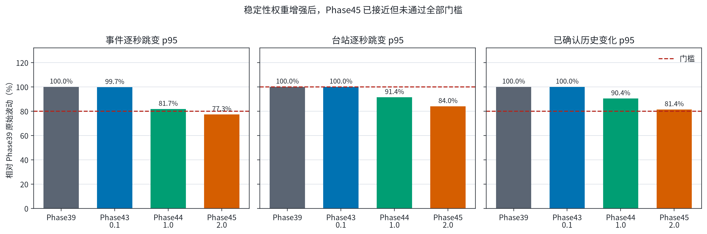
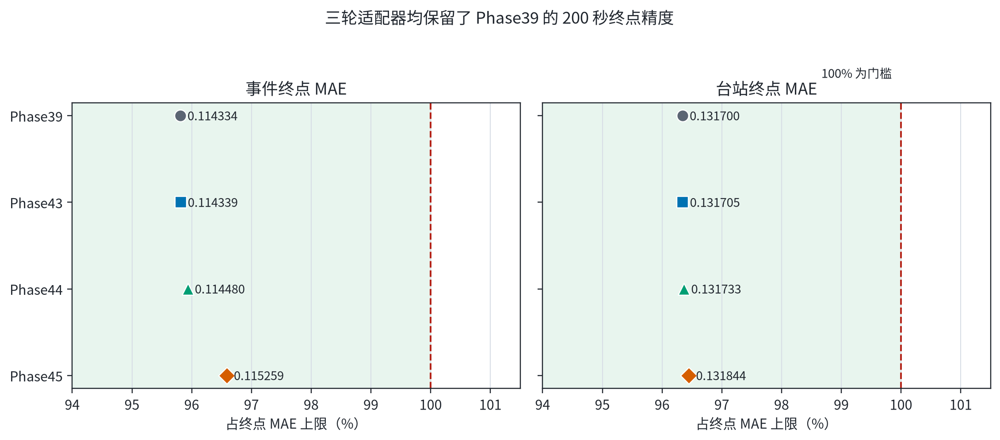
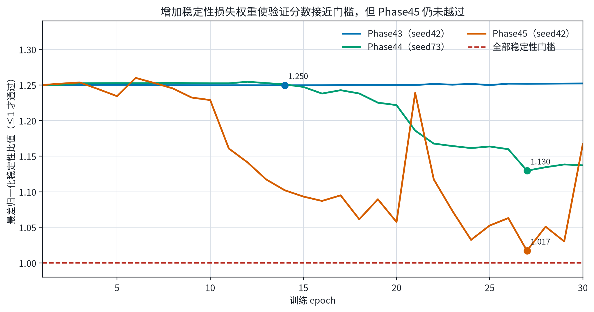

# Phase39 流式 STF 适配器验证报告

> 状态：Phase43、Phase44、Phase45 均已完成正式 validation-only 三 seed 训练；三轮均未通过完整稳定性 gate，因此没有正式选中 seed，也没有打开 internal test、外部 8 事件或 grouped test。

## 结论

Phase45 已经明显减少逐秒波动，并保留 200 秒终点精度，但按预先固定的门槛仍应判为 **失败**。最接近门槛的是仅供审计的 seed42 epoch27：

- Event 终点 MAE：**0.115259 Mw**，相对冻结 Phase39 增加 0.000925 Mw。
- Station 终点 MAE：**0.131844 Mw**，相对冻结 Phase39 增加 0.000144 Mw。
- 后期事件逐秒跳变 p95：**0.019703 Mw**，改善 22.7%。
- 后期台站逐秒跳变 p95：**0.043099 Mw**，改善 16.0%。
- 已确认历史变化 p95：**0.055666 log10**，改善 18.6%；门槛要求至少 20%，实际还差约 1.4 个百分点。

因此，Phase39 仍是保留模型；Phase45 checkpoint 只能作为验证诊断，不应追认为通过模型。

[PDF 图件](figures/01_stability_progression.pdf)

## 三轮训练比较

| 方法 | 稳定性权重 | 审计用最近 seed/epoch | Event MAE | Station MAE | 事件跳变 p95 | 台站跳变 p95 | 历史变化 p95 | 最差比值 | 正式通过 |
|---|---:|---:|---:|---:|---:|---:|---:|---:|---|
| Phase39 冻结基线 | 0 | seed42 | 0.114334 | 0.131700 | 0.025489 | 0.051320 | 0.068413 | 1.250 | 否 |
| Phase43 | 0.1 | seed42 / e14 | 0.114339 | 0.131705 | 0.025406 | 0.051316 | 0.068388 | 1.250 | 否 |
| Phase44 | 1.0 | seed73 / e27 | 0.114480 | 0.131733 | 0.020830 | 0.046891 | 0.061824 | 1.130 | 否 |
| Phase45 | 2.0 | seed42 / e27 | 0.115259 | 0.131844 | 0.019703 | 0.043099 | 0.055666 | 1.017 | 否 |

固定门槛为：Event 终点 MAE ≤ 0.119334、Station 终点 MAE ≤ 0.136700、事件跳变 p95 ≤ 0.020391、台站跳变 p95 ≤ 0.051320、历史变化 p95 ≤ 0.054730。

[PDF 图件](figures/02_endpoint_tradeoff.pdf)

[PDF 图件](figures/03_training_curves.pdf)

## 这次实际训练了什么

- Phase39 Glehman scalar + global invariant、seed42 主干完全冻结，没有重新训练约 101 万参数网络。
- 新增一个 **489 参数**的因果流式 STF retention adapter，只读取截至当前发布时间可得到的原始 E/N 波形，经实时 R 分量重处理后，处理 `20–200 s` 的逐秒前缀；发布时间为观测时长 `h+6 s`。
- 每一秒，冻结 Phase39 先重新预测一条完整非负 STF；adapter 再按 STF 时间格点融合上一状态与当前预测。三轮唯一变化是两项稳定性损失共同权重 `0.1 → 1.0 → 2.0`。
- 固定 seeds 为 17/42/73，每个 seed 30 epochs，只使用 train/validation。没有 ensemble。

## 为什么震级仍可能小幅下降

adapter 对每个 STF 时间格点执行 `state_t = gate * state_(t-1) + (1-gate) * raw_t`。上一状态和当前预测都非负，所以输出 STF 始终非负；但如果当前完整 STF 在某些格点低于上一秒，融合后的累计矩仍可能下降。

这不是“出现负矩率”，而是模型利用新增波形修正上一秒对总矩的估计。强制震级只能上升会系统性保留早期高估，因此本轮目标是**限制后期大幅回撤**，而不是数学上禁止所有下降。Phase45 已把后期事件跳变 p95 压到约 0.020 Mw，但极端台站和已确认历史的一致性仍未达到预定标准。

## 研究边界

- 训练使用的 validation 仍是 `within_event_station`：同一事件的不同台站分散在 train/validation/test，不能证明未见事件泛化。
- internal test、反复使用的外部 8 事件和 grouped test 均未打开。
- 按预先声明的停止规则，Phase45 失败后不再根据同一 validation 继续调高稳定性权重。
- 若继续推进实时模型，应另开一个冻结协议的新阶段，改变状态更新或训练目标；不能把 Phase45 的近门槛结果当作再次调参的依据。

## 工件

- [阶段级指标](validation_metrics.csv)
- [九个 seed 指标](seed_metrics.csv)
- [机器可读摘要](summary.json)
- [发布清单与 SHA-256](publication_manifest.json)
- [训练驱动](../../../scripts/experiments/run_phase43_streaming_adapter.py)
- [流式适配器](../../../src/models/streaming_stf_adapter.py)
- [可复现报告生成器](../../../scripts/plotting/plot_phase39_streaming_adapter_validation_zh.py)

全仓回归：`786 passed, 1 skipped`。报告角色：`within_event_validation_streaming_diagnostic`。
