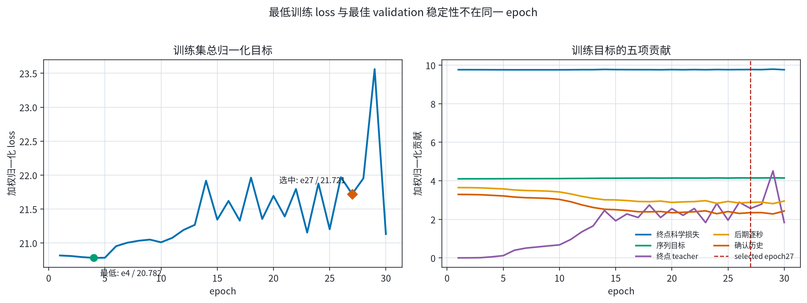
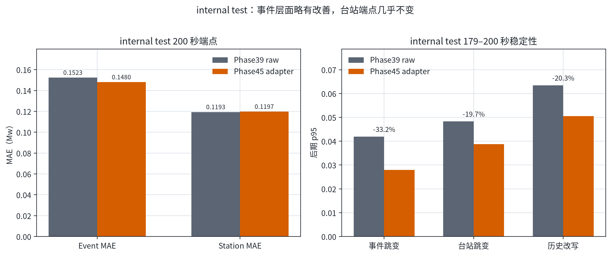
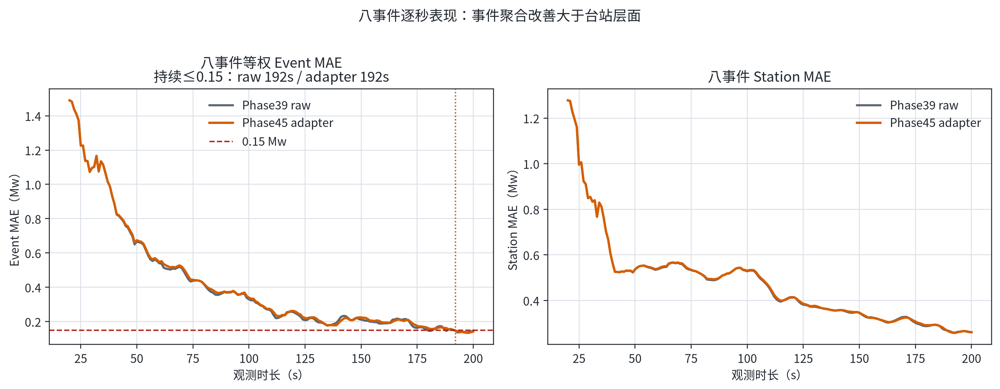
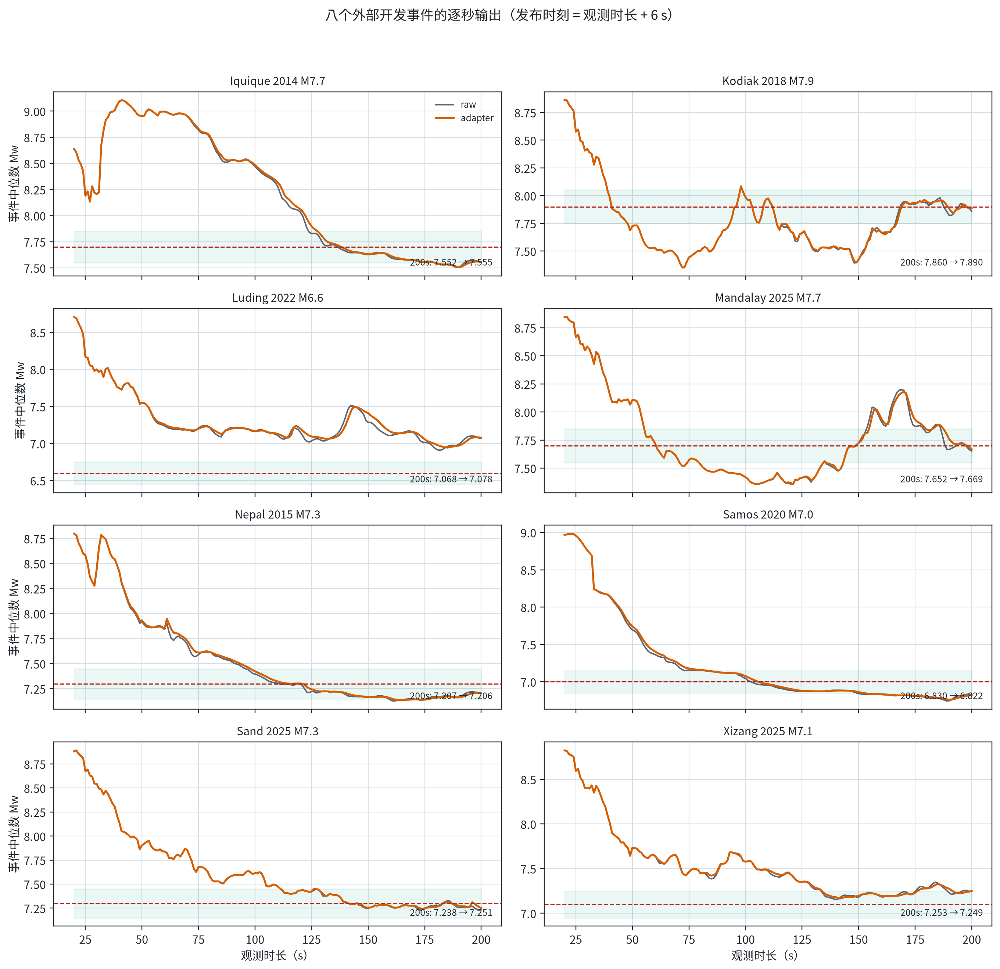

# Phase45 训练、internal test 与八事件逐秒评估

> 固定对象：Phase45 489 参数 streaming STF adapter，seed42 epoch27。Phase39 主干不变；没有根据 test 或八事件结果换 seed、换 checkpoint 或调权重。

## 结论

- **训练集目标**：最低总归一化 loss 在 epoch4（20.781635），而 validation 稳定性最佳 checkpoint 是 epoch27（训练 loss 21.721208）。两者不一致，说明稳定性目标与端点/teacher 约束存在权衡。
- **internal test**：Event MAE 从 0.152287 改善到 0.147962 Mw；Station MAE 从 0.119336 轻微变为 0.119672 Mw。
- **八事件开发集**：Event MAE 从 0.147737 改善到 0.141660 Mw，5/8 事件改善；Station MAE 0.260824 → 0.260718，基本不变。
- **逐秒稳定性**：八事件后期事件跳变 p95 0.030194 → 0.024836 Mw；历史改写 p95 0.075795 → 0.056332。

这些结果支持“adapter 可以降低 Phase39 的后期逐秒波动，同时基本保留端点精度”。但 Phase45 原 validation gate 没有通过，所以本文仍是事后诊断，不把它升级为正式选中模型。

## 1. 训练集损失函数

[PDF 图件](figures/01_training_loss.pdf)

Phase45 训练目标为五项固定加权、固定 normalizer 后的和：

| epoch27 分量 | 原始值 | 加权归一化贡献 |
|---|---:|---:|
| Endpoint science | 0.132897 | 9.773721 |
| Sequence target | 0.699053 | 4.148855 |
| Endpoint teacher | 0.000256 | 2.564741 |
| Late step | 0.004881 | 2.884861 |
| Confirmed history | 0.004447 | 2.349030 |
| **总计** | — | **21.721208** |

这个 loss 是训练目标的无量纲组合，不能直接与 Mw MAE 比数值大小。

## 2. internal test 泛化性能

[PDF 图件](figures/02_internal_test.pdf)

| 指标 | Phase39 raw | Phase45 adapter | 变化 |
|---|---:|---:|---:|
| Event MAE | 0.152287 | 0.147962 | -0.004326 |
| Station MAE | 0.119336 | 0.119672 | +0.000335 |
| Event step p95 | 0.041886 | 0.027988 | -33.2% |
| Station step p95 | 0.048305 | 0.038787 | -19.7% |
| Confirmed-history p95 | 0.063428 | 0.050540 | -20.3% |

这里的 test 是 `within_event_station`：同一地震的不同台站分散在 train/validation/test，因此它测量未见台站插值，不等于未见事件泛化。

## 3. 八事件逐秒结果

[PDF 图件](figures/03_external_overall.pdf)

[PDF 图件](figures/04_external_event_trajectories.pdf)

| 事件 | 参考 Mw | raw 200 s | adapter 200 s | raw 绝对误差 | adapter 绝对误差 | raw 持续收敛 | adapter 持续收敛 |
|---|---:|---:|---:|---:|---:|---:|---:|
| Iquique 2014 M7.7 | 7.7 | 7.552 | 7.555 | 0.148 | 0.145 | 193 s | 195 s |
| Kodiak 2018 M7.9 | 7.9 | 7.860 | 7.890 | 0.040 | 0.010 | 167 s | 167 s |
| Luding 2022 M6.6 | 6.6 | 7.068 | 7.078 | 0.468 | 0.478 | >200 s | >200 s |
| Mandalay 2025 M7.7 | 7.7 | 7.652 | 7.669 | 0.048 | 0.031 | 187 s | 188 s |
| Nepal 2015 M7.3 | 7.3 | 7.207 | 7.206 | 0.093 | 0.094 | 176 s | 178 s |
| Samos 2020 M7.0 | 7.0 | 6.830 | 6.822 | 0.170 | 0.178 | >200 s | >200 s |
| Sand 2025 M7.3 | 7.3 | 7.238 | 7.251 | 0.062 | 0.049 | 112 s | 112 s |
| Xizang 2025 M7.1 | 7.1 | 7.253 | 7.249 | 0.153 | 0.149 | >200 s | 192 s |

逐秒输出从 20 s 到 200 s，发布时间为 `h+6 s`。adapter 改善最终误差的同时可能引入少量滞后：部分已收敛事件的 suffix-stable 时间晚 1–2 秒；Xizang 则从 raw 在 200 s 仍略超 0.15 Mw，变为 adapter 在 192 s 后持续达标。

## 4. 数据角色与限制

- Phase45 没有通过原 validation gate；seed42 epoch27 只能称为预先固定的 audit checkpoint。
- internal test 已按用户要求一次性打开，但它仍是同事件未见台站测试。
- 八事件没有进入模型训练，但已被多轮开发反复使用，角色仍是 `development_validation`，不能当作新的无偏盲测。
- 第一次八事件 CUDA/batch64 运行因浮点批处理差异未通过旧 CPU 端点复现门槛，未发布性能结果。正式结果使用锁定端点原始口径 CPU/batch158，并通过最大台站差 2.86e-06 Mw。
- grouped test 没有打开。

## 5. 可下载工件

- [训练逐 epoch loss](training_loss_by_epoch.csv)
- [internal test 逐秒总体指标](internal_horizon_metrics.csv)
- [internal test 逐事件逐秒输出](internal_event_predictions.csv)
- [八事件逐事件逐秒输出](external_event_predictions.csv)
- [八事件逐台站逐秒输出](external_station_predictions.csv)
- [八事件逐秒总体指标](external_horizon_metrics.csv)
- [八事件收敛时间](external_event_convergence.csv)
- [机器可读总摘要](summary.json)
- [发布清单与 SHA-256](publication_manifest.json)
- [冻结评估器](../../../scripts/evaluation/evaluate_phase45_posthoc_streaming.py)
- [可复现绘图脚本](../../../scripts/plotting/plot_phase45_posthoc_report_zh.py)

原始/adapter STF rate 立方体保留在本机正式 run 目录，不提交 GitHub；其 SHA-256 已写入总摘要。全仓实现回归：`793 passed, 1 skipped`。
