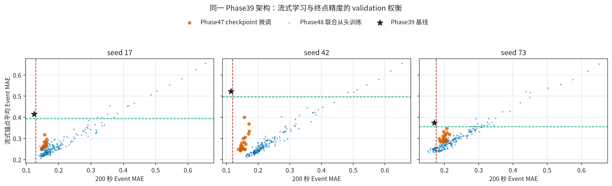
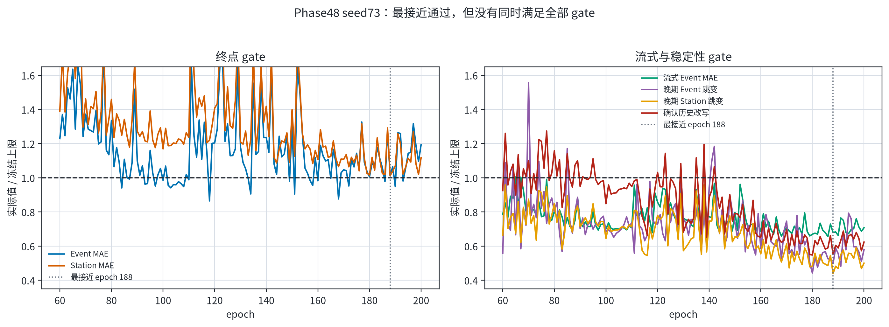
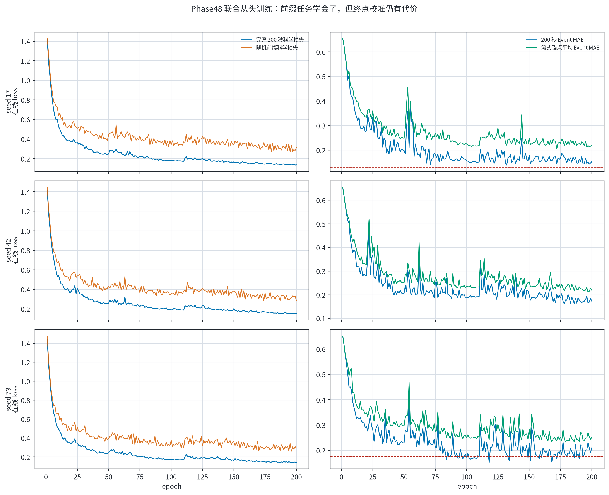

# Phase39 原模型直接流式训练：Phase47/48 validation 报告

## 结论

这两轮实验已经按“**不加 adapter，直接重新训练 Phase39 本体**”执行。

- 网络仍是 Phase39 的 1,010,850 参数 TCN + SE + Transformer + 分解 STF 头。
- 输入是实际长度为 `h` 的 R 波形前缀 `B x 1 x h`，不是把外部平滑模块接在模型后面。
- STF 仍为非负形状与总矩分解，Glehman scalar、global invariant 和
  `1.0 L_MSE + 0.5 L_synth + 1.0 L_mag` 均保留。
- Phase47 从各 seed 的 Phase39 checkpoint 全参数微调；Phase48 使用同一模型和
  同一流式损失，从随机初始化联合训练 200 轮。

结果是：**流式前缀任务确实学会了，但两轮都没有通过冻结的 validation gate，
因此没有选中新的正式模型。** internal test、八个开发事件和 grouped test 均未打开。

## 方法

每个训练 batch 包含两条直接作用于同一个 Phase39 模型的科学监督：

1. 完整 200 秒 R 波形，使用原 Phase39 三项非零损失。
2. 一个 20--200 秒的真实变长前缀，仍使用相同 STF、正演波形和最终 Mw 目标。

前一秒 `h-1` 由同一个模型在 `eval/no-grad` 下预测，仅作为训练时 teacher：

- `0.2 * Huber(delta Mw, beta=0.02)`；
- `0.05 * Huber(delta confirmed log10 M0, beta=0.05)`。

稳定性权重在 60 秒前为 0，随后二次增长到 200 秒时的 1。因此早期可以快速修正，
后期的大幅回撤受到更强惩罚，但没有强制 Mw 单调增加。推理时没有 teacher、状态或 adapter。

## 两轮差异

| 项目 | Phase47 | Phase48 |
|---|---:|---:|
| 初始化 | 各 seed 的 Phase39 checkpoint | 确定性随机初始化 |
| 可训练参数 | 全部 1,010,850 | 全部 1,010,850 |
| epoch | 20 | 200 |
| 初始学习率 | `1e-5` | `1e-4` |
| scheduler | constant | Phase39 原 cosine warm restarts |
| adapter / 新模型层 | 无 | 无 |
| validation 结果 | failed | failed |

Phase47 证明短前缀监督有效，但从只针对 `h=200` 收敛的 checkpoint 出发会快速遗忘终点。
Phase48 避免了这种灾难性遗忘，能同时降低前缀误差与终点误差，但仍有少量终点校准代价。

## 最接近结果

下表中的“最接近”只表示该 seed 的最低 validation 综合 score，不是选中 checkpoint。

| Phase | seed | epoch | 200 秒 Event MAE | 200 秒 Station MAE | 流式 Event MAE | 晚期 Event 跳变 p95 | score |
|---|---:|---:|---:|---:|---:|---:|---:|
| 47 | 17 | 20 | 0.147690 | 0.120725 | 0.253756 | 0.023719 | 1.188930 |
| 47 | 42 | 14 | 0.138097 | 0.164771 | 0.248311 | 0.021573 | 1.205346 |
| 47 | 73 | 19 | 0.188309 | 0.127504 | 0.285266 | 0.024132 | 1.137136 |
| 48 | 17 | 198 | 0.142938 | 0.111513 | 0.214080 | 0.009334 | 1.108687 |
| 48 | 42 | 178 | 0.161286 | 0.135063 | 0.216792 | 0.009225 | 1.351555 |
| 48 | 73 | 188 | 0.177830 | 0.125775 | 0.241607 | 0.010548 | 1.012633 |

Phase48 seed73 epoch188 最接近通过，但冻结上限为：

- Event MAE `<= 0.175612`，实际高 `0.002219 Mw`；
- Station MAE `<= 0.124259`，实际高 `0.001516 Mw`。

所以不能事后放宽阈值、增加轮次或追认该 checkpoint。图中小于 1 才表示对应 gate 通过；
epoch188 的流式与稳定性项已经通过，但两个终点项仍略高于 1。

## 训练行为

Phase48 的完整输入损失和前缀损失都持续下降。流式锚点 Event MAE 从随机模型约
0.65 降到 0.21--0.24，晚期逐秒跳变也显著小于 Phase39；问题集中在完整 200 秒的
最终校准仍未同时达到原模型的 Event 与 Station 门槛。

这说明当前剩余问题是**同一模型内部的多任务损失尺度与终点校准**，不是必须增加一个
推理 adapter。下一轮若继续 direct-model 路线，应在新的冻结协议中测试终点 teacher
或固定尺度归一化，并优先使用 grouped-event CV；不应继续针对这次 validation 结果
临时调权重。

## 证据边界

- Phase47 commit：`31a3271`
- Phase48 commit：`3ff2449`
- Phase47/48 均从 seeds 17/42/73 中仅按 validation 选择，不做 ensemble。
- 两轮均为 `validation_gate_failed`，`selected_seed=null`。
- internal test：未迭代。
- 八个外部开发事件：未加载。
- grouped test：未加载。
- Phase39 主干仍为对称 TCN padding 和无 causal mask Transformer，因此这是
  “逐前缀重算的流式模型”，不是单次前向的严格因果网络。

## 可复现文件

- [Phase47 每轮指标](phase47_epoch_metrics.csv)
- [Phase48 每轮指标](phase48_epoch_metrics.csv)
- [Phase39 validation 基线](baseline_metrics.csv)
- [各 seed 最接近行](closest_candidates.csv)
- [结构化摘要](summary.json)
- [Phase47 campaign summary](phase47_campaign_summary.json)
- [Phase48 campaign summary](phase48_campaign_summary.json)
- [绘图与发布脚本](../../../scripts/plotting/plot_phase47_phase48_direct_streaming_validation_zh.py)
- [发布清单](publication_manifest.json)

验证：10 个 Phase47/48 与发布脚本专项测试通过；全仓 `803 passed, 1 skipped`。
