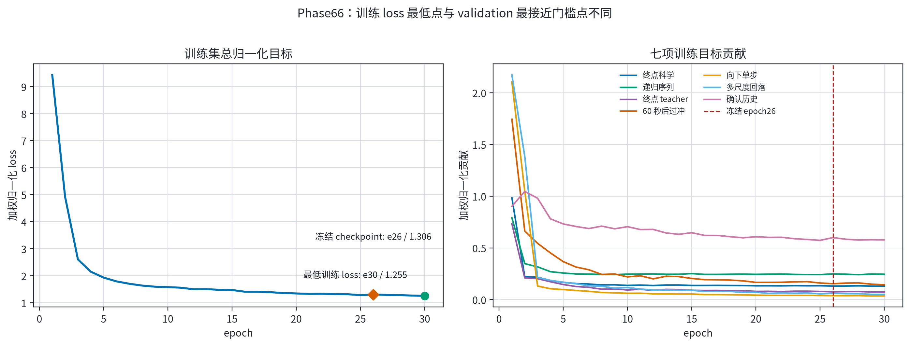
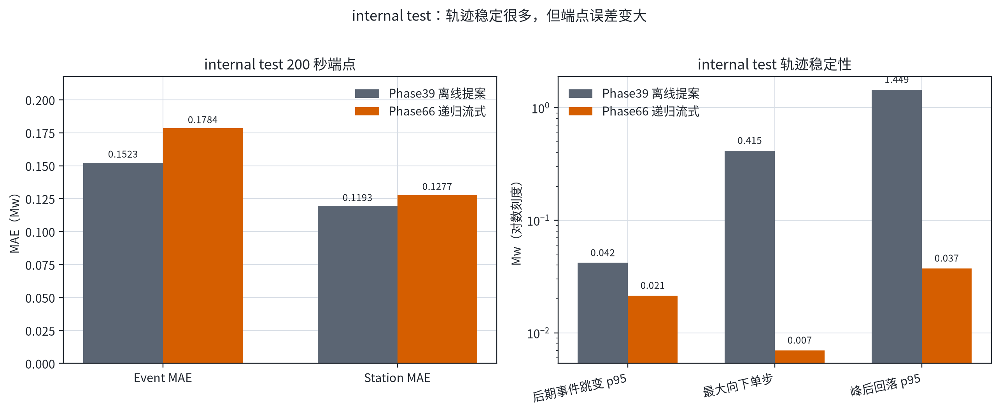
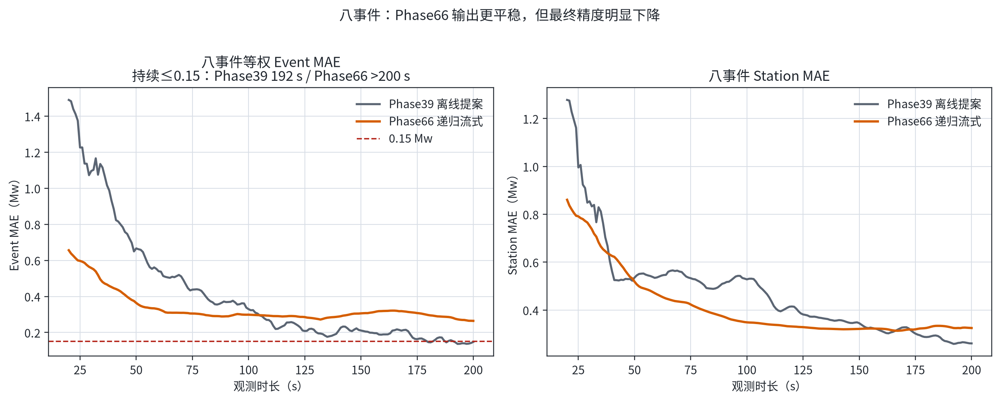
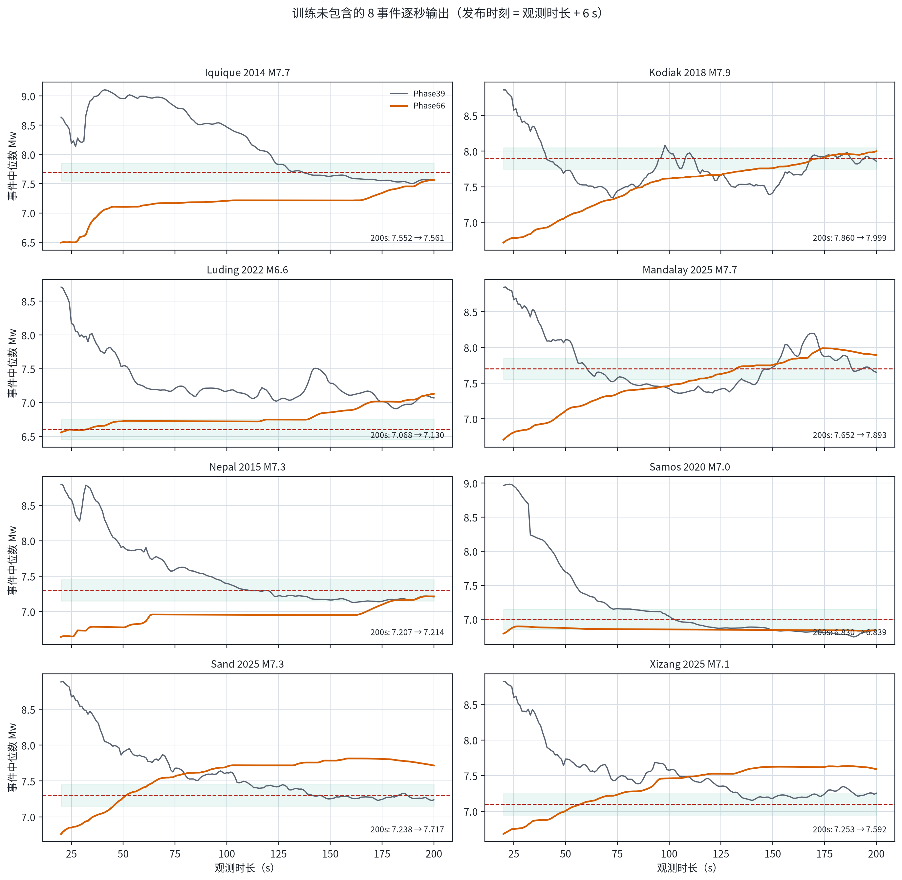
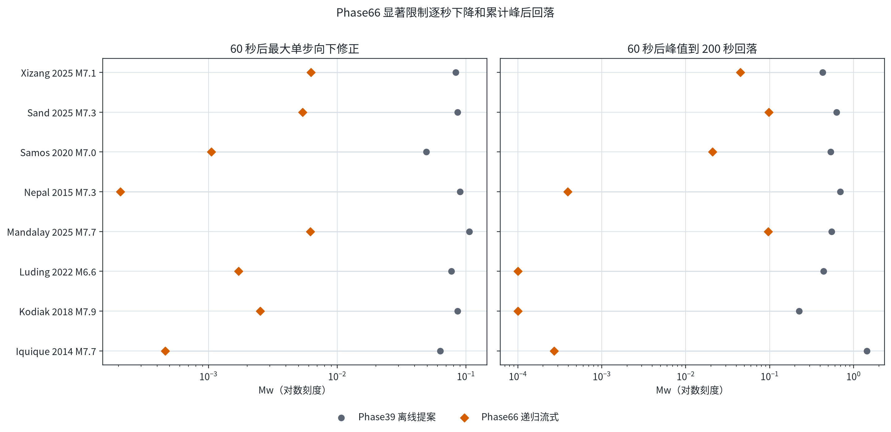

# Phase66 模型内递归流式评估：internal test 与 8 事件

> 固定对象：Phase66 seed17 epoch26，完整 `PINNModel` 检查点。它以 Phase39 Glehman+GI 的每秒完整 STF 提案为证据，在模型内部用上一秒 STF/矩状态递归更新；没有 adapter、后处理单调夹紧或 ensemble。该 checkpoint 未通过原 validation Event MAE 门槛，差 `0.008906 Mw`，本报告依据用户明确授权进行一次性测试。

## 结论

- **internal test**：Event MAE 从 0.152287 变为 0.178413 Mw，Station MAE 从 0.119336 变为 0.127712 Mw，端点精度均变差。
- **8 事件开发集**：Event MAE 从 0.147737 变为 0.264522 Mw，Station MAE 从 0.260824 变为 0.325080 Mw；仅 3/8 事件最终绝对误差改善。
- **流式稳定性明显改善**：8 事件最大向下单步从 0.454437 降至 0.006257 Mw，峰后回落 p95 从 1.181700 降至 0.096884 Mw，后期事件跳变 p95 从 0.030194 降至 0.011149 Mw。
- **当前判断**：Phase66 已解决“逐秒大幅先升后降”的主要稳定性问题，但在未用于训练的 8 事件上出现高偏差，尤其是 Sand 和 Xizang。因此它暂时不能替代 Phase39 作为精度最好的模型，也不能只凭轨迹变平稳就认定泛化更好。

## 1. 训练损失与 checkpoint

[PDF 图件](figures/01_training_loss.pdf)

Phase66 的最低训练总 loss 出现在 epoch30（1.255470），而冻结 checkpoint 是 epoch26（1.306435）。因此本轮不存在“第四轮训练 loss 最低”的现象；epoch26 是按 validation 最接近全部门槛选出的，而不是按训练 loss 最低选出。

| epoch26 分量 | 原始值 | 加权归一化贡献 |
|---|---:|---:|
| Confirmed history | 0.002806 | 0.599523 |
| Downward step | 0.000028 | 0.038316 |
| Endpoint science | 0.166400 | 0.131168 |
| Endpoint teacher | 0.084043 | 0.075118 |
| Multiscale downward | 0.001642 | 0.060232 |
| Post-60 overshoot | 0.070085 | 0.153489 |
| Recurrent sequence | 0.508381 | 0.248589 |
| **总计** | — | **1.306435** |

## 2. internal test

[PDF 图件](figures/02_internal_test.pdf)

| 指标 | Phase39 离线提案 | Phase66 递归流式 | 变化 |
|---|---:|---:|---:|
| Event MAE | 0.152287 | 0.178413 | +0.026126 |
| Station MAE | 0.119336 | 0.127712 | +0.008375 |
| 后期 Event step p95 | 0.041886 | 0.021429 | -48.8% |
| 最大向下单步 | 0.414907 | 0.006990 | -98.3% |
| 峰后回落 p95 | 1.448530 | 0.037420 | -97.4% |

这里的 internal test 是 `within_event_station`：同一地震的不同台站分散在 train/validation/test，因此它衡量同事件未见台站插值，不等于未见事件泛化。

## 3. 训练未包含的 8 事件

[PDF 图件](figures/03_external_overall.pdf)

[PDF 图件](figures/04_external_event_trajectories.pdf)

| 事件 | 参考 Mw | Phase39 200 s | Phase66 200 s | Phase39 绝对误差 | Phase66 绝对误差 | Phase66 持续收敛 |
|---|---:|---:|---:|---:|---:|---:|
| Iquique 2014 M7.7 | 7.7 | 7.552 | 7.561 | 0.148 | 0.139 | 197 s |
| Kodiak 2018 M7.9 | 7.9 | 7.860 | 7.999 | 0.040 | 0.099 | 143 s |
| Luding 2022 M6.6 | 6.6 | 7.068 | 7.130 | 0.468 | 0.530 | >200 s |
| Mandalay 2025 M7.7 | 7.7 | 7.652 | 7.893 | 0.048 | 0.193 | >200 s |
| Nepal 2015 M7.3 | 7.3 | 7.207 | 7.214 | 0.093 | 0.086 | 180 s |
| Samos 2020 M7.0 | 7.0 | 6.830 | 6.839 | 0.170 | 0.161 | >200 s |
| Sand 2025 M7.3 | 7.3 | 7.238 | 7.717 | 0.062 | 0.417 | >200 s |
| Xizang 2025 M7.1 | 7.1 | 7.253 | 7.592 | 0.153 | 0.492 | >200 s |

Phase66 在 Iquique、Nepal、Samos 上改善最终绝对误差；Kodiak、Luding、Mandalay、Sand、Xizang 变差。Sand 和 Xizang 的 200 秒预测分别达到 7.717 和 7.592，说明递归状态保留了偏高的早期估计，虽然不再大幅回落，但也未能充分向正确端点修正。

## 4. 向下修正与峰后回落

[PDF 图件](figures/05_external_revision_diagnostics.pdf)

该图把“单步跳动”和“长期累计回落”分开。Phase66 对所有 8 个事件都显著压低了两者；这证明模型内部递归约束有效，但也解释了端点高偏差：对早期高估的向下纠正能力可能过弱。

## 5. 数据角色与限制

- Phase66 原 validation gate 没有正式通过；本报告使用预先冻结的 seed17 epoch26，不因 test 或 8 事件结果更换 checkpoint。
- internal test 已按用户授权一次性打开，仍属于同事件未见台站插值。
- 8 事件没有进入模型训练，因此对模型而言是未训练事件；但这些事件已被此前多轮开发反复使用，统计角色必须写作 `development_validation`，不能作为新的无偏盲测证明。
- Phase39 原始端点复现门槛通过：最大台站预测差 2.86e-06 Mw，说明本报告的精度退化不是台站错位或基线回放变化造成的。
- grouped test 没有打开；本报告结果不得用于继续选择 Phase67。

## 6. 可下载工件

- [训练逐 epoch loss](training_loss_by_epoch.csv)
- [internal test 逐秒总体指标](internal_horizon_metrics.csv)
- [internal test 逐事件逐秒输出](internal_event_predictions.csv)
- [8 事件逐事件逐秒输出](external_event_predictions.csv)
- [8 事件逐台站逐秒输出](external_station_predictions.csv)
- [8 事件逐秒总体指标](external_horizon_metrics.csv)
- [8 事件收敛时间](external_event_convergence.csv)
- [逐事件回落诊断](external_trajectory_diagnostics.csv)
- [机器可读总摘要](summary.json)
- [发布清单与 SHA-256](publication_manifest.json)
- [冻结评估器](../../../scripts/evaluation/evaluate_phase66_stateful_streaming.py)
- [可复现绘图脚本](../../../scripts/plotting/plot_phase66_stateful_report_zh.py)

原始 Phase39/Phase66 STF rate 立方体保留在本机正式 run 目录，不提交 GitHub；其 SHA-256 已写入摘要。全仓实现回归：`863 passed, 1 skipped in 54.57s`。
