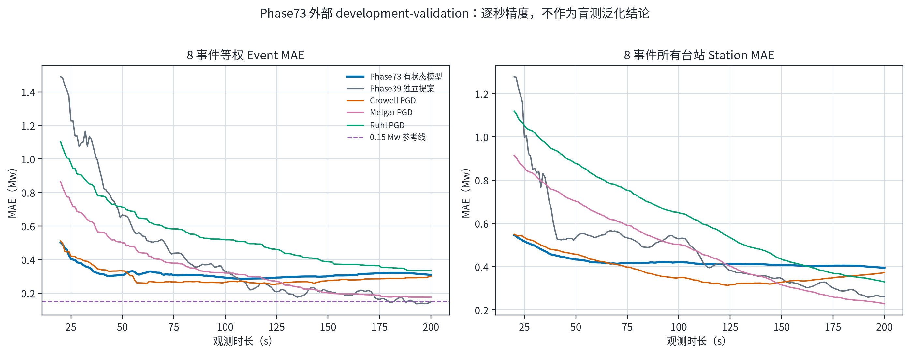
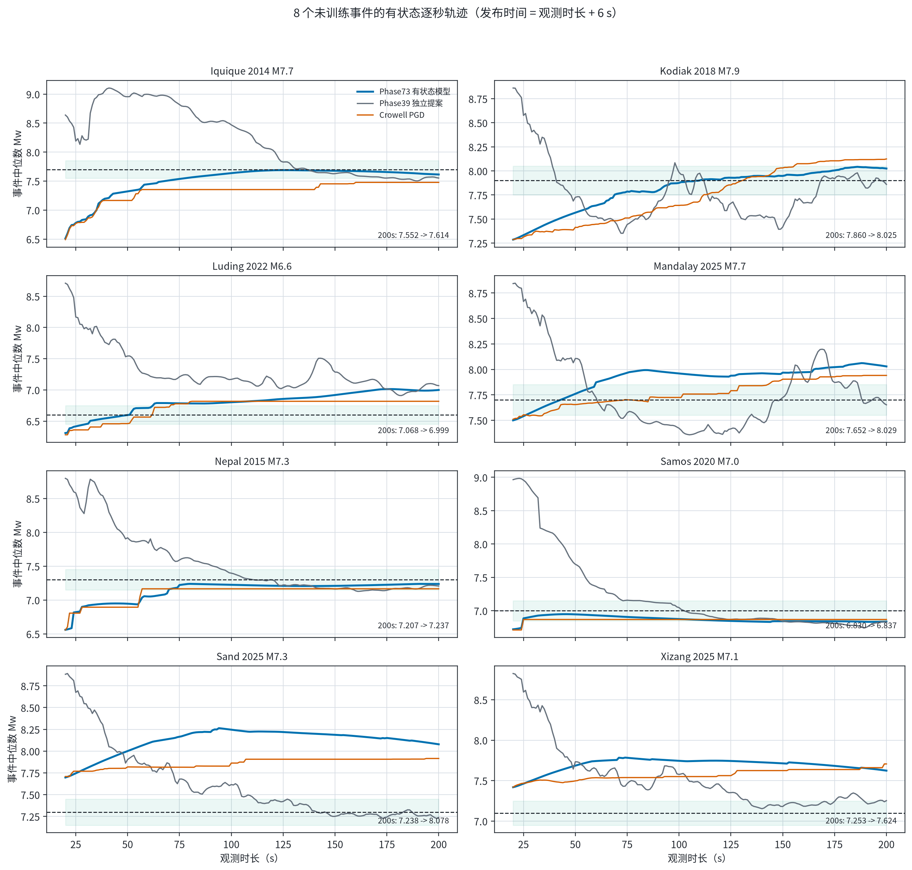
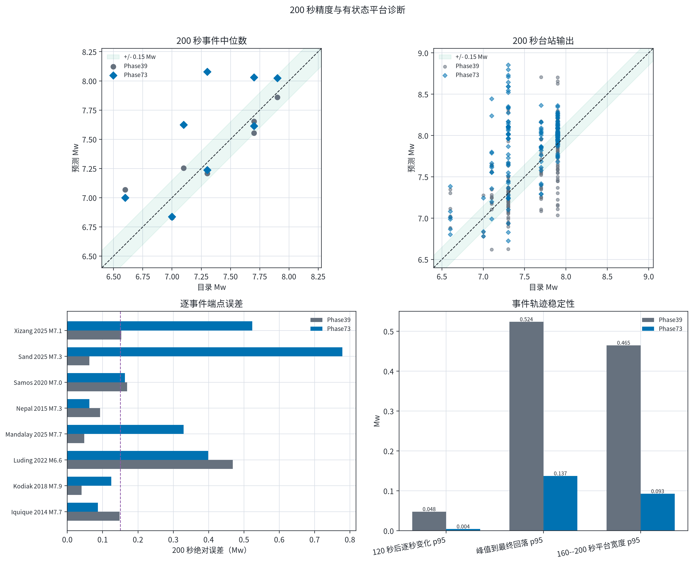

# Phase73 PGD 引导有状态流式模型：8 事件外部评估

> 固定对象：Phase73 seed17 epoch27，来自原始 validation campaign 的
> `closest_model.pth`。该模型每秒继承上一秒的 STF/Mw/GRU 状态和平台置信度，
> 输入当前 Phase39 R-only STF 提案及基于原始 E/N/U 的因果 Crowell PGD 提示；
> 没有 adapter、外部平滑、单调 clamp 或 ensemble。本次按用户明确授权仅运行一次。

## 结论

- **200 秒 Event MAE**：Phase73 为 **0.308476 Mw**，Phase39 为 **0.147737 Mw**，Crowell PGD 为 **0.299131 Mw**；Phase73 相对 Phase39 的变化是 **+0.160738 Mw**。
- **200 秒 Station MAE**：Phase73 为 **0.393851 Mw**，Phase39 为 **0.260824 Mw**；变化是 **+0.133027 Mw**。
- **逐事件端点**：Phase73 相对 Phase39 改善 **4/8** 个事件的最终绝对误差。
- **轨迹**：Phase73 的 120 秒后逐秒变化 p95、峰值到最终回落 p95、160--200 秒平台宽度 p95 分别为 **0.004229 / 0.137154 / 0.092595 Mw**；Phase39 对应 **0.047761 / 0.523511 / 0.464504 Mw**。

## 逐秒总体表现

[PDF 图件](figures/01_external_overall_metrics.pdf)

## 8 个事件轨迹

[PDF 图件](figures/02_external_event_trajectories.pdf)

| 事件 | 参考 Mw | Phase39 200 s | Phase73 200 s | Crowell 200 s | Phase39 绝对误差 | Phase73 绝对误差 |
|---|---:|---:|---:|---:|---:|---:|
| Iquique 2014 M7.7 | 7.7 | 7.552 | 7.614 | 7.478 | 0.148 | 0.086 |
| Kodiak 2018 M7.9 | 7.9 | 7.860 | 8.025 | 8.124 | 0.040 | 0.125 |
| Luding 2022 M6.6 | 6.6 | 7.068 | 6.999 | 6.817 | 0.468 | 0.399 |
| Mandalay 2025 M7.7 | 7.7 | 7.652 | 8.029 | 7.941 | 0.048 | 0.329 |
| Nepal 2015 M7.3 | 7.3 | 7.207 | 7.237 | 7.166 | 0.093 | 0.063 |
| Samos 2020 M7.0 | 7.0 | 6.830 | 6.837 | 6.868 | 0.170 | 0.163 |
| Sand 2025 M7.3 | 7.3 | 7.238 | 8.078 | 7.916 | 0.062 | 0.778 |
| Xizang 2025 M7.1 | 7.1 | 7.253 | 7.624 | 7.706 | 0.153 | 0.524 |

## 端点与平台诊断

[PDF 图件](figures/03_external_endpoint_and_stability.pdf)

## 数据角色与方法边界

- 这 8 个事件没有用于 Phase73 训练，因而对模型是未训练事件；但它们在历史开发中已经被反复使用，本报告只能标为 `development_validation`，**不能**称为新的无偏盲测或未见事件泛化证明。
- 原始 Phase73 campaign 没有通过完整 validation endpoint gate：200 秒 validation Event/Station MAE 是 0.158228 / 0.179794 Mw；本次外部结果不会用于更换 seed、checkpoint、超参数或推理规则。
- internal test 和 grouped held-out test 均未打开。原始 training campaign 的隐藏数据标志仍是 `internal_test_iterated=false`、`external_data_loaded=false`、`grouped_test_loaded=false`；本报告只记录这一次独立的外部 override。
- Phase39 原始提案端点复现通过，最大台站差为 2.86e-06 Mw；因此比较建立在锁定的台站身份、波形输入和完整 STF 提案上。
- 每个 horizon 使用 `0 <= t < h` 的原始 E/N/U 计算 PGD，发布时间为 `h + 6 s`。神经波形主干始终只使用 R 分量；输出表示当前对完整 STF 和最终 Mw 的预测，而不是累计释放矩。

## 可审计工件

- [评估摘要](evaluation_summary.json)
- [发布摘要](summary.json)
- [逐秒 Event 指标](external_horizon_metrics.csv)
- [逐事件逐秒输出](external_event_predictions.csv)
- [逐台站逐秒输出（gzip）](external_station_predictions.csv.gz)
- [200 秒逐台站输出](external_endpoint_station_predictions.csv)
- [事件轨迹诊断](external_trajectory_diagnostics.csv)
- [发布清单](publication_manifest.json)
- [冻结评估器](../../../scripts/evaluation/evaluate_phase73_stateful_external.py)
- [绘图脚本](../../../scripts/plotting/plot_phase73_stateful_external_zh.py)
