# Phase73 PGD 引导有状态流式预测：Train / Validation 图件报告

> 固定 Phase73 seed17 epoch27；不重新训练、不换 seed、不做外部平滑或单调 clamp。
> 本报告只使用训练集与 within_event_station validation；internal test、反复使用的 8 个事件和 grouped test 均未打开。

## 结论

Phase73 已经实现真正的逐秒有状态更新：每秒继承上一秒的 STF、Mw、GRU hidden state 和平台置信度，
再结合当前 Phase39 STF 提案与因果 Crowell PGD 提示做小幅修正。它不是 Phase39 那种每秒独立重算。

在 validation 上，200 秒 Event/Station MAE 为 **0.158228 / 0.179794 Mw**。
30 个事件中 **93.3%** 最终高于 20 秒估计；
160--200 秒事件平台宽度 p95 为 **0.277252 Mw**。

它在五个关键时刻都优于 Crowell PGD 的 validation Event MAE，但 200 秒仍未恢复 Phase39 的最终精度门槛，
因此它是当前最好的流式候选，不是已经通过全部 validation gate 的最终模型。

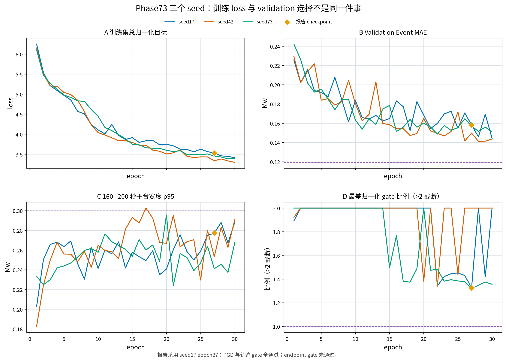

[PDF 图件](figures/01_training_dynamics.pdf)

## 逐秒总体表现

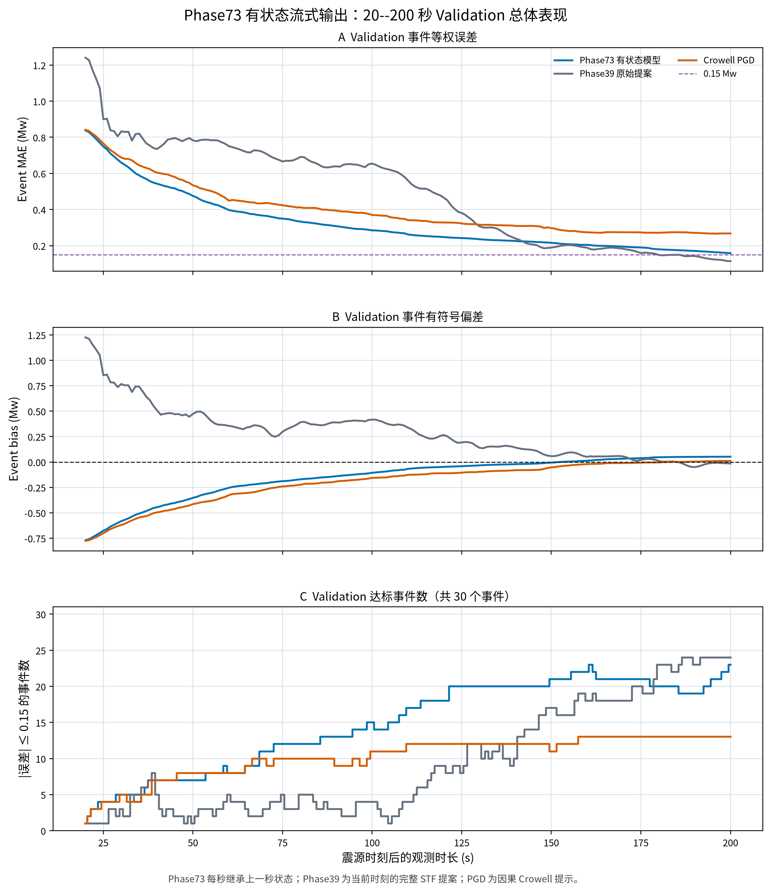

[PDF 图件](figures/02_overall_metrics.pdf)

## 30 个 Validation 事件轨迹

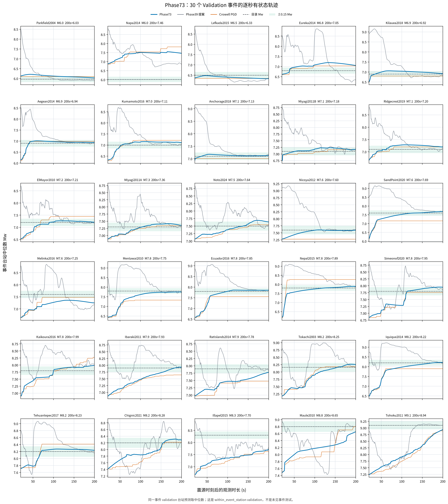

[PDF 图件](figures/03_validation_event_trajectories.pdf)

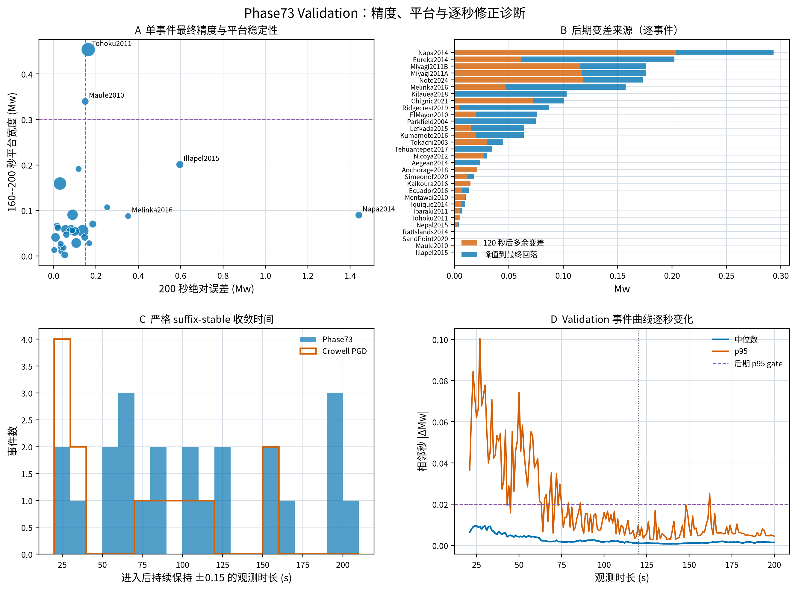

[PDF 图件](figures/04_validation_trajectory_diagnostics.pdf)

## 200 秒最终散点

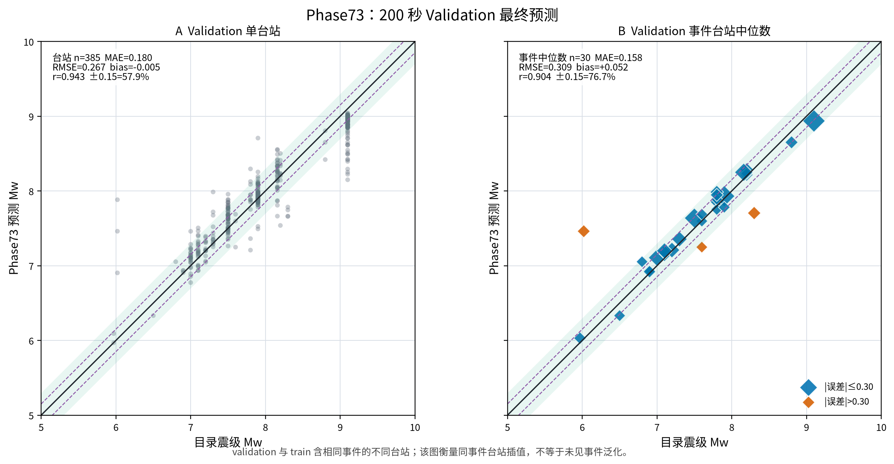

[PDF 图件](figures/05_validation_endpoint_scatter.pdf)

## 五个关键时间点

| 观测/发布 | Train Station MAE | Train Event MAE | Validation Station MAE | Validation Event MAE | Validation Crowell Event MAE |
|---|---:|---:|---:|---:|---:|
| 30/36 s | 0.963207 | 0.629384 | 0.973885 | 0.659695 | 0.687882 |
| 60/66 s | 0.736570 | 0.396400 | 0.738418 | 0.397154 | 0.449185 |
| 90/96 s | 0.572678 | 0.250576 | 0.576128 | 0.308057 | 0.394160 |
| 120/126 s | 0.449918 | 0.182735 | 0.444255 | 0.247212 | 0.328188 |
| 200/206 s | 0.178298 | 0.087161 | 0.179794 | 0.158228 | 0.267508 |

### 30 秒 Train / Validation

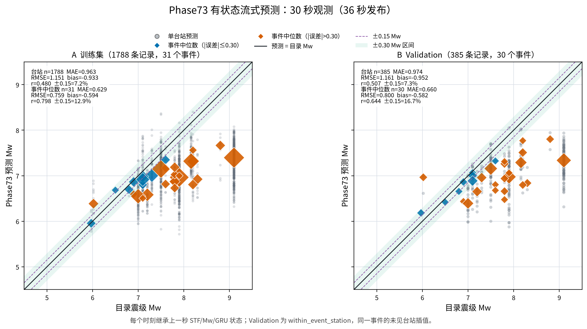

[PDF 图件](figures/06_train_validation_030s.pdf)

### 60 秒 Train / Validation

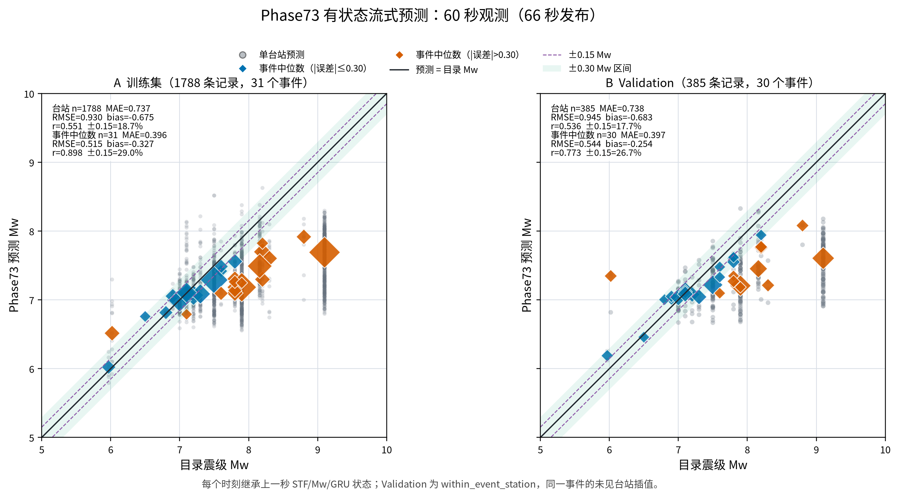

[PDF 图件](figures/07_train_validation_060s.pdf)

### 90 秒 Train / Validation

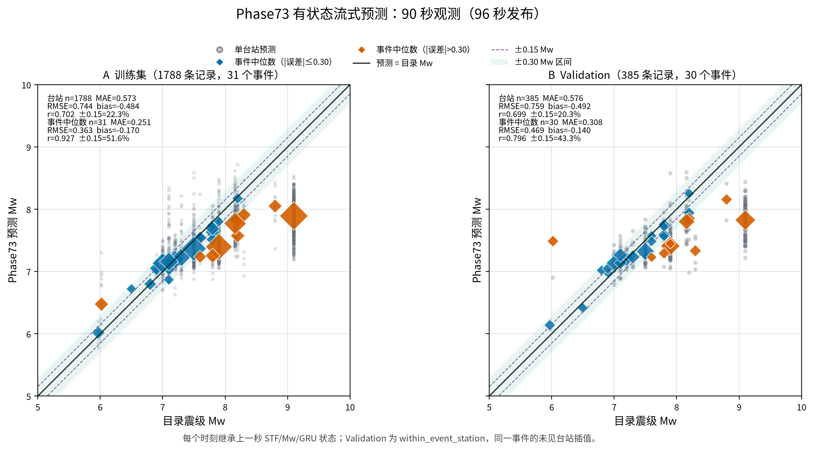

[PDF 图件](figures/08_train_validation_090s.pdf)

### 120 秒 Train / Validation

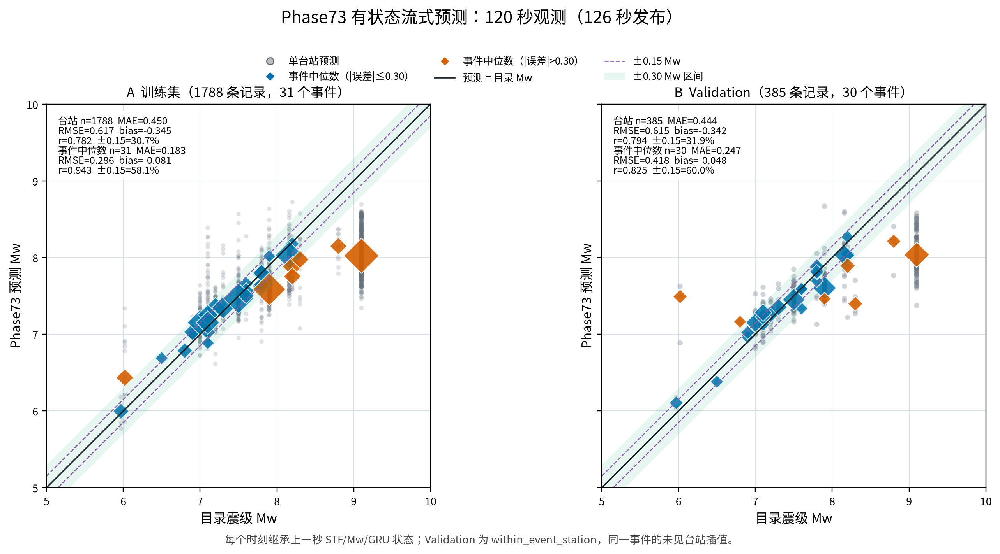

[PDF 图件](figures/09_train_validation_120s.pdf)

### 200 秒 Train / Validation

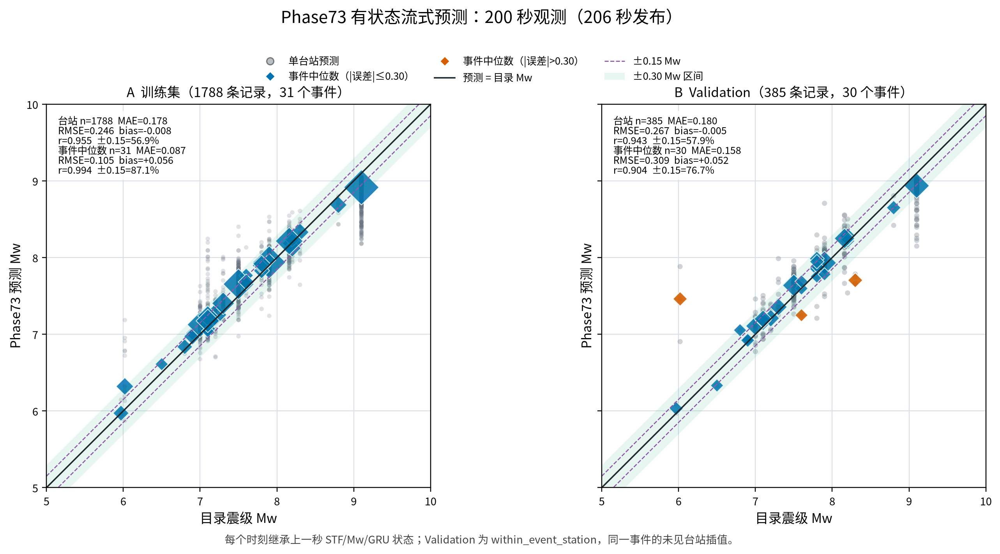

[PDF 图件](figures/10_train_validation_200s.pdf)

## Phase73、Phase39 与三种 PGD

### 30 秒方法比较

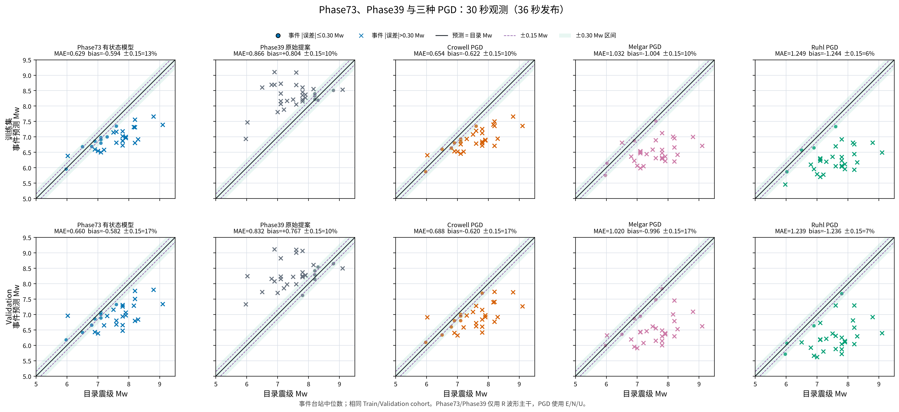

[PDF 图件](figures/11_method_comparison_030s.pdf)

### 60 秒方法比较

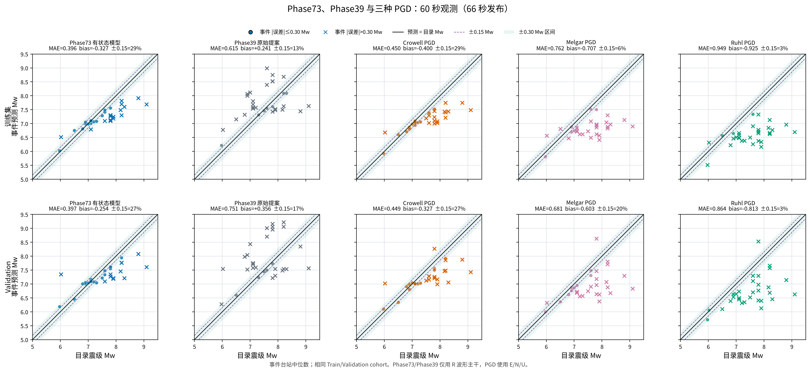

[PDF 图件](figures/12_method_comparison_060s.pdf)

### 90 秒方法比较

[PDF 图件](figures/13_method_comparison_090s.pdf)

### 120 秒方法比较

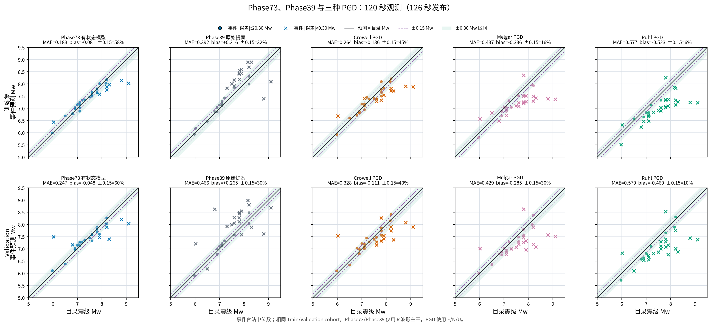

[PDF 图件](figures/14_method_comparison_120s.pdf)

### 200 秒方法比较

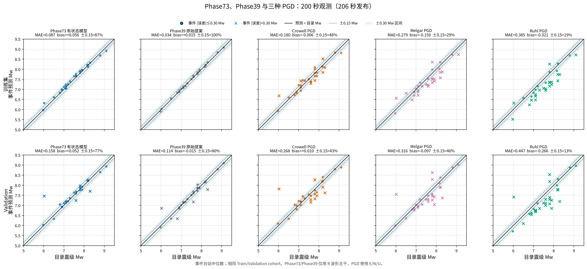

[PDF 图件](figures/15_method_comparison_200s.pdf)

## 方法边界

- 神经波形主干仍只输入 R 分量；Crowell PGD 提示由原始 E/N/U 计算。
- 每个 horizon 使用 `0 <= t < h` 的数据，并报告 `h+6 s` 发布时间。
- Phase73 预测的是当前最优的完整 STF 与最终 Mw，不是截至当前已释放矩的严格累计量。
- 输出允许小幅向下修正，但模型内部限制后期逐秒修正，并训练平台宽度。
- Train/Validation split 是 `within_event_station`；同一事件台站分散在两个 split，不能据此宣称未见事件泛化。
- Phase73 未通过完整 endpoint gate，因此本报告没有打开 internal test、8 个开发事件或 grouped test。

## 可审计工件

- [汇总](summary.json)
- [逐秒 Event 指标](horizon_metrics.csv)
- [逐事件逐秒预测](phase73_event_predictions.csv)
- [五时刻逐站预测（gzip）](phase73_selected_horizon_station_predictions.csv.gz)
- [Validation 轨迹诊断](validation_trajectory_diagnostics.csv)
- [三个 seed 训练记录](training_epoch_metrics.csv)
- [运行来源](provenance.json)
- [发布清单](publication_manifest.json)
- [生成脚本](../../../scripts/plotting/plot_phase73_stateful_validation_zh.py)
- [聚焦测试](../../../tests/test_plot_phase73_stateful_validation_zh.py)
