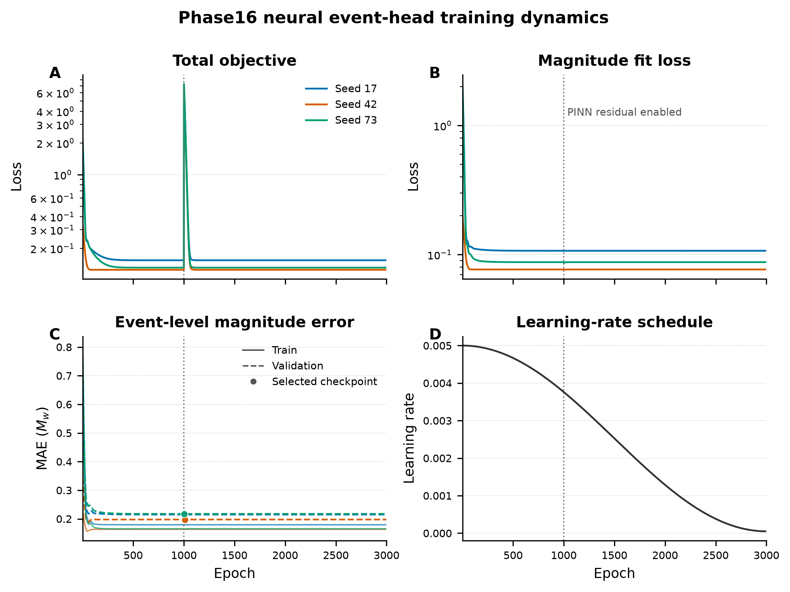
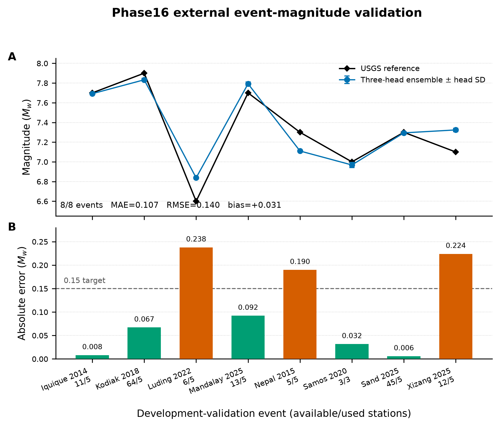
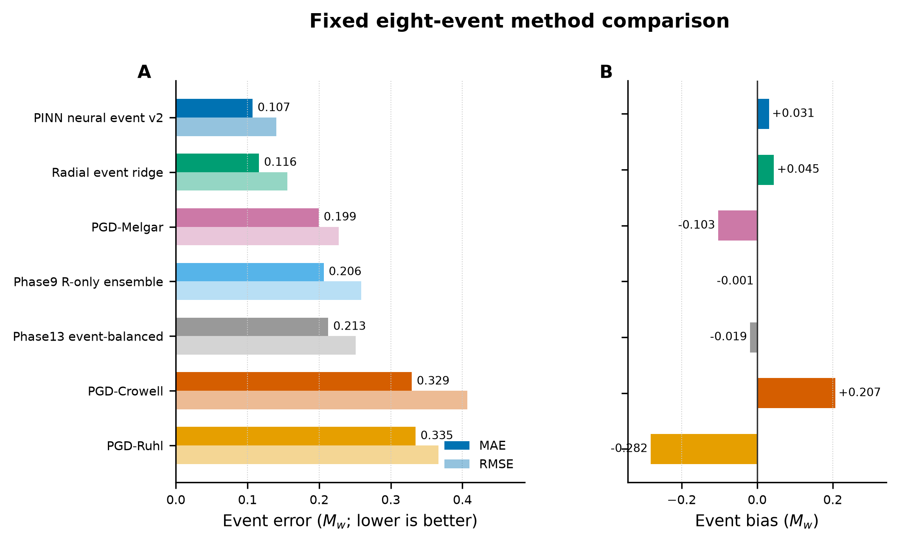
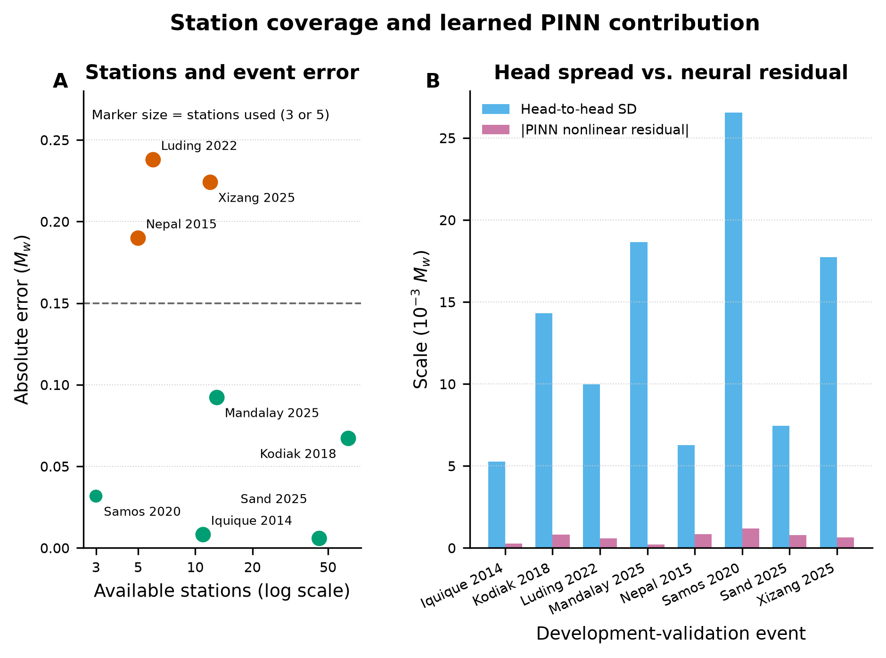

# Phase16 R-only PINN Event Neural v2

> Fixed eight-event development validation. These events participated in earlier model/feature selection and are not an unbiased final test set.

## Headline result

| Coverage | Event MAE | Event RMSE | Bias | Events with abs. error <= 0.15 |
|---:|---:|---:|---:|---:|
| 8/8 | 0.107106 | 0.140061 | +0.031422 | 5/8 |

## 1. Training dynamics

[Download PDF](figures/01_training_dynamics.pdf)

The dotted vertical line marks the 1000-epoch amplitude-only warm-up. The nonlinear PINN residual is enabled after this point; selected checkpoints occur near epochs 1003-1009.

## 2. External event predictions

[Download PDF](figures/02_external_event_performance.pdf)

| Event | Stations available/used | Reference Mw | Predicted Mw | Absolute error |
|---|---:|---:|---:|---:|
| Iquique 2014 | 11/5 | 7.7 | 7.692 | 0.008 |
| Kodiak 2018 | 64/5 | 7.9 | 7.833 | 0.067 |
| Luding 2022 | 6/5 | 6.6 | 6.838 | 0.238 |
| Mandalay 2025 | 13/5 | 7.7 | 7.792 | 0.092 |
| Nepal 2015 | 5/5 | 7.3 | 7.110 | 0.190 |
| Samos 2020 | 3/3 | 7.0 | 6.968 | 0.032 |
| Sand 2025 | 45/5 | 7.3 | 7.294 | 0.006 |
| Xizang 2025 | 12/5 | 7.1 | 7.324 | 0.224 |

## 3. Method comparison

[Download PDF](figures/03_method_comparison.pdf)

| Method | Event MAE | Event RMSE | Bias |
|---|---:|---:|---:|
| PINN neural event v2 | 0.107 | 0.140 | +0.031 |
| Radial event ridge | 0.116 | 0.156 | +0.045 |
| PGD-Melgar | 0.199 | 0.228 | -0.103 |
| Phase9 R-only ensemble | 0.206 | 0.259 | -0.001 |
| Phase13 event-balanced | 0.213 | 0.251 | -0.019 |
| PGD-Crowell | 0.329 | 0.407 | +0.207 |
| PGD-Ruhl | 0.335 | 0.367 | -0.282 |

## 4. Station coverage and neural contribution

[Download PDF](figures/04_station_and_neural_contribution.pdf)

The learned nonlinear PINN residual is only about 0.001 Mw on average. The achieved accuracy is driven mainly by the top-five radial amplitude/distance trunk, so this bundle must not be used to claim that PINN deep features provide the dominant gain.

## Data and provenance

- [Event predictions](event_predictions.csv)
- [Method metrics](method_metrics.csv)
- [Publication manifest](publication_manifest.json)
- Formal implementation commit: `fd40706`
- Outcome documentation commit: `dee07e2`
