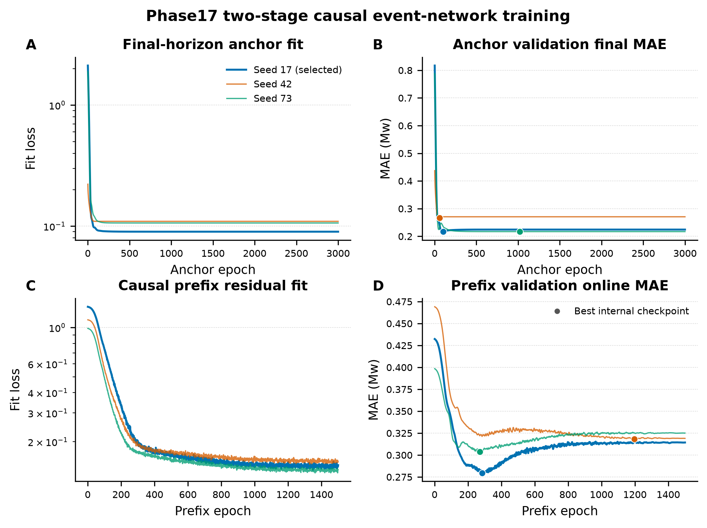
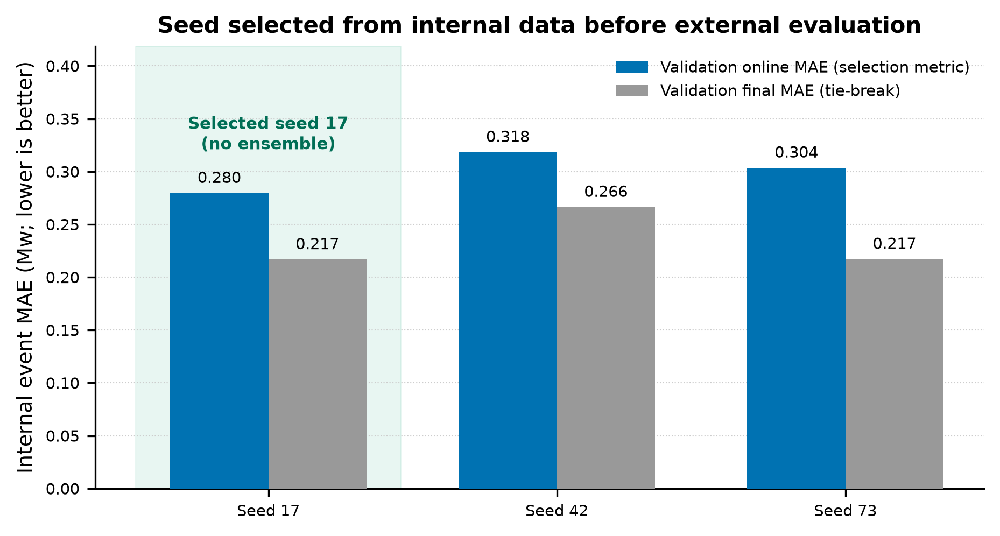
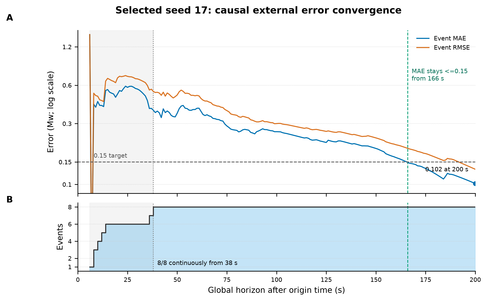
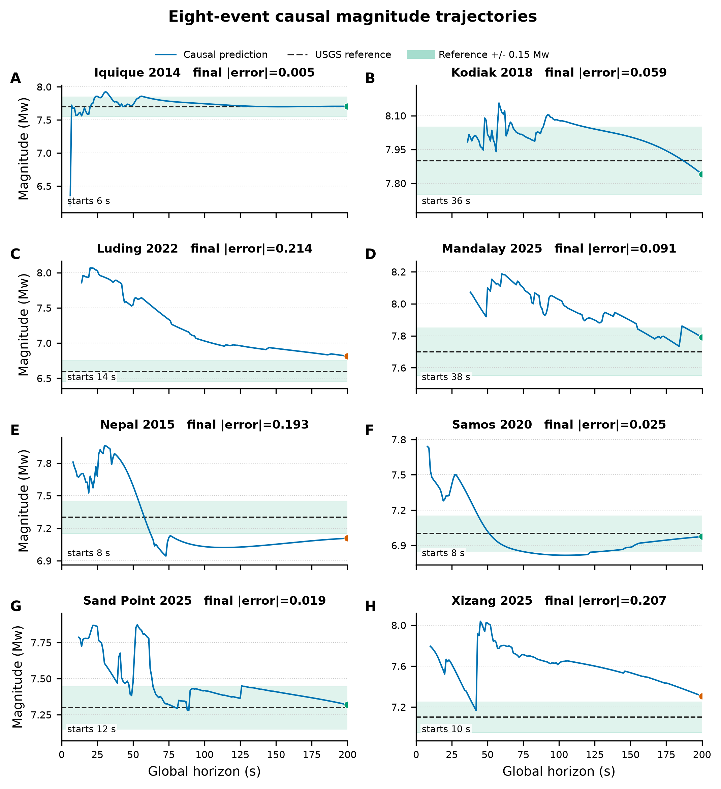
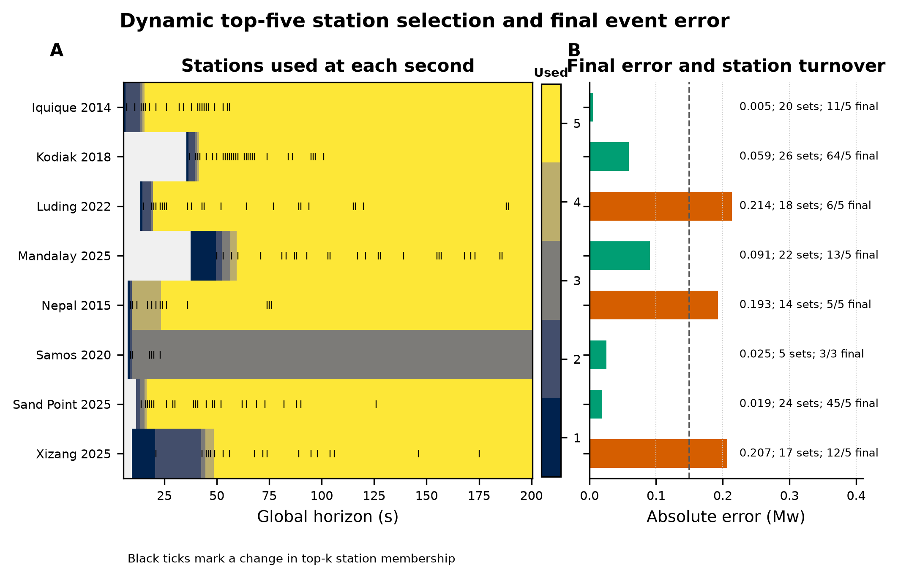

# Phase17 Causal R-only Single-seed Event Neural Model

> Fixed eight-event development validation. These events influenced earlier feature development and are not an unbiased final paper test set.

## Headline result

| Selected seed | Ensemble | Coverage at 200 s | Event MAE | Event RMSE | Bias | Events with abs. error <= 0.15 |
|---:|:---:|---:|---:|---:|---:|---:|
| 17 | no | 8/8 | 0.101627 | 0.131581 | +0.032241 | 5/8 |

The input is radial R only. At second `t`, the model uses only waveform samples available through `t`, after a conservative 6-second processing delay. Running peaks and the top-five station set are recomputed every second; no full-window peak or final station ranking is used.

## 1. Two-stage training dynamics

[Download PDF](figures/01_training_dynamics.pdf)

The 200-second amplitude anchor is trained first. A two-layer GELU prefix residual is then trained for evolving estimates and is gated to exactly zero at 200 seconds.

## 2. Internal single-seed selection

[Download PDF](figures/02_seed_selection.pdf)

| Seed | Validation online MAE | Validation final MAE | Selected |
|---:|---:|---:|:---:|
| 17 | 0.279643 | 0.216865 | yes |
| 42 | 0.318414 | 0.266477 | no |
| 73 | 0.303651 | 0.217152 | no |

All three seeds were trained. Seed 17 was selected once using internal validation online MAE before external waveforms were loaded. External predictions use only seed 17; there is no averaging and no per-event seed choice.

## 3. External error convergence

[Download PDF](figures/03_external_convergence.pdf)

All eight events have predictions continuously from 38 seconds onward. Event MAE first reaches and then remains <=0.15 Mw at 166 seconds.

| Global horizon | Event coverage | Event MAE |
|---:|---:|---:|
| 30 s | 6/8 | 0.559939 |
| 60 s | 8/8 | 0.396096 |
| 90 s | 8/8 | 0.259267 |
| 120 s | 8/8 | 0.224115 |
| 150 s | 8/8 | 0.191596 |
| 180 s | 8/8 | 0.120932 |
| 200 s | 8/8 | 0.101627 |

## 4. Eight event trajectories

[Download PDF](figures/04_event_trajectories.pdf)

| Event | Reference Mw | Predicted Mw at 200 s | Absolute error | Active/used stations |
|---|---:|---:|---:|---:|
| Iquique 2014 | 7.7 | 7.705 | 0.005 | 11/5 |
| Kodiak 2018 | 7.9 | 7.841 | 0.059 | 64/5 |
| Luding 2022 | 6.6 | 6.814 | 0.214 | 6/5 |
| Mandalay 2025 | 7.7 | 7.791 | 0.091 | 13/5 |
| Nepal 2015 | 7.3 | 7.107 | 0.193 | 5/5 |
| Samos 2020 | 7.0 | 6.975 | 0.025 | 3/3 |
| Sand Point 2025 | 7.3 | 7.319 | 0.019 | 45/5 |
| Xizang 2025 | 7.1 | 7.307 | 0.207 | 12/5 |

## 5. Dynamic station selection

[Download PDF](figures/05_dynamic_station_selection.pdf)

| Event | First prediction | Distinct station sets | Set changes | Final active/used |
|---|---:|---:|---:|---:|
| Iquique 2014 | 6 s | 20 | 21 | 11/5 |
| Kodiak 2018 | 36 s | 26 | 28 | 64/5 |
| Luding 2022 | 14 s | 18 | 23 | 6/5 |
| Mandalay 2025 | 38 s | 22 | 25 | 13/5 |
| Nepal 2015 | 8 s | 14 | 13 | 5/5 |
| Samos 2020 | 8 s | 5 | 6 | 3/3 |
| Sand Point 2025 | 12 s | 24 | 24 | 45/5 |
| Xizang 2025 | 10 s | 17 | 18 | 12/5 |

## Data and provenance

- [Seed selection](seed_selection.csv)
- [Final event predictions](external_final_event_predictions.csv)
- [Per-second horizon metrics](external_horizon_metrics.csv)
- [Per-second event predictions](external_online_predictions.csv)
- [Dynamic station summary](dynamic_station_summary.csv)
- [Publication manifest](publication_manifest.json)
- Formal implementation commit: `a337bd4`
- Outcome documentation commit: `5cd0194`
