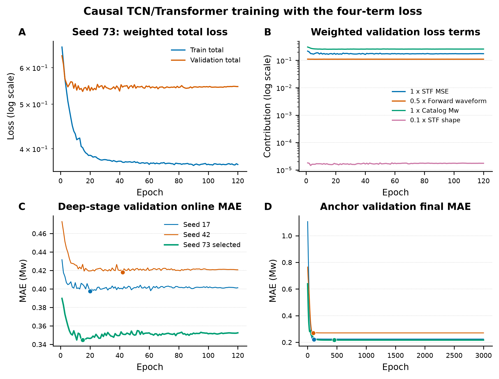
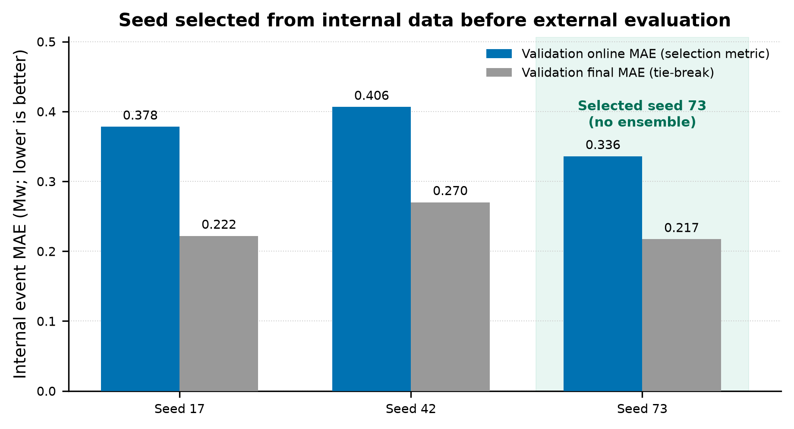
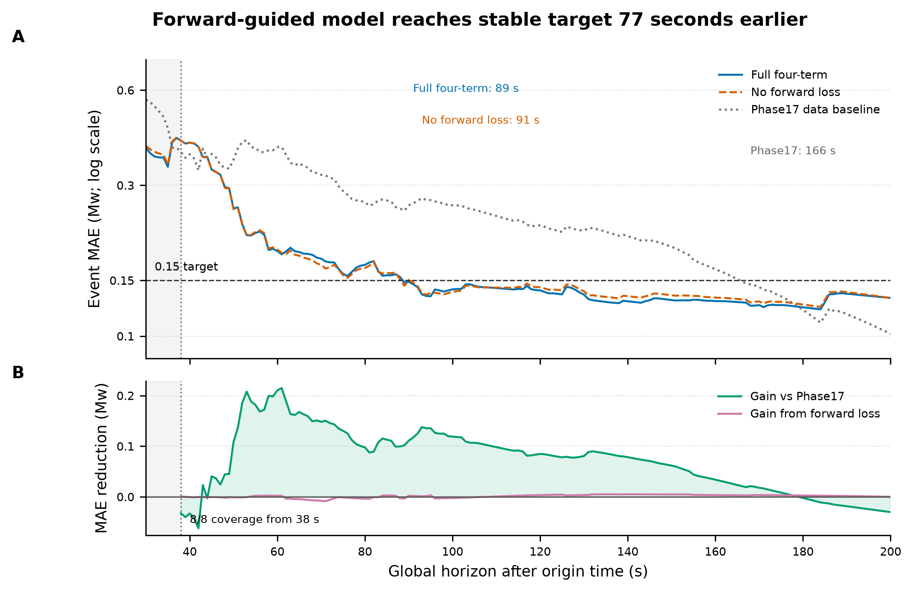
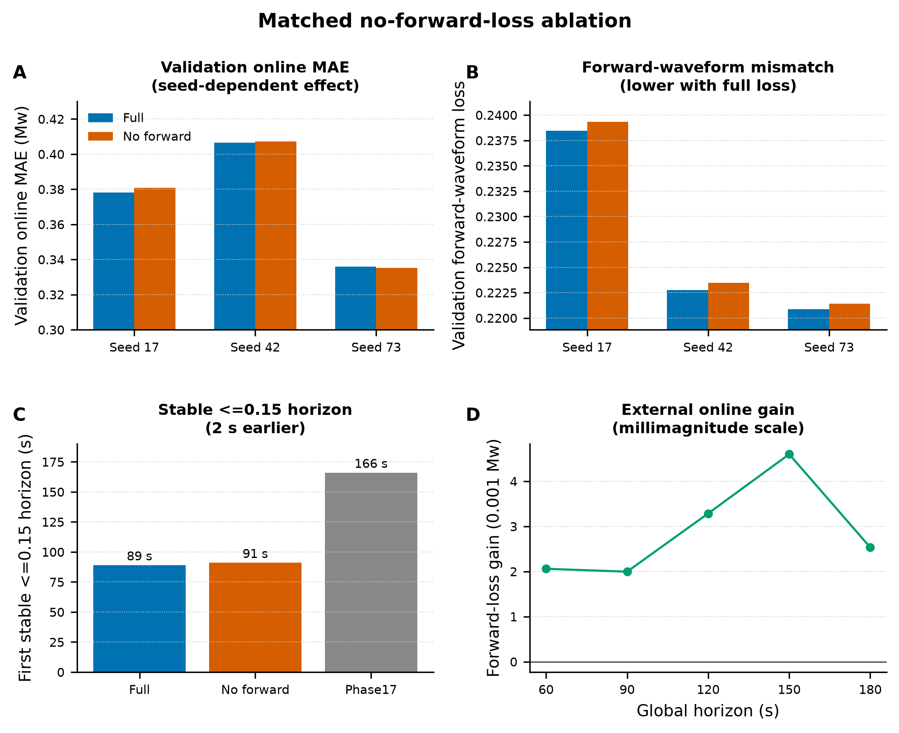
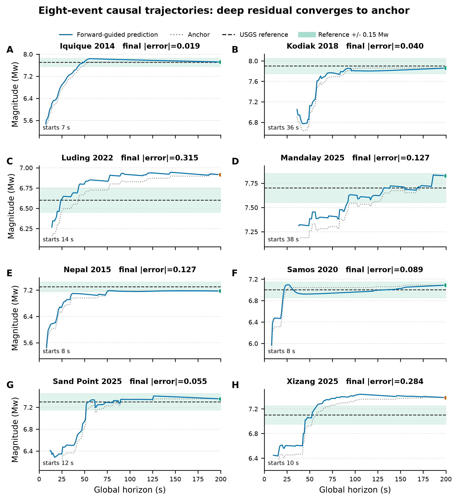
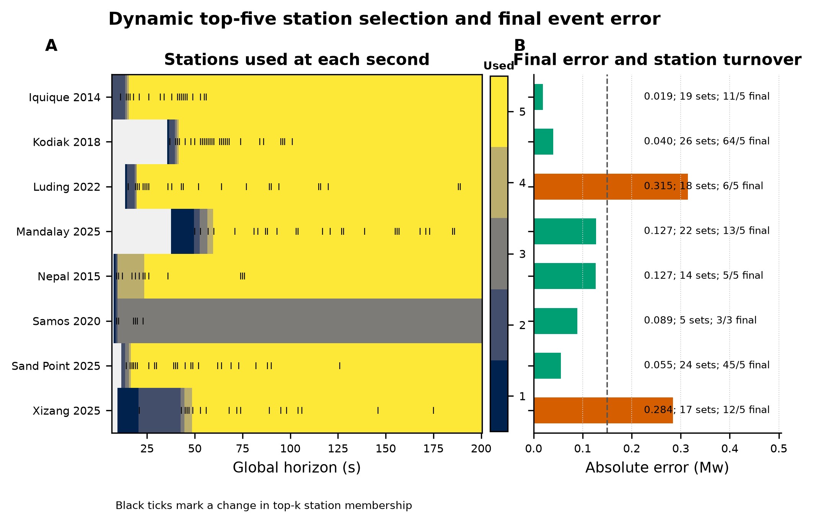

# Phase19 Causal Forward-Guided R-only Event Neural Model

> Fixed eight-event development validation. The events influenced feature and gate decisions and are not an unbiased final paper test set.

## Headline result

| Selected seed | Ensemble | Coverage | All-second MAE | 200 s MAE | 200 s RMSE | Bias | Events <=0.15 | Stable <=0.15 from |
|---:|:---:|---:|---:|---:|---:|---:|---:|---:|
| 73 | no | 8/8 | 0.215284 | 0.131990 | 0.167656 | +0.090314 | 6/8 | 89 s |

This is a causal forward-guided multi-task neural network, not a PINN. It retains causal TCN and masked Transformer layers plus the original STF MSE, forward-waveform, catalog-Mw, and STF-shape losses. At each second, dynamic top-five selection uses only the released R prefix after a conservative six-second processing delay.

The deep Mw residual is active online and is gated to exactly zero at 200 seconds. The final 0.131990 Mw result therefore comes from the stable amplitude-distance anchor; the deep branch's main scalar benefit is earlier convergence, while its shared STF remains trained by all four losses.

## 1. Four-term training dynamics

[Download PDF](figures/01_training_dynamics.pdf)

The full loss is `1.0 L_MSE + 0.5 L_synth + 1.0 L_mag + 0.1 L_shape`. The forward model uses absolute P/S delays and the signed full-radiation coefficients associated with Glehman et al. (2026), DOI `10.1029/2025JB033222`.

## 2. Internal single-seed selection

[Download PDF](figures/02_seed_selection.pdf)

| Seed | Validation online MAE | Validation final MAE | Selected |
|---:|---:|---:|:---:|
| 17 | 0.378165 | 0.221849 | no |
| 42 | 0.406408 | 0.270041 | no |
| 73 | 0.335906 | 0.217152 | yes |

All three seeds were trained before any external waveform was loaded. Seed 73 minimizes the predeclared internal all-second validation MAE. External evaluation uses only seed 73; there is no averaging or per-event seed choice.

## 3. External online convergence

[Download PDF](figures/03_online_convergence.pdf)

All eight events are covered continuously from 38 seconds. The full model remains <=0.15 Mw from 89 seconds, compared with 91 seconds without the forward loss and 166 seconds for Phase17.

| Horizon | Full model | No forward loss | Phase17 |
|---:|---:|---:|---:|
| 60 s | 0.185796 | 0.187856 | 0.396096 |
| 90 s | 0.148414 | 0.150411 | 0.259267 |
| 120 s | 0.139531 | 0.142818 | 0.224115 |
| 150 s | 0.129987 | 0.134587 | 0.191596 |
| 180 s | 0.123281 | 0.125816 | 0.120932 |
| 200 s | 0.131990 | 0.131990 | 0.101627 |

## 4. Matched forward-loss ablation

[Download PDF](figures/04_forward_loss_ablation.pdf)

The ablation changes only `lambda_synth: 0.5 -> 0.0`. The forward loss lowers validation waveform mismatch for all three seeds, improves three-seed mean validation online MAE by 0.000920 Mw, improves selected-seed external all-second MAE by 0.000842 Mw, and advances stable <=0.15 performance by two seconds. This is a small physical-consistency benefit, not the source of final accuracy.

| Seed | Full validation online MAE | No-forward MAE | No-forward minus full | Full L_synth | No-forward L_synth |
|---:|---:|---:|---:|---:|---:|
| 17 | 0.378165 | 0.380815 | +0.002651 | 0.238457 | 0.239340 |
| 42 | 0.406408 | 0.407172 | +0.000764 | 0.222766 | 0.223457 |
| 73 | 0.335906 | 0.335251 | -0.000654 | 0.220849 | 0.221410 |

## 5. Eight event trajectories

[Download PDF](figures/05_event_trajectories.pdf)

| Event | Reference Mw | Predicted Mw at 200 s | Absolute error | Active/used stations |
|---|---:|---:|---:|---:|
| Iquique 2014 | 7.7 | 7.719 | 0.019 | 11/5 |
| Kodiak 2018 | 7.9 | 7.860 | 0.040 | 64/5 |
| Luding 2022 | 6.6 | 6.915 | 0.315 | 6/5 |
| Mandalay 2025 | 7.7 | 7.827 | 0.127 | 13/5 |
| Nepal 2015 | 7.3 | 7.173 | 0.127 | 5/5 |
| Samos 2020 | 7.0 | 7.089 | 0.089 | 3/3 |
| Sand Point 2025 | 7.3 | 7.355 | 0.055 | 45/5 |
| Xizang 2025 | 7.1 | 7.384 | 0.284 | 12/5 |

## 6. Dynamic station selection

[Download PDF](figures/06_dynamic_station_selection.pdf)

| Event | First prediction | Distinct station sets | Set changes | Final active/used |
|---|---:|---:|---:|---:|
| Iquique 2014 | 7 s | 19 | 20 | 11/5 |
| Kodiak 2018 | 36 s | 26 | 28 | 64/5 |
| Luding 2022 | 14 s | 18 | 23 | 6/5 |
| Mandalay 2025 | 38 s | 22 | 25 | 13/5 |
| Nepal 2015 | 8 s | 14 | 13 | 5/5 |
| Samos 2020 | 8 s | 5 | 6 | 3/3 |
| Sand Point 2025 | 12 s | 24 | 24 | 45/5 |
| Xizang 2025 | 10 s | 17 | 18 | 12/5 |

## Data and provenance

- [Seed selection](seed_selection.csv)
- [Forward-loss ablation](forward_loss_ablation.csv)
- [Final event predictions](external_final_event_predictions.csv)
- [Full-model horizon metrics](external_horizon_metrics.csv)
- [No-forward horizon metrics](no_synth_horizon_metrics.csv)
- [Phase17 horizon metrics](phase17_horizon_metrics.csv)
- [Full-model per-second predictions](external_online_predictions.csv)
- [Dynamic station summary](dynamic_station_summary.csv)
- [Publication manifest](publication_manifest.json)
- Main model commit: `c7c1736`
- Ablation config commit: `de2149b`
- Outcome documentation commit: `9904903`
