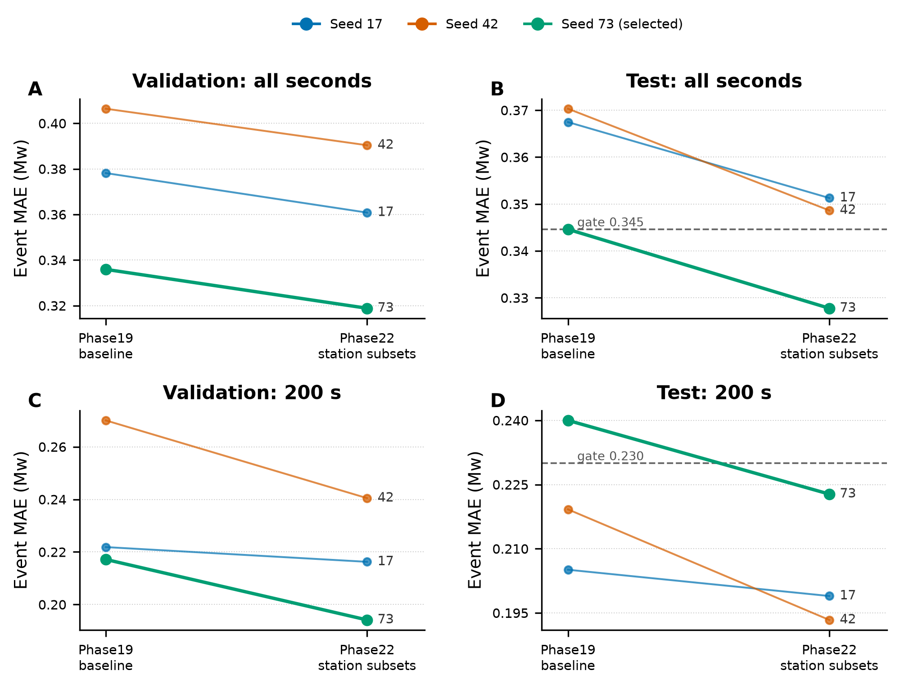
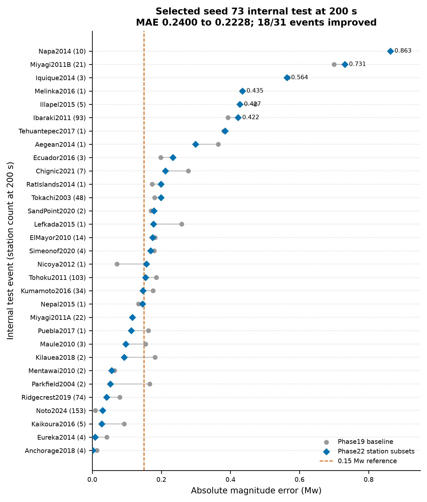

# Phase22 Station-Subset Robustness Result

> The fixed eight external events remain a development validation set. The internal station-random test was gated before external files were loaded.

## Headline result

| Metric | Phase19 baseline | Phase22 station subsets | Improvement |
|---|---:|---:|---:|
| Internal test all-second MAE | 0.344605 | 0.327774 | 0.016832 |
| Internal test 200 s MAE | 0.239998 | 0.222771 | 0.017227 |
| External all-second MAE | 0.215284 | 0.220199 | -0.004914 |
| External 200 s MAE | 0.131990 | 0.123864 | 0.008125 |

Seed 73 was selected only by internal validation all-second MAE. There is no seed averaging. The internal gate passed before the external eight-event directory was hashed or loaded.

The model remains R-only and causal. It retains the causal TCN, masked Transformer, shared STF, and the original `1.0 L_MSE + 0.5 L_synth + 1.0 L_mag + 0.1 L_shape` objective. The only scientific change is training-time exposure to one canonical station pool plus three deterministic 25% station subsets per event.

## 1. Same-split internal metrics

[Download PDF](figures/01_internal_metrics.pdf)

| Seed | Validation online | Test online | Test final | Selected |
|---:|---:|---:|---:|:---:|
| 17 | 0.360821 | 0.351281 | 0.198948 | no |
| 42 | 0.390380 | 0.348638 | 0.193354 | no |
| 73 | 0.318842 | 0.327774 | 0.222771 | yes |

All three Phase22 splits have the same assignment SHA as Phase19. Validation selected seed 73 without consulting test or external metrics.

Seed 42 happens to have the lowest Phase22 test final MAE (0.193354), but switching to it after viewing test would turn the test split into a model-selection set. The frozen validation rule is therefore retained.

## 2. Internal event residuals

[Download PDF](figures/02_internal_event_errors.pdf)

The 200-second absolute error improved for 18/31 internal test events. The mean improved from 0.239998 to 0.222771 Mw. The remaining large errors, especially Napa, Miyagi2011B, Iquique, Melinka, and Ibaraki, show that the internal result is materially better but not yet a <=0.15 Mw result.

## External development check

| Event | Stations available/used | Reference Mw | Predicted Mw | Absolute error |
|---|---:|---:|---:|---:|
| Iquique 2014 | 11/5 | 7.7 | 7.710905 | 0.010905 |
| Kodiak 2018 | 64/5 | 7.9 | 7.872855 | 0.027145 |
| Luding 2022 | 6/5 | 6.6 | 6.889972 | 0.289972 |
| Mandalay 2025 | 13/5 | 7.7 | 7.850008 | 0.150008 |
| Nepal 2015 | 5/5 | 7.3 | 7.159829 | 0.140171 |
| Samos 2020 | 3/3 | 7.0 | 7.040740 | 0.040740 |
| Sand Point 2025 | 45/5 | 7.3 | 7.345515 | 0.045515 |
| Xizang 2025 | 12/5 | 7.1 | 7.386456 | 0.286456 |

Coverage is 8/8 events and 159 accepted stations. The final external MAE is 0.123864 Mw, while the all-second external MAE changes from 0.215284 to 0.220199 Mw. This check was executed once after the internal gate passed; it is not an unbiased paper test.

## Data and provenance

- [Seed metrics](seed_metrics.csv)
- [Internal final-event comparison](internal_test_final_event_comparison.csv)
- [External final-event comparison](external_final_event_comparison.csv)
- [Publication manifest](publication_manifest.json)
- Implementation commit: `8884db2`
- Formal run: `phase22-forward-guided-station-subset-20260724T113401Z-8884db2`
- Selected checkpoint SHA-256: `61969f71eff384288de22af0d826fd2f03d181e3743c4894d4ce8dacc8baed6b`
