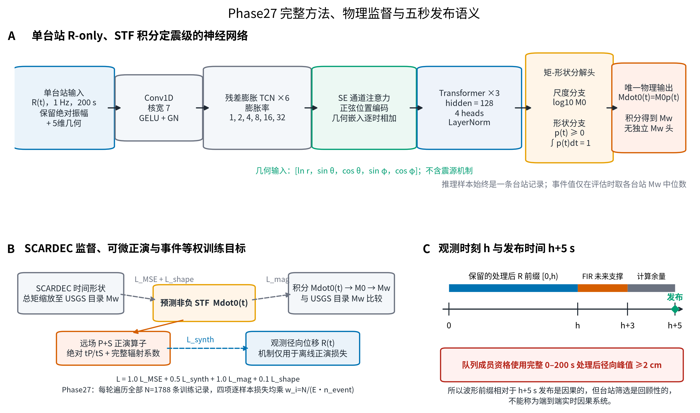
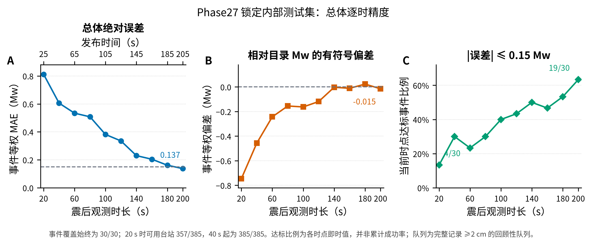
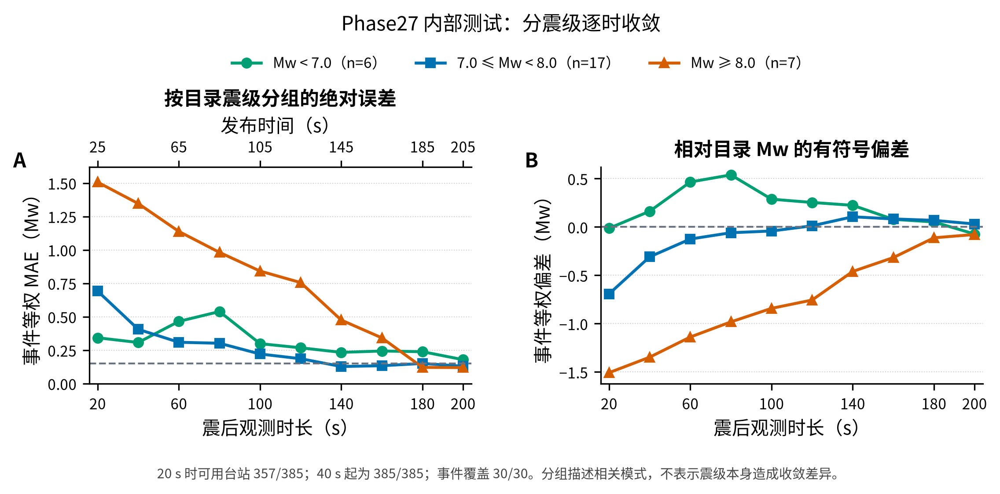
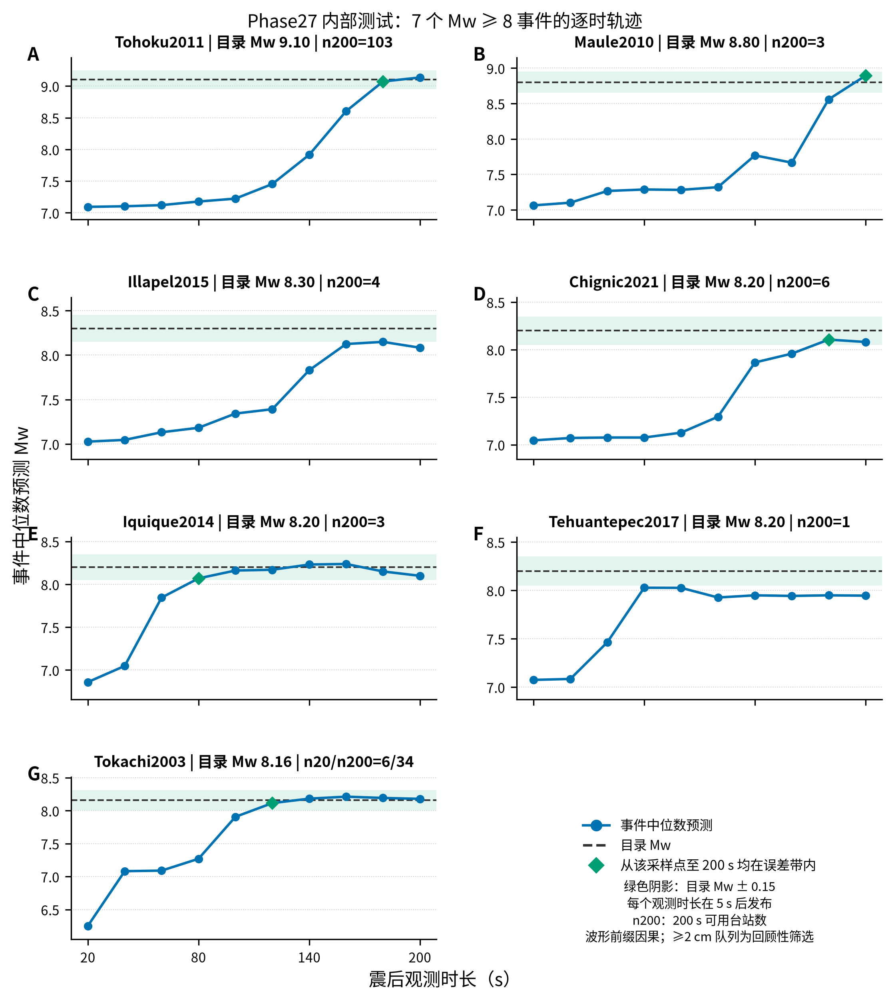
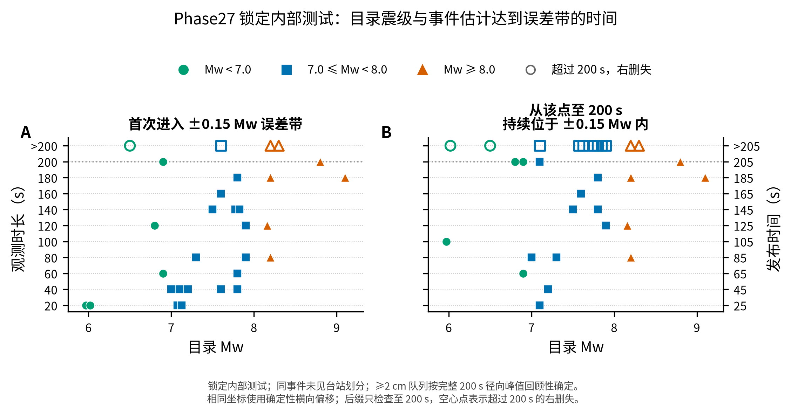
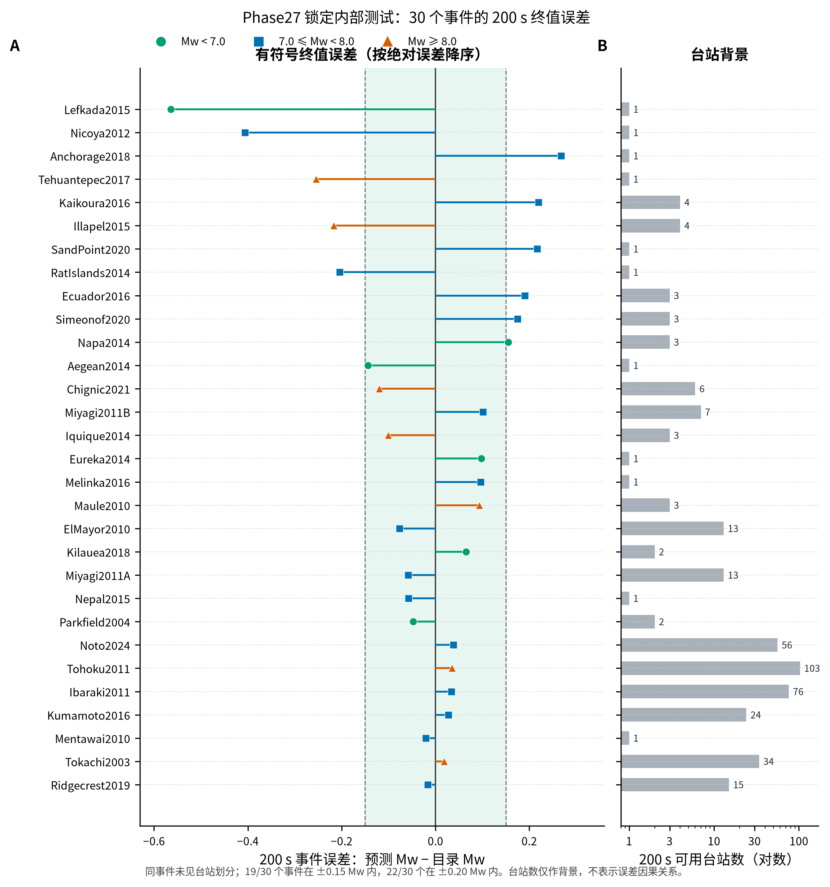
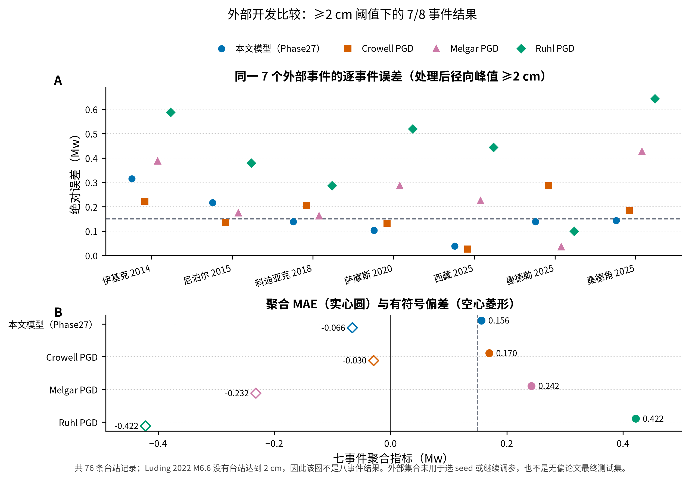

# Phase27 中文完整方法与结果图集

> 本页对应验证集选择的单一 seed 17。内部测试是同一批事件中的未见台站，不是未见事件测试；外部 8 事件是开发验证集合，不是无偏论文最终测试集。

## 核心结果

| 指标 | 结果 |
|---|---:|
| 内部 validation Event MAE | 0.111354 |
| 锁定内部 test Event MAE（200 s 观测 / 205 s 发布） | 0.137287 |
| 锁定内部 test Station MAE | 0.107366 |
| 锁定内部 test Event bias | -0.015141 |
| 内部事件 / 台站 | 30 / 385 |
| 从某个采样点至 200 s 始终满足绝对误差≤0.15 Mw | 19/30 事件 |
| 外部 ≥2 cm Event MAE | 0.156270（7/8 事件，76 台站） |
| 外部 cm0 Event MAE | 0.226682（8/8 事件） |

外部 ≥2 cm 的第 8 个事件 Luding 2022 M6.6 没有任何台站达到阈值，因此 0.156270 只能称为 7/8 事件结果。当前模型在这 7 个事件中有 5/7 满足 |误差|≤0.15；它不能替代完整八事件指标。

## 方法总览

### 1. 数据、预处理与划分

- 活动快照包含 31 个可用事件、2558 条台站记录。数据 SHA-256：`2e1fa4c12fc1eb03ffc8bf9235491f0886d4b0d360ebcb3486baca4d948cfd6a`。
- 每个样本只输入一条台站径向位移 R；不使用 T/Z、动态 top-5、事件共享 STF、经验幅值-距离锚点或独立 Mw 预测头。
- 波形保留物理绝对振幅，采样率 1 Hz，窗口 0–200 s；正式流程不插值。使用 7 taps（order 6）Hamming FIR 低通，截止频率 0.2 Hz。
- 训练队列按完整 200 s 处理后径向峰值 ≥2 cm 决定成员资格。这个筛选是回顾性的。
- seeds 17/42/73 都使用 within-event station split，每个 seed 为 1788/385/385 条 train/validation/test。Puebla 只有一条记录，只留在训练集，所以 validation/test 各覆盖 30 个事件。

### 2. 网络与 STF 唯一震级路径

- 主干依次为 Conv1D stem、6 个残差膨胀 TCN block、SE 通道注意力、正弦位置编码与 5 维机制无关几何嵌入、3 层 Transformer。hidden size 为 128，Transformer 为 4 heads，dropout 为 0.2；总参数量 1,010,850。
- 几何输入为 `[ln(r), sin(theta), cos(theta), sin(phi), cos(phi)]`。震源机制不进入推理输入；它只用于离线训练期完整辐射系数和正演波形损失。
- 输出头把 STF 分成总矩尺度和归一化时间形状：形状分支产生 `p(t)≥0` 且 `integral p(t)dt=1`，尺度分支产生 `log10(M0)`，最终 `Mdot0(t)=10^log10(M0) * p(t)`。因此 STF 非负且积分严格等于 M0。
- `Mw=(2/3)(log10(M0)-9.1)` 只由同一 STF 的积分得到，没有第二条标量震级路径。

### 3. 物理正演与四项损失

SCARDEC 提供 STF 时间形状，总矩缩放到 USGS 目录 Mw。可微正演算子使用震源距、`alpha=7900 m/s`、`beta=4533 m/s`、`rho=3400 kg/m^3`、绝对 P/S 延迟、远场 P+S 和完整辐射系数；中场项关闭。正演形式参考 [DOI 10.1029/2025JB033222](https://doi.org/10.1029/2025JB033222)。

```text
L = 1.0 L_MSE + 0.5 L_synth + 1.0 L_mag + 0.1 L_shape
```

- `L_MSE`：`log10(1 + Mdot0 / M_ref)` 编码空间中的预测 STF 与参考 STF 均方误差，其中 `M_ref = 1e18 N·m/s`。
- `L_synth`：预测 STF 经可微正演后与观测径向位移的一致性。
- `L_mag`：STF 积分得到的 Mw 与 USGS 目录 Mw 的平方误差。
- `L_shape`：积分归一化后 STF 时间形状的均方误差。

非负性由输出参数化直接保证，不存在第五个 `L_nonneg`。

### 4. Phase27 的单一改动

Phase27 不改网络、输入、四项损失或划分，只改变训练目标的估计方式。每个 epoch 遍历全部 N=1788 条训练记录，并对四项逐样本损失统一施加：

```text
w_i = N / (E * n_event),    E = 31
batch loss = mean(w_i * per_sample_loss_i)
```

因此每个训练事件的总目标质量相同；权重范围为 0.119663–57.677419。这不是新增损失项，也不是事件级模型。

### 5. seed 选择与数据边界

| Seed | validation Event MAE | 是否选择 |
|---:|---:|:---:|
| 17 | 0.111354 | 是 |
| 42 | 0.132082 | 否 |
| 73 | 0.201927 | 否 |

只按内部 validation 选择 seed 17，不做 seed 平均。候选冻结后才一次性读取锁定内部 test；只有内部 Event MAE 小于 0.15 后，才报告外部开发集合。外部结果没有用于选择 seed 或 Phase27 变量。

## 1. 方法、物理监督与五秒发布语义



[查看可编辑文字 PDF](figures/01_method_and_causal_timing.pdf)

对观测时长 h，模型输入只保留 `[0,h)` 的处理后波形槽，后续槽置零；居中 FIR 最多需要到 h+3 s 的原始波形支撑，结果在 h+5 s 发布。因此它相对于发布时间是波形前缀因果的。TCN 卷积和 Transformer 本身并不是严格 causal/masked 结构，不应这样命名。更重要的是，≥2 cm 队列依赖完整 200 s 峰值，所以系统不是端到端实时因果选站。

## 2. 内部总体逐时精度



[查看 PDF](figures/02_overall_internal_convergence.pdf)

总体 Event MAE 从 20 s 观测（25 s 发布）的 0.8122 降至 200 s 观测（205 s 发布）的 0.1373；bias 从 -0.7462 收敛到 -0.0151。当前时点满足 |误差|≤0.15 的事件由 4/30 增至 19/30。该比例逐时独立计算，可能非单调，不是累计成功率。

## 3. 分震级逐时收敛



[查看 PDF](figures/03_magnitude_group_convergence.pdf)

| 观测 / 发布 | Mw < 7 MAE | 7≤Mw<8 MAE | Mw≥8 MAE | Mw≥8 bias |
|---:|---:|---:|---:|---:|
| 20 / 25 s | 0.3428 | 0.6918 | 1.5068 | -1.5068 |
| 100 / 105 s | 0.2987 | 0.2214 | 0.8417 | -0.8417 |
| 180 / 185 s | 0.2387 | 0.1508 | 0.1212 | -0.1119 |
| 200 / 205 s | 0.1789 | 0.1298 | 0.1198 | -0.0777 |

Mw≥8 组在 20 s 时的 MAE 与 bias 都为约 1.5068，表现为一致的早期低估；到 200 s 三组 MAE 为 0.1789/0.1298/0.1198。分组图是描述性结果，不能解释为震级本身造成差异。

## 4. 七个 Mw≥8 事件轨迹



[查看 PDF](figures/04_high_magnitude_event_trajectories.pdf)

| 事件 | 目录 Mw | 首次进入 ±0.15 | 从该点至 200 s 均达标 | 200 s 绝对误差 | n200 |
|---|---:|---:|---:|---:|---:|
| Tohoku2011 | 9.10 | 180 s | 180 s | 0.0351 | 103 |
| Maule2010 | 8.80 | 200 s | 200 s | 0.0937 | 3 |
| Illapel2015 | 8.30 | 未达到 | >200 s（右删失） | 0.2167 | 4 |
| Chignic2021 | 8.20 | 180 s | 180 s | 0.1196 | 6 |
| Iquique2014 | 8.20 | 80 s | 80 s | 0.1006 | 3 |
| Tehuantepec2017 | 8.20 | 未达到 | >200 s（右删失） | 0.2546 | 1 |
| Tokachi2003 | 8.16 | 120 s | 120 s | 0.0186 | 34 |

Tokachi2003 在 20 s 只有 6 个可用台站，到 200 s 为 34 个；其余高震级事件的逐时台站数不变。图中绿色菱形只表示从该采样点到 200 s 终点持续达标。

## 5. 目录震级与进入误差带的时间



[查看 PDF](figures/05_convergence_time_by_magnitude.pdf)

首次进入误差带与后缀达标不是一回事：事件可能先进入、随后又离开。后缀达标要求之后所有已采样时点直到 200 s 都保持在带内。没有满足的 11 个事件按超过 200 s 右删失，不能强行赋值为 200 s。

| 震级组 | 事件数 | 已进入者的首次进入中位数 | 删失感知的后缀中位数 | 200 s 前后缀达标 |
|---|---:|---:|---:|---:|
| Mw < 7.0 | 6 | 60 s | 200 s 观测 / 205 s 发布 | 4/6 |
| 7.0 ≤ Mw < 8.0 | 17 | 70 s | 180 s 观测 / 185 s 发布 | 10/17 |
| Mw ≥ 8.0 | 7 | 180 s | 180 s 观测 / 185 s 发布 | 5/7 |

## 6. 30 个内部事件的终值误差与台站背景



[查看 PDF](figures/06_final_event_errors_and_station_counts.pdf)

200 s 时 19/30 个事件在 ±0.15 Mw 内，22/30 个在 ±0.20 Mw 内。每事件 test 台站数范围 1–103，中位数 3。下表列出绝对误差最大的事件；完整 30 行见 CSV。

| 事件 | 目录 Mw | 预测 Mw | 有符号误差 | 绝对误差 | 台站数 |
|---|---:|---:|---:|---:|---:|
| Lefkada2015 | 6.50 | 5.935 | -0.565 | 0.565 | 1 |
| Nicoya2012 | 7.60 | 7.194 | -0.406 | 0.406 | 1 |
| Anchorage2018 | 7.10 | 7.367 | +0.267 | 0.267 | 1 |
| Tehuantepec2017 | 8.20 | 7.945 | -0.255 | 0.255 | 1 |
| Kaikoura2016 | 7.80 | 8.020 | +0.220 | 0.220 | 4 |
| Illapel2015 | 8.30 | 8.083 | -0.217 | 0.217 | 4 |
| SandPoint2020 | 7.60 | 7.817 | +0.217 | 0.217 | 1 |
| RatIslands2014 | 7.90 | 7.696 | -0.204 | 0.204 | 1 |

少台站事件中存在大误差，但多台站并不保证误差小；右栏台站数只是上下文，不能据此建立因果解释。

## 7. 外部 ≥2 cm 的同事件方法比较



[查看 PDF](figures/07_external_cm2_method_comparison.pdf)

| 方法 | 七事件 MAE | bias | RMSE | 绝对误差≤0.15 Mw |
|---|---:|---:|---:|---:|
| 本文模型（Phase27） | 0.156270 | -0.066026 | 0.176095 | 5/7 |
| Crowell PGD | 0.169640 | -0.029511 | 0.186132 | 3/7 |
| Melgar PGD | 0.242190 | -0.232032 | 0.272973 | 1/7 |
| Ruhl PGD | 0.421949 | -0.421949 | 0.456206 | 1/7 |

| 事件 | 目录 Mw | Phase27 绝对误差 | Crowell | Melgar | Ruhl | Phase27 台站数 |
|---|---:|---:|---:|---:|---:|---:|
| 伊基克 2014 | 7.7 | 0.314 | 0.222 | 0.387 | 0.587 | 11 |
| 尼泊尔 2015 | 7.3 | 0.217 | 0.134 | 0.174 | 0.378 | 5 |
| 科迪亚克 2018 | 7.9 | 0.139 | 0.205 | 0.162 | 0.286 | 46 |
| 萨摩斯 2020 | 7.0 | 0.103 | 0.132 | 0.286 | 0.519 | 3 |
| 西藏 2025 | 7.1 | 0.039 | 0.026 | 0.225 | 0.443 | 2 |
| 曼德勒 2025 | 7.7 | 0.138 | 0.286 | 0.036 | 0.099 | 5 |
| 桑德角 2025 | 7.3 | 0.144 | 0.183 | 0.427 | 0.643 | 4 |

本文模型在相同 7 事件上优于三种 PGD 汇总 MAE，但 0.156270 仍高于 0.15，且缺少 Luding。不能据此声称已经完成 8/8 外部目标，也没有进行显著性检验。

## 结论边界

- 推荐名称：**单台站 R-only、STF 积分定震级的物理正演约束神经网络**。
- 逐时实验是波形前缀诊断；网络不是严格因果卷积或 masked Transformer。
- 内部 test 是同事件未见台站，不证明对全新事件的无偏泛化。
- ≥2 cm 台站成员来自完整记录，当前评估不是端到端实时系统。
- 外部 8 事件已用于开发验证，不能继续据此选择结构或作为论文最终盲测。
- 后缀达标只定义到 200 s 观测终点，不推断 200 s 之后的稳定性。

## 数据表与可复现来源

- [总体逐时指标](overall_horizon_metrics.csv)
- [分震级逐时指标](magnitude_group_horizon_metrics.csv)
- [全部事件逐时预测](event_predictions_by_horizon.csv)
- [事件首次/后缀达标与删失表](event_convergence_summary.csv)
- [内部 30 事件终值误差](final_event_errors.csv)
- [外部 ≥2 cm 逐事件四方法对比](external_cm2_event_comparison.csv)
- [外部 ≥2 cm 四方法汇总](external_cm2_method_summary.csv)
- [发布清单与 SHA-256](publication_manifest.json)
- [可复现中文生成器](../../../scripts/plotting/plot_phase27_complete_results_zh.py)
- [共享英文科学派生实现](../../../scripts/plotting/plot_phase27_magnitude_convergence.py)

模型/评估 commit：`e02aecac9b1211851b926d69e57c78da34970d1a`
选择 checkpoint SHA-256：`c7d50f3d5ecfa9418f33743209a8e390431545047ca97539c6155c829ab94805`
正式运行：`phase27-manuscript-stf-event-loss-weighted-20260724T221820Z-e02aeca`
