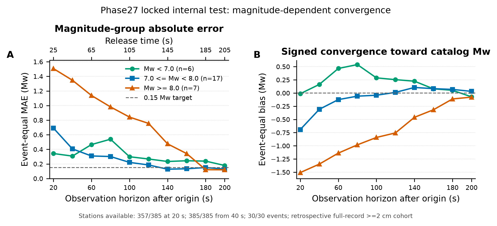
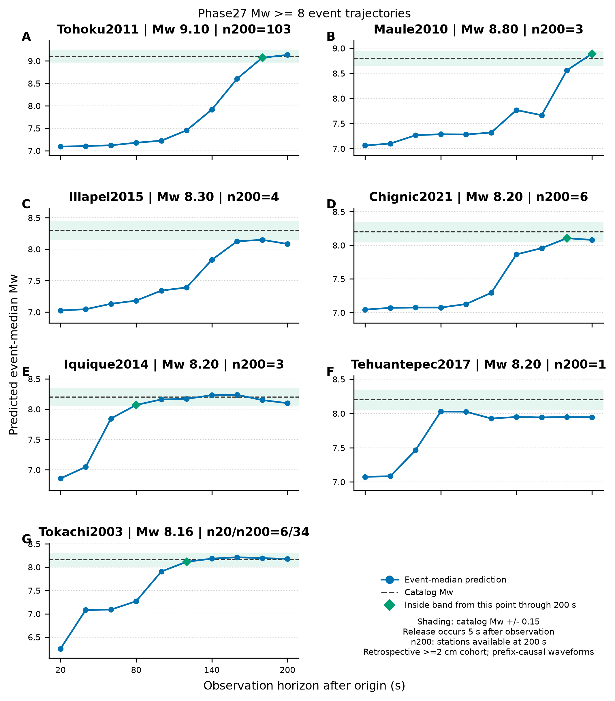
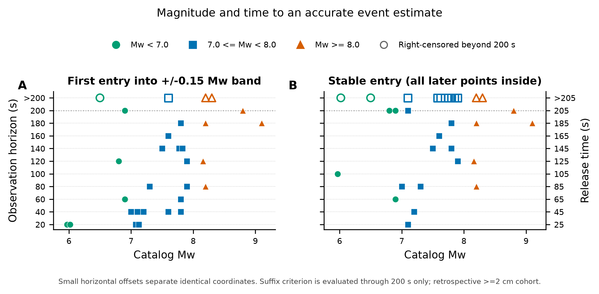

# Phase27 Manuscript STF Magnitude-Convergence Result

> Locked internal test diagnostics for validation-selected seed 17. This is a same-event, unseen-station split, not an unseen-event test.

## Headline result

| Metric | Result |
|---|---:|
| Validation Event MAE | 0.111354 |
| Locked test Event MAE at 200 s | 0.137287 |
| Locked test Station MAE at 200 s | 0.107366 |
| Test events / stations | 30 / 385 |
| Inside +/-0.15 Mw from some sampled horizon through 200 s | 19/30 events |
| Final observation / release | 200 s / 205 s |

The model uses R only, predicts one nonnegative STF, and derives Mw only from the STF integral. Seed 17 was selected by internal validation before the locked test was evaluated; there is no seed averaging.

The waveform prefix at every plotted horizon is causal and is released five seconds later. The displayed cohort is not end-to-end causal, because membership uses the processed radial peak over the complete 200 s record (>=2 cm). The figures must therefore be read as delayed-prefix diagnostics on a retrospective cohort.

## 1. Magnitude-group convergence

[Download PDF](figures/01_magnitude_group_convergence.pdf)

High-magnitude events are strongly underestimated early: the Mw>=8 group begins at 1.5068 Mw MAE and -1.5068 Mw bias at a 20 s observation horizon. It reaches 0.1212 Mw MAE at 180 s and 0.1198 Mw at 200 s. This is a group-level delayed convergence pattern, not evidence that every large event converges later than every smaller event.

| Observation / release | Mw < 7 MAE | 7 <= Mw < 8 MAE | Mw >= 8 MAE | Mw >= 8 bias |
|---:|---:|---:|---:|---:|
| 20 / 25 s | 0.3428 | 0.6918 | 1.5068 | -1.5068 |
| 100 / 105 s | 0.2987 | 0.2214 | 0.8417 | -0.8417 |
| 140 / 145 s | 0.2337 | 0.1279 | 0.4751 | -0.4599 |
| 160 / 165 s | 0.2437 | 0.1338 | 0.3420 | -0.3165 |
| 180 / 185 s | 0.2387 | 0.1508 | 0.1212 | -0.1119 |
| 200 / 205 s | 0.1789 | 0.1298 | 0.1198 | -0.0777 |

Station availability is 357/385 at the 20 s observation / 25 s release and 385/385 from the 40 s observation / 45 s release onward. Event coverage remains 30/30. The changing event is Tokachi2003 6->34 stations.

## 2. Mw >= 8 event trajectories

[Download PDF](figures/02_high_magnitude_event_trajectories.pdf)

| Event | Catalog Mw | First within +/-0.15 | Inside from this horizon through 200 s | Final absolute error | Stations at 200 s |
|---|---:|---:|---:|---:|---:|
| Tohoku2011 | 9.10 | 180 s | 180 s | 0.0351 | 103 |
| Maule2010 | 8.80 | 200 s | 200 s | 0.0937 | 3 |
| Illapel2015 | 8.30 | not reached | right-censored | 0.2167 | 4 |
| Chignic2021 | 8.20 | 180 s | 180 s | 0.1196 | 6 |
| Iquique2014 | 8.20 | 80 s | 80 s | 0.1006 | 3 |
| Tehuantepec2017 | 8.20 | not reached | right-censored | 0.2546 | 1 |
| Tokachi2003 | 8.16 | 120 s | 120 s | 0.0186 | 34 |

## 3. Magnitude and convergence time

[Download PDF](figures/03_convergence_time_by_magnitude.pdf)

First entry and suffix-stable entry are different. An event may briefly enter the +/-0.15 Mw band and leave it again. Suffix-stable entry requires every later sampled horizon through 200 s to remain inside; it does not claim stability after 200 s. Events that fail this condition are plotted as right-censored rather than assigned a false 200 s convergence time. Small deterministic horizontal offsets separate events with identical plotted coordinates.

| Magnitude group | Events | Median first entry among reached | Censor-aware stable median | Stable by 200 s |
|---|---:|---:|---:|---:|
| Mw < 7.0 | 6 | 60 s | 200 s observation / 205 s release | 4/6 |
| 7.0 <= Mw < 8.0 | 17 | 70 s | 180 s observation / 185 s release | 10/17 |
| Mw >= 8.0 | 7 | 180 s | 180 s observation / 185 s release | 5/7 |

## Data and provenance

- [All event predictions by horizon](event_predictions_by_horizon.csv)
- [Magnitude-group horizon metrics](magnitude_group_horizon_metrics.csv)
- [Event convergence summary](event_convergence_summary.csv)
- [Publication manifest](publication_manifest.json)
- [Reproducible generator](../../../scripts/plotting/plot_phase27_magnitude_convergence.py)
- Model/evaluation commit: `e02aecac9b1211851b926d69e57c78da34970d1a`
- Selected checkpoint SHA-256: `c7d50f3d5ecfa9418f33743209a8e390431545047ca97539c6155c829ab94805`
- Formal run: `phase27-manuscript-stf-event-loss-weighted-20260724T221820Z-e02aeca`
