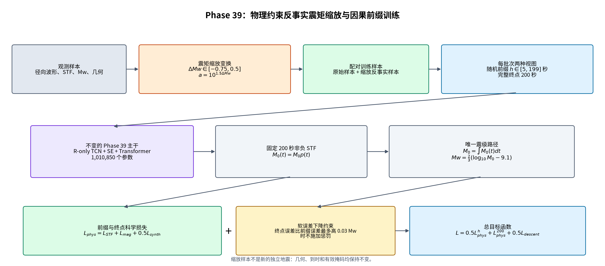
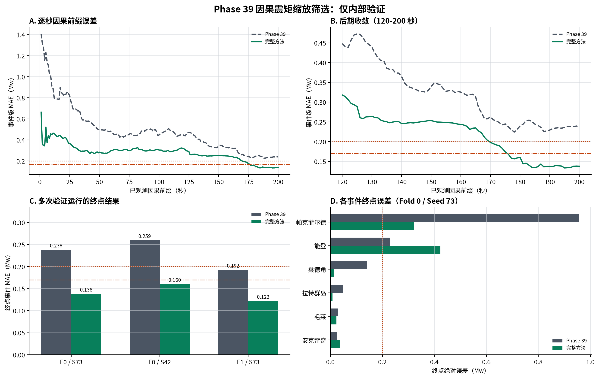
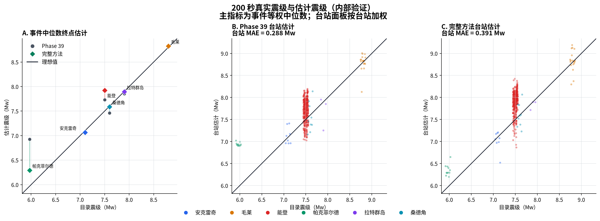
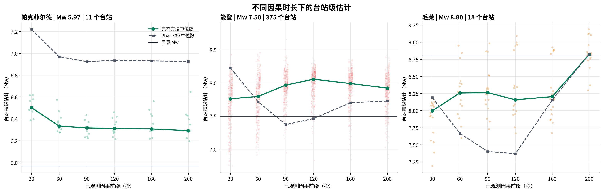
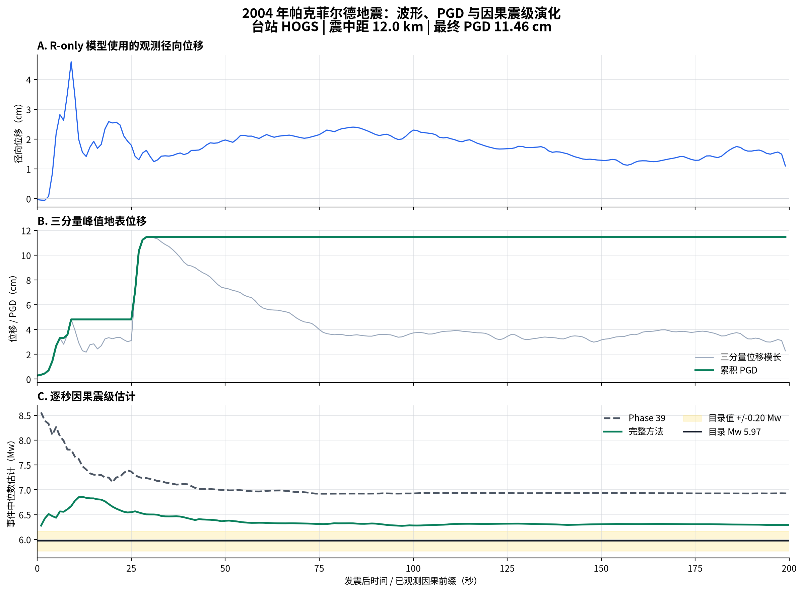
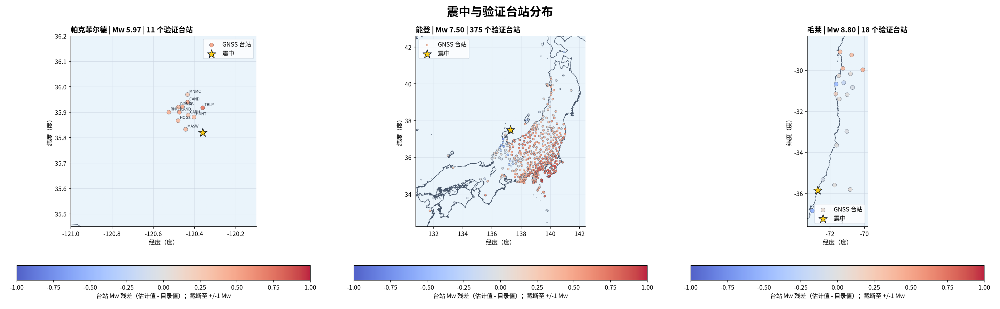

# 基于物理正演约束与反事实震矩缩放的逐秒 GNSS 震级估计：Phase 39 内部验证研究

> 稿件状态：完整中文初稿。本文报告的是模型筛选阶段的内部验证结果，不是完整 5 折 OOF、锁定测试集或 8 个外部事件的最终结果。

## 摘要

快速、稳定且物理可解释的地震震级估计是 GNSS 地震预警中的关键问题。传统峰值地表位移（peak ground displacement, PGD）方法通常依据峰值振幅、震源距离与震级之间的经验标度关系进行估计，具有计算简单的优势，但难以直接利用完整波形时序，也不能显式约束预测震源时间函数（source time function, STF）能否正演重构观测位移。本文在 Phase 39 的单台站径向位移模型基础上，提出一个逐秒因果前缀训练方案。模型结构和 1,010,850 个参数保持不变；每个观测前缀均输出一条固定 200 秒、非负的矩率/STF 曲线，震级只由该曲线积分得到。核心物理约束为可微正演合成波形损失 `L_synth`。为扩大这一约束覆盖的震矩范围，训练中构造原始样本与反事实震矩缩放样本的配对：采样 `Delta Mw in [-0.75, 0.5]`，令 `a = 10^(1.5 Delta Mw)`，将径向波形、模型输入和目标 STF 同乘 `a`，并把目标震级改为 `Mw + Delta Mw`，而几何、到时和掩码保持不变。此外，引入带 0.03 Mw 松弛量的软误差下降损失，使终点估计在总体上优于随机前缀估计，同时允许逐秒短期波动。

在三次预先固定配置的内部验证运行中，完整方法的 200 秒事件等权 MAE 为 `0.13979 +/- 0.01930 Mw`，Phase 39 基线均值为 `0.22993 Mw`。代表性 Fold 0 / Seed 73 的事件 MAE 从 `0.23808` 降至 `0.13784 Mw`，120 秒后的事件逐秒变化 P95 为 `0.01947 Mw`。但是，台站加权 MAE 从 `0.28758` 增至 `0.39058 Mw`。能登 2024 占该验证折 424 个台站中的 375 个，其事件中位残差由 Phase 39 的 `+0.229 Mw` 增至完整方法的 `+0.423 Mw`，形成广泛而系统的正偏差。结果说明，该方法显著改善了当前内部验证中的事件等权精度和后期稳定性，但尚不能证明震矩缩放本身的独立贡献，也没有解决密集台网下大型复杂事件的跨台站校准问题。

**关键词：** GNSS；地震预警；震级估计；震源时间函数；物理约束损失；合成波形；震矩缩放；因果前缀

## 1. 引言

GNSS 能够直接记录强震引起的永久和长周期地表位移，在大震不饱和震级估计中具有重要价值。传统 PGD 方法把观测到的峰值位移与震源距离输入经验标度关系，从而快速得到震级。该路线简单、稳健且易于部署，但通常把波形压缩成一个峰值，难以描述震源释放过程，也不能保证估计震级所对应的震矩释放能够通过波动传播模型重构观测位移。

深度学习可以利用完整时间序列，但直接回归一个标量震级容易产生两个问题。第一，网络可能依赖数据集中的统计相关性，而不是震矩、STF 与位移之间的物理关系。第二，若模型在每个时刻独立处理不同长度的波形，逐秒估计可能大幅波动，最终精度与动态收敛之间缺少明确联系。

Phase 39 采用不同的震级路径：模型首先预测非负 STF/矩率曲线，再对其积分得到标量震矩和 Mw；训练中用 `L_synth` 将预测 STF 通过可微正演算子映射回径向位移，并与 GNSS 观测比较。本文不改变这一核心结构，而是解决两个训练层面的问题：

1. 如何让同一个 Phase 39 模型真正适应 1--200 秒的变长因果前缀；
2. 如何在保留 `L_synth` 创新点的前提下，使模型学习“振幅按震矩缩放时，输出震矩也应相应变化”的等变关系。

本文的主要贡献可概括为：

1. 构建不增加参数的逐秒因果前缀训练目标，使每个前缀都预测完整 200 秒 STF，并从同一 STF 积分得到 Mw；
2. 提出与物理正演约束配套的反事实震矩缩放增强，将原始样本与受控缩放样本成对训练，而不是生成新的独立地震事件；
3. 加入带松弛量的软误差下降约束，鼓励整体误差随观测增长而降低，同时不要求每一秒严格单调；
4. 同时报告事件等权与台站加权结果，并把能登 2024 的系统退化作为方法限制进行分析。



## 2. 方法

### 2.1 问题定义、输入与输出

对第 `i` 个台站，在观测时长 `h` 秒时，模型输入为处理后的单分量径向 GNSS 位移前缀

```text
x_i,1:h in R^(1 x h),    h = 1, 2, ..., 200 s
```

以及五维几何元数据

```text
g_i = [ln(r_i), sin(theta_i), cos(theta_i), sin(phi_i), cos(phi_i)].
```

其中 `r_i` 为震源距，`theta_i` 和 `phi_i` 描述台站相对震源的几何方向。推理输入不包含手工 PGD 特征、震源机制、上一秒状态或独立 Mw 预测头。

对于任意长度的输入前缀，网络输出固定 200 个时间步的非负矩率曲线

```text
Mdot_i^(h)(tau),    tau = 1, 2, ..., 200 s.
```

总震矩与震级由同一输出唯一确定：

```text
M0_i^(h) = integral Mdot_i^(h)(tau) d tau,
Mw_i^(h) = (2/3) [log10 M0_i^(h) - 9.1].
```

每个台站独立产生一个 Mw。事件级估计为同一事件全部验证台站预测的中位数，主指标对事件等权。

### 2.2 数据、划分与数据角色

活动数据快照包含 31 个事件和 2,558 条通过预处理与阈值筛选的台站记录。代表性 Fold 0 / Seed 73 使用严格按事件分组的划分：

| 子集 | 事件数 | 台站记录数 | 本文是否评分 |
|---|---:|---:|:---:|
| 训练 | 19 | 1,744 | 是 |
| 内部验证 | 6 | 424 | 是 |
| 锁定测试 | 6 | 390 | 否 |

内部验证事件为 Anchorage 2018、Maule 2010、Noto 2024、Parkfield 2004、Rat Islands 2014 和 Sand Point 2020。Noto 2024 单独贡献 375 条验证台站记录。本文所有详细图件和逐事件分析仅使用这 6 个内部验证事件。锁定测试折未评分，8 个外部事件也未加载。

三次筛选运行包括 Fold 0 / Seed 73、Fold 0 / Seed 42 和 Fold 1 / Seed 73。它们用于检查配置在不同随机种子和第二个事件折上的重复性，但并不构成完整 5 折 OOF 确认实验。

### 2.3 波形与 STF 预处理

每个样本仅使用径向位移，采样率为 1 Hz，观测窗为发震后 0--200 秒。预处理包括：

- 震前窗口中位数基线校正；
- 7 taps Hamming FIR 低通滤波，截止频率 0.2 Hz；
- 保留物理绝对振幅；
- 完整 200 秒处理后径向峰值至少 2 cm 的台站进入当前样本队列；
- SCARDEC STF 保持积分，并按目录 Mw 对总震矩进行缩放。

由于 2 cm 成员资格依赖完整 200 秒记录，当前研究是固定回顾性台站队列上的因果前缀实验，不是端到端实时选站系统。居中滤波与处理流程按 6 秒延迟解释，因此标记为 `h` 秒观测的估计在实际语义上约于 `h + 6` 秒发布。

### 2.4 Phase 39 网络

网络结构保持 Phase 39 不变，总参数量为 1,010,850：

1. 7 点 Conv1D 输入嵌入；
2. 6 个膨胀率递增的残差 TCN 模块；
3. Squeeze-Excitation 通道注意力；
4. 正弦位置编码和 3 层、4 heads Transformer 编码器；
5. `moment_shape_factorized` STF 输出头。

输出头将矩率分解为总矩尺度与归一化时间形状：

```text
p(t) >= 0,    integral p(t) dt = 1,
Mdot0(t) = M0 p(t).
```

因此非负性和积分等于 `M0` 由参数化直接保证。网络没有 adapter、teacher、循环状态、EMA 或手工 PGD 输入；本实验从随机初始化重新训练全部参数。

### 2.5 基础科学损失与 `L_synth`

对任一前缀或 200 秒端点，基础科学损失为

```text
L_phys = L_STF + L_mag + 0.5 L_synth.
```

其中：

- `L_STF` 是预测矩率与参考 STF 在 `log10(1 + Mdot0/M_ref)` 编码空间中的均方误差，`M_ref = 10^18 N m/s`；
- `L_mag` 是由预测 STF 积分得到的 Mw 与目录 Mw 的平方误差；
- `L_synth` 是预测 STF 经过可微正演后生成的径向位移与观测径向位移之间的归一化误差。

正演算子写为

```text
u_hat_R = F(Mdot0; r, theta, phi, alpha, beta, rho),
```

其中 `alpha = 7900 m/s`、`beta = 4533 m/s`、`rho = 3400 kg/m^3`，使用绝对 P/S 到时、远场 P+S 项与完整辐射系数。当前配置关闭中场项。辐射系数采用 Glehman scalar 合同，正演形式参考 [Glehman et al. (2026)](https://doi.org/10.1029/2025JB033222)。

`L_synth` 对每条观测波形按其最大绝对振幅归一化，并允许整条合成波形发生一次全局极性翻转：

```text
L_synth,i = min over s in {-1,+1}
            sum_t m_it [(s u_hat_it - u_it)/A_i]^2 / sum_t m_it,
A_i = max_t |u_it|.
```

这一项是本文物理创新的核心：它要求预测 STF 不仅给出正确震级，还应通过传播与辐射关系生成与观测相容的径向位移。由于损失按观测幅值归一化，它更直接约束波形形态和相对物理一致性；绝对震矩仍由 `L_STF`、`L_mag` 和 STF 的尺度参数化共同约束。

### 2.6 反事实震矩缩放增强

对每个原始训练样本采样

```text
Delta Mw ~ Uniform(-0.75, 0.5),
a = 10^(1.5 Delta Mw).
```

由矩震级定义可知，震级变化 `Delta Mw` 对应总震矩乘以 `a`。构造缩放样本：

```text
x_tilde       = a x,
u_tilde_R     = a u_R,
Mdot_tilde(t) = a Mdot(t),
Mw_tilde      = Mw + Delta Mw.
```

震源距、方位、P/S 到时、采样间隔、有效掩码和事件身份不变。原始样本与缩放样本在同一 batch 中等权训练，并分别计算完整的 `L_phys`，包括非零 `L_synth`。

该操作不应解释为“生成了一个新的地震事件”。它是同一几何与时间结构下的反事实震矩变体，用于训练近似等变关系：如果输入位移和参考矩率按 `a` 缩放，模型输出的总矩也应按 `a` 缩放。其科学作用不是替代 `L_synth`，而是扩大带有 `L_synth` 物理约束的训练分布，使网络不能只记住有限目录震级与几何组合。

### 2.7 因果前缀训练与软误差下降约束

每个训练 step 从 5--199 秒中确定性循环选择一个随机化前缀 `h`，并同时计算同一样本的 200 秒端点。前缀和端点都使用完整科学损失：

```text
L_phys^h,    L_phys^200.
```

为了鼓励总体收敛，定义

```text
e_h   = |Mw_hat_h - Mw_true|,
e_200 = |Mw_hat_200 - Mw_true|,
L_descent = [max(0, e_200 - stopgrad(e_h) - 0.03)]^2.
```

总目标为

```text
L = 0.5 L_phys^h + 1.0 L_phys^200 + 0.5 L_descent.
```

该约束并不强制相邻两秒严格单调。它只要求在 0.03 Mw 松弛范围之外，完整端点不应比当前训练前缀更差。因此，模型仍可在新证据到达时上调或下调估计，但总体上应向较低误差和稳定平台发展。

### 2.8 训练与评估

模型使用 AdamW，初始学习率 `1e-4`，权重衰减 `1e-5`，batch size 64，最多 200 epochs，梯度范数截断为 1.0，并使用 cosine warm restarts。训练采样按事件平衡，避免 Tohoku、Ibaraki 等多台站事件完全支配优化。checkpoint 只按内部验证的 200 秒事件 MAE 选择。

评估时对每个 `h = 1, ..., 200` 秒重新输入真实变长前缀 `B x 1 x h`，得到新的完整 STF 与 Mw。主指标是 6 个验证事件的事件中位数 MAE；同时报告把 424 个台站视为独立样本的台站 MAE，以检查密集台网事件的影响。

## 3. 结果

### 3.1 三次内部验证运行



| Fold / Seed | Phase 39 终点事件 MAE | 完整方法终点事件 MAE | 改善 | 完整方法最低逐秒 MAE |
|---|---:|---:|---:|---:|
| 0 / 73 | 0.23808 | **0.13784** | 0.10024 | 0.13349 @ 195 s |
| 0 / 42 | 0.25944 | **0.16000** | 0.09944 | 0.15983 @ 194 s |
| 1 / 73 | 0.19228 | **0.12154** | 0.07073 | 0.09285 @ 159 s |

完整方法三次运行的均值为 `0.13979 +/- 0.01930 Mw`，Phase 39 均值为 `0.22993 Mw`，平均改善 `0.09014 Mw`。三次运行均低于 0.20 Mw 和 0.17 Mw 两个筛选阈值。由于只覆盖两个 fold 和三个 fold/seed 组合，该结果属于配置筛选证据，不能替代完整 5 折 OOF。

### 3.2 逐秒误差与后期稳定性

代表性 Fold 0 / Seed 73 的事件等权 MAE 如下：

| 观测时长 | Phase 39 | 完整方法 |
|---:|---:|---:|
| 1 s | 1.40645 | 0.66256 |
| 30 s | 0.69278 | 0.32473 |
| 60 s | 0.47773 | 0.29859 |
| 90 s | 0.50009 | 0.29566 |
| 120 s | 0.44818 | 0.31801 |
| 160 s | 0.32534 | 0.24357 |
| 195 s | 0.23582 | **0.13349** |
| 200 s | 0.23808 | **0.13784** |

完整方法的误差总体下降，但并非逐秒单调。相邻秒 MAE 下降的比例为 58.8%。按“此后事件 MAE 始终不超过终点 MAE + 0.05 Mw”的定义，稳定时刻为 174 秒；120 秒后的逐事件绝对步长 P95 为 `0.01947 Mw`，低于 Phase 39 的约 `0.04130 Mw`。这些指标支持“总体收敛并在后期稳定”的描述，不支持“每秒都更准确”的描述。

### 3.3 事件等权改善与台站加权退化



代表性运行在 200 秒时，事件等权 MAE 从 `0.23808` 降至 `0.13784 Mw`；但台站加权 MAE 从 `0.28758` 增至 `0.39058 Mw`。两者差异来自事件台站数极不均衡：事件指标让 6 个事件各占 `1/6`，台站指标则让 Noto 的 375 个台站占 `375/424 = 88.4%`。

| 事件 | 目录 Mw | Phase 39 估计 | 完整方法估计 | Phase 39 绝对误差 | 完整方法绝对误差 | 台站数 |
|---|---:|---:|---:|---:|---:|---:|
| Anchorage 2018 | 7.10 | 7.076 | 7.064 | 0.024 | 0.036 | 8 |
| Maule 2010 | 8.80 | 8.830 | 8.823 | 0.030 | 0.023 | 18 |
| Noto 2024 | 7.50 | 7.729 | 7.923 | 0.229 | **0.423** | 375 |
| Parkfield 2004 | 5.97 | 6.926 | 6.293 | 0.956 | **0.323** | 11 |
| Rat Islands 2014 | 7.90 | 7.851 | 7.892 | 0.049 | 0.008 | 3 |
| Sand Point 2020 | 7.60 | 7.460 | 7.586 | 0.140 | 0.014 | 9 |

主要改善来自 Parkfield、Sand Point 和 Rat Islands；Maule 基本保持准确；Anchorage 略有退化；Noto 明显退化。结果不能概括为“所有事件或所有台站都改善”。

### 3.4 代表性事件的动态行为



Parkfield 的高估由 Phase 39 的约 `+0.956 Mw` 降为完整方法的 `+0.323 Mw`，说明震矩缩放配对有助于低震级端的校准，但仍未进入 `+/-0.20 Mw` 范围。Maule 在大部分时段低估，接近 200 秒时快速收敛至目录值。Noto 在 30 秒时绝对误差约 0.262 Mw，随后增至 120 秒的 0.557 Mw，200 秒仍为 0.423 Mw，表现为持续正偏而不是正常收敛。



Parkfield 示例使用 HOGS 台站，震中距约 12 km，三分量 PGD 为 11.46 cm。模型实际输入为径向位移；三分量 PGD 仅用于物理直观展示，不进入网络。完整方法从每个前缀重新预测完整 STF，事件中位 Mw 在早期快速调整，随后在约 6.3 附近形成稳定平台。

### 3.5 台站分布与能登误差



地图以完整方法 200 秒台站残差着色。Noto 的高密度台网显示大范围正残差，并非少数异常点。其 375 个台站的残差统计为：

| 指标 | Noto 2024 |
|---|---:|
| 台站残差中位数 | +0.42283 Mw |
| 台站残差均值 | +0.38032 Mw |
| 台站 MAE | 0.41396 Mw |
| 5% 分位数 | -0.09888 Mw |
| 95% 分位数 | +0.71913 Mw |
| 1--200 秒事件中位残差为正的时刻比例 | 97.5% |

因此，Noto 是当前方法最重要的失败案例，也是台站加权指标恶化的主要来源。

## 4. 讨论

### 4.1 该方法应该如何解释

最准确的表述不是“Phase 39 加了一个缩放技巧”，而是：

> 本文方法是一个以 STF 为唯一震级路径、以 `L_synth` 为核心物理约束的逐秒因果前缀模型；反事实震矩缩放用于扩大这一物理约束覆盖的震矩范围，软下降损失用于连接随机前缀精度与最终收敛。

三个组成部分各自承担不同作用：

- **STF + `L_synth`：** 决定方法的物理身份。模型必须预测可积分的震源释放过程，并通过正演与观测波形相容；
- **震矩缩放：** 提供受控的幅值/Mw 配对监督，使模型学习同一几何下的震矩等变关系；
- **下降损失：** 约束动态行为，使终点总体优于较短前缀，但允许短时反复。

因此，创新点可以分为“核心物理创新”和“配套训练创新”。核心物理创新仍是非零 `L_synth`；震矩缩放并没有取代它，而是让这一约束在更多反事实震矩状态下被执行。

### 4.2 震矩缩放为什么有必要

原始训练数据对每个事件通常只有一个目录 Mw。网络可能把事件几何、持续时间或特定台网模式与震级绑定，而没有学到振幅变化应对应 `Delta Mw = (2/3) log10 a`。配对缩放把同一几何样本放在两个震矩水平上，相当于向模型提出一个更严格的问题：在其他条件不变时，输入与 STF 的绝对尺度改变，输出总矩是否按物理关系改变？

这一策略有三个潜在价值：

1. 连续填充稀疏的目录震级轴，尤其改善当前数据中不足的低震级端；
2. 减少模型只记忆事件身份或几何组合的可能性；
3. 让 `L_synth`、STF 监督和 Mw 监督共同作用于原始与反事实配对样本。

但必须注意，当前 `L_synth` 按每条波形峰值归一化并允许全局极性翻转，因此它本身对绝对幅值的直接约束较弱。缩放带来的绝对震矩监督主要还依赖 `L_STF`、`L_mag` 和尺度头。论文不应声称“缩放直接增强了 `L_synth` 的幅值约束”，而应表述为“缩放扩大了完整物理目标的适用范围，并要求带 `L_synth` 的模型满足震矩等变性”。

### 4.3 相对传统 PGD 方法的概念优势与代价

与传统 PGD 标度关系相比，本文方法具有以下概念优势：

1. 使用完整径向波形前缀，而不是把记录压缩为单一峰值；
2. 输出完整 STF 和总震矩，Mw 具有明确的积分来源；
3. `L_synth` 显式检查预测源过程能否正演产生观测位移；
4. 每增加 1 秒观测即可重新估计 STF 和 Mw，能够描述动态收敛；
5. 震矩缩放在训练中显式编码幅值与 Mw 的物理变换关系。

相应代价是模型更复杂、需要参考 STF 和正演几何、训练成本更高，并可能受到传播模型、辐射系数和 STF 标签误差影响。当前结果包没有在完全相同验证事件和输入条件下给出 PGD 数值对照，因此这里只能讨论方法机制，不能声称数值上已经优于 PGD。

### 4.4 为什么能登误差较大

当前证据支持“系统正偏”这一现象，但不能单独证明原因。以下解释应作为可检验假设：

1. **纯振幅缩放忽略震级-持续时间关系。** 当前增强只乘振幅，不改变 STF 持续时间、破裂传播或多峰结构。大型复杂破裂不一定满足这种幅值等变性；
2. **密集、异质台网暴露传播与辐射失配。** 375 个台站覆盖广泛距离和方位，简化的速度、辐射和场项假设可能产生空间一致的偏差；
3. **同一事件参考 STF 对所有台站共享。** 每个台站虽独立预测 STF，但都被同一源 STF 监督。未建模的路径效应可能被网络吸收到总矩尺度中；
4. **归一化且极性不变的 `L_synth` 对绝对尺度约束有限。** 当波形形态可匹配时，系统性震级偏差仍可能存在；
5. **训练目标与台站指标的权重不同。** 事件平衡采样和事件中位数主指标使 Noto 在优化与评价中作为一个事件，而台站 MAE 让其占 88.4% 权重；
6. **Noto 可能超出幅值反事实的有效范围。** 对相同时间结构做大范围震矩缩放，可能在这类复杂事件上产生不真实的训练对照。

这些假设可通过残差-距离/方位图、台站分层抽样、持续时间感知缩放和传播模型敏感性实验逐一检验。

### 4.5 动态估计与“收敛”的合理定义

本方法的目标不是让 `|error_h|` 对每个事件、每一秒严格递减。新台站证据或新波形阶段到达时，合理估计可能暂时离开真值。更科学的收敛判据应包括：

- 整体 MAE 的长期下降趋势；
- 后期逐秒变化分位数；
- 进入误差带后持续保持到终点的时间；
- 终点误差、峰值后回落和平台宽度；
- 逐事件而非只看总体平均的收敛轨迹。

当前完整方法在 174 秒后保持在终点 MAE + 0.05 Mw 范围内，且后期步长 P95 为 0.01947 Mw，满足“总体逐渐改善并形成稳定平台”的初步要求；Noto 的持续偏差说明稳定不等于准确。

### 4.6 下一步改进方向

后续工作应保持 `L_synth` 为非零核心约束，并按以下优先级推进：

1. **严格 matched ablation：** 在同一 fold、seed、初始化和训练预算下比较 causal-only、`+ moment scaling`、`+ descent` 和 matched `lambda_synth = 0`，隔离每个组成部分的贡献；
2. **完整 5 折 OOF：** 冻结配置后一次性完成五折，并在看到 OOF 结果后不再调参；
3. **能登专项残差审计：** 分析残差与距离、方位、PGD、台站子网和波形质量的关系，并做固定数量台站子采样；
4. **持续时间感知缩放：** 在改变震矩时同时调整 STF 持续时间或时间尺度，避免只改变振幅；
5. **层级或鲁棒台站损失：** 同时约束事件中位数与事件内部残差分布，防止事件等权目标掩盖密集台网系统偏差；
6. **多台站事件级融合：** 在不牺牲因果性的条件下，让模型显式利用跨台站一致性，而不是仅在输出端取中位数。

## 5. 局限性

1. 当前结果只有 3 次内部验证运行，未完成完整 5 折 OOF；
2. 因果前缀训练、震矩缩放和下降损失同时改变，缺少严格单因素消融；
3. 锁定测试折和 8 个外部事件没有在本研究中评分；
4. 2 cm 台站队列依赖完整 200 秒峰值，尚非端到端实时系统；
5. 网络内部 TCN 使用对称 padding，Transformer 没有自回归 causal mask。它对输入前缀之外没有未来信息，但不是逐样本递归因果架构；
6. `L_synth` 采用归一化、全局极性不变形式，对绝对幅值和局部极性误差的约束有限；
7. 传播速度、辐射系数和场项采用简化物理模型，可能在 Noto 等密集台网事件上产生系统失配；
8. 当前样本规模与震级分布不均衡，训练集高震级和多台站事件占比较大。

## 6. 结论

本文在不改变 Phase 39 网络结构和参数量的前提下，将其重写为一个以 `L_synth` 为核心物理约束的逐秒因果前缀模型，并加入反事实震矩缩放与软误差下降损失。内部验证结果显示，完整方法在三次运行中把 200 秒事件等权 MAE 从 Phase 39 平均 `0.22993 Mw` 降至 `0.13979 +/- 0.01930 Mw`，代表性运行在后期达到约 0.02 Mw 的逐秒变化水平。该结果证明这一路线值得进入冻结的 5 折 OOF 确认阶段。

同时，Noto 2024 的事件误差增至 0.423 Mw，且 375 个台站呈广泛正偏，使台站加权 MAE 明显恶化。因而当前最严谨的结论是：反事实震矩缩放、因果前缀训练和 `L_synth` 约束的联合方案改善了内部验证的事件级精度与稳定性，但对密集台网复杂事件仍存在系统校准问题，且震矩缩放的独立贡献尚待严格消融证明。

## 数据、图件与代码可用性

- [英文完整稿](MANUSCRIPT_EN.md)
- [机器可读实验摘要](summary.json)
- [英文图件清单](figures/figure_manifest.json)
- [中文图件清单](figures/zh/figure_manifest.json)
- [可复现双语绘图脚本](../../../scripts/plotting/plot_phase39_moment_scaling_explainer.py)

## 参考文献

Glehman, S., et al. (2026). *Journal of Geophysical Research: Solid Earth*. [https://doi.org/10.1029/2025JB033222](https://doi.org/10.1029/2025JB033222)
