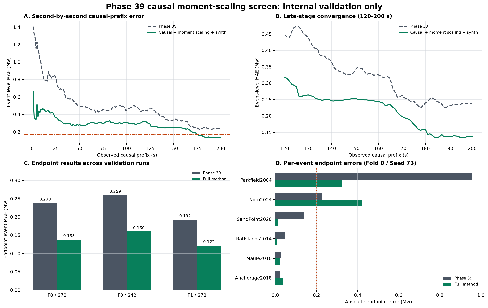

# Phase 39 因果前缀矩率缩放验证结果

## 方法

在 Phase 39 网络结构和参数量不变的前提下，加入：

- 逐秒因果前缀训练；
- 物理一致矩率缩放增强；
- `lambda_synth = 0.5` 合成波形约束；
- 允许小幅波动的误差下降约束。

矩率缩放采样 `delta_Mw in [-0.75, 0.5]`，并使用
`a = 10^(1.5 * delta_Mw)` 同时缩放观测波形和 STF，监督震级改为
`Mw + delta_Mw`。距离、方位、到时和有效掩码保持不变。

## 内部验证结果

| Fold | Seed | Phase 39 endpoint MAE | 新方法 endpoint MAE | 改善 |
|---:|---:|---:|---:|---:|
| 0 | 73 | 0.23808 | **0.13784** | 0.10024 |
| 0 | 42 | 0.25944 | **0.16000** | 0.09944 |
| 1 | 73 | 0.19228 | **0.12154** | 0.07073 |

新方法平均 endpoint MAE 为 `0.13979 +/- 0.01930 Mw`，三次运行均低于
`0.20 Mw` 和 `0.17 Mw`。

代表性运行 Fold 0 / Seed 73 在 200 秒时达到 `0.13784 Mw`，最低逐秒
MAE 为 `0.13349 Mw @ 195 s`。Parkfield2004 改善明显，但 Noto2024 有
退化，因此正式评估必须同时报告逐事件结果。

## 结果边界

这些结果仅来自内部验证事件，不是测试折结果，也不是 8 个外部未见事件。
本轮没有读取或评分测试折和外部事件。当前比较也不能单独证明全部改善都来自
矩率缩放，后续仍需要固定配置的单变量消融和五折 OOF 验证。

更完整的说明见 [REPORT_ZH.md](REPORT_ZH.md)，机器可读汇总见
[summary.json](summary.json)。
