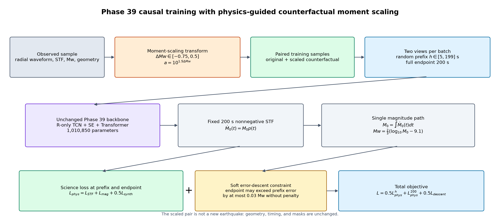
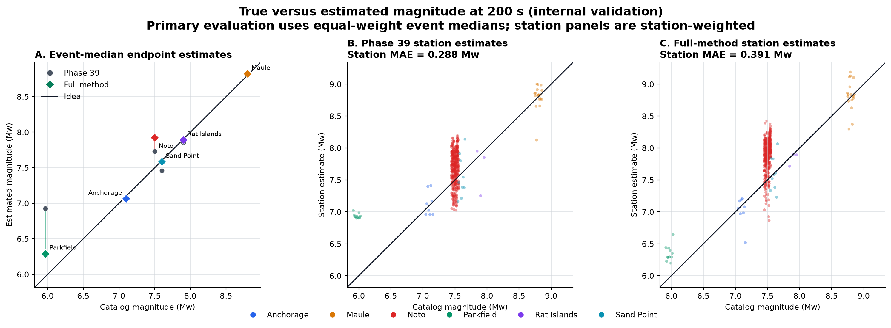
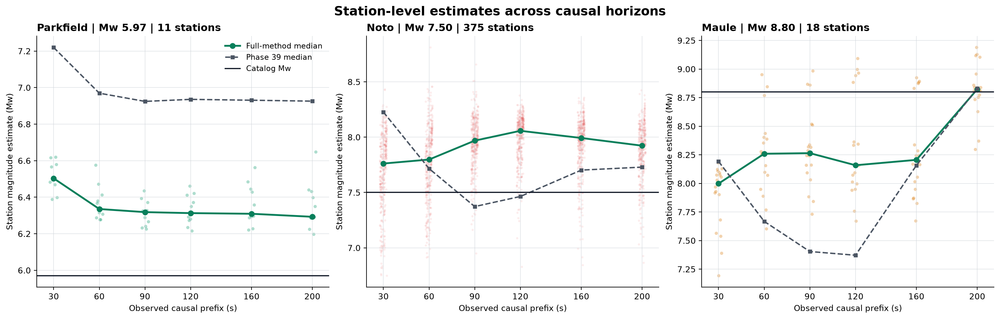
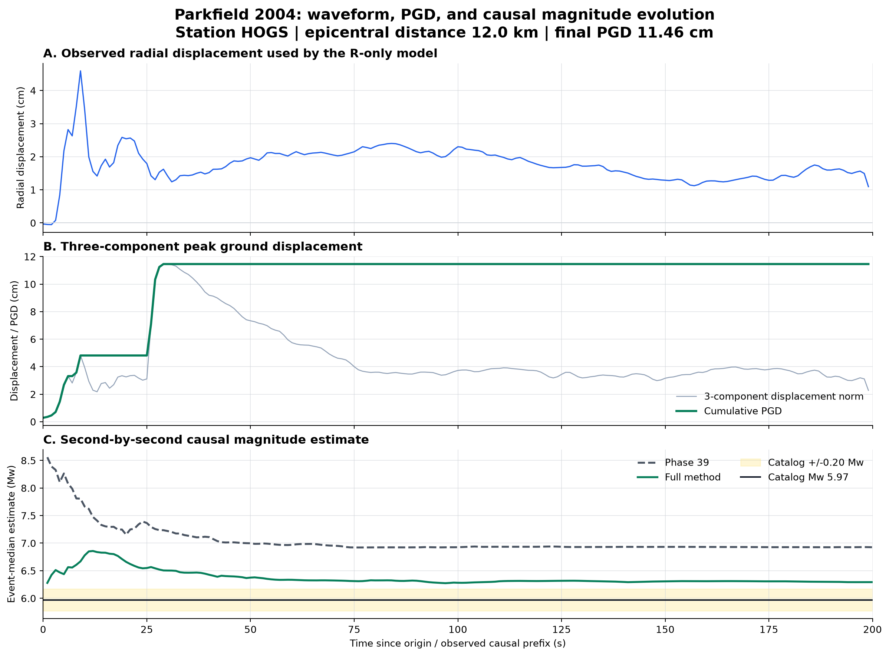
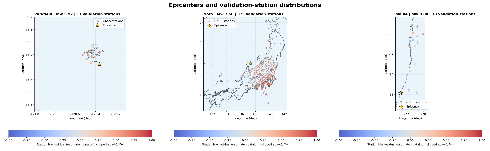

# Phase 39 Causal Moment-Scaling Validation

This page is the landing page for the complete bilingual paper package.

- [Complete English manuscript](MANUSCRIPT_EN.md)
- [完整中文论文](MANUSCRIPT_ZH.md)
- [Concise Chinese validation report](REPORT_ZH.md)

The full method keeps the Phase 39 architecture unchanged and adds:

- second-by-second causal-prefix training;
- physically consistent moment-scaling augmentation;
- the required synthesized-waveform constraint, `lambda_synth = 0.5`;
- a soft error-descent constraint that allows short-term fluctuations.

Moment scaling samples `delta_Mw in [-0.75, 0.5]` and applies
`a = 10^(1.5 * delta_Mw)` to both the observed waveform and STF, while changing
the target to `Mw + delta_Mw`. Geometry and arrival timing remain unchanged.

## Validation summary

| Fold | Seed | Phase 39 endpoint MAE | Full-method endpoint MAE | Improvement |
|---:|---:|---:|---:|---:|
| 0 | 73 | 0.23808 | **0.13784** | 0.10024 |
| 0 | 42 | 0.25944 | **0.16000** | 0.09944 |
| 1 | 73 | 0.19228 | **0.12154** | 0.07073 |

The three-run full-method mean is `0.13979 +/- 0.01930 Mw`. These are internal
validation results, not test-fold or external-event results.

## 1. True versus estimated magnitude

Panel A uses the primary evaluation rule: one median estimate per event, with
all six validation events weighted equally. Panels B and C show all 424 station
estimates. This distinction matters: the full method improves the equal-event
endpoint MAE, but station-weighted MAE changes from `0.288` to `0.391 Mw` because
Noto contributes 375 of 424 stations and degrades under the full method.

## 2. Station estimates over time

- **Parkfield:** the full method substantially reduces the Phase 39
  overestimate, but still ends about `+0.32 Mw` high.
- **Noto:** the full method becomes more positively biased, which is the main
  current failure case.
- **Maule:** estimates remain low for much of the record and converge near the
  catalog magnitude at 200 s.

The individual station dots need not improve monotonically. The intended
behavior is an overall reduction and late-time stabilization of event-level
error.

## 3. PGD waveform and causal magnitude evolution

This example uses the validation station `Parkfield2004::HOGS`, located about
12 km from the epicenter. Panel A is the radial displacement used by the R-only
model. Panel B shows the three-component displacement norm and cumulative PGD,
which reaches `11.46 cm`. Panel C shows the event-median estimate recomputed for
every causal prefix from 1 to 200 s.

The full method moves Parkfield from the Phase 39 endpoint near `Mw 6.93` to
about `Mw 6.29`, versus catalog `Mw 5.97`. This is a large improvement, but the
event still remains outside the `+/-0.20 Mw` band.

## 4. Epicenters and station distributions

Station color is the 200 s residual, `estimated Mw - catalog Mw`, clipped to
`[-1, +1] Mw` on a shared scale. The maps connect station geometry with the
prediction behavior:

- Parkfield stations are close to the source and remain consistently high.
- Noto has a dense Japanese network with widespread positive residuals.
- Maule stations span a long north-south aperture and have mixed residuals.

Full-resolution maps:

- [Parkfield station map](figures/04_parkfield2004_station_map.png)
- [Noto station map](figures/04_noto2024_station_map.png)
- [Maule station map](figures/04_maule2010_station_map.png)

## Scope and reproducibility

The figure workflow reads only persisted internal-validation predictions and
the corresponding validation waveform/coordinate records. It does not score
the test split and does not load the eight external events.

- [Complete English manuscript](MANUSCRIPT_EN.md)
- [Complete Chinese manuscript](MANUSCRIPT_ZH.md)
- [Concise Chinese report](REPORT_ZH.md)
- [Machine-readable experiment summary](summary.json)
- [English figure manifest](figures/figure_manifest.json)
- [Chinese figure manifest](figures/zh/figure_manifest.json)
- [Chinese method figure](figures/zh/00_method_workflow.png)
- [Chinese result overview](figures/zh/result_overview.png)
- [Chinese prediction scatter](figures/zh/01_prediction_scatter.png)
- [Chinese station convergence](figures/zh/02_station_convergence_scatter.png)
- [Chinese waveform and Mw trajectory](figures/zh/03_parkfield_pgd_and_mw.png)
- [Chinese selected-event maps](figures/zh/04_selected_event_maps.png)
- [Reproducible plotting script](../../../scripts/plotting/plot_phase39_moment_scaling_explainer.py)

The result supports the full causal moment-scaling method as a promising
validation candidate. It does not yet isolate the effect of moment scaling from
the other causal-training changes, and it does not establish final test or
external-event performance.
