# Phase 39 因果模型：已释放震矩前缀目标（方向 1）验证报告

> 日期 2026-09-07，2026-09-08 补第 0 节（白话版）、第 6b 节（种子复现与两个采样旋钮），图 4 加入真实 STF 与吻合度。
> 第 1–8 节报告固定划分的 **验证集（6 事件，446 条台站记录）**，用于选模与诊断。
> **第 9 节是 9 事件测试集的一次性评估**（2026-09-08 14:55 决定：NEW-3 定为最终候选，冻结后只跑一次，结果原样报告）。
> 预注册验证门当时未全部通过，因此这次测试是对预注册协议的正式终止，不是"过门"；测试结果之后不再调整任何模型。
> 上一阶段的终点实验与旧因果模型见 [phase39-expanded-fixed-split](../phase39-expanded-fixed-split/README.md)。

## 0. 一页看懂（白话版）

**我们在做什么。** 地震发生后，GNSS 台站每秒都在记录地面位移。我们想让一个神经网络在地震**还没结束**时，
只用"到现在为止"看到的波形，逐秒给出震级估计，而且这条估计曲线应该像 PGD 经验公式那样**从小到大、逐渐逼近真值**，
而不是一开始就乱猜一个大数再往下改。

**之前的问题。** 旧模型（下文 OLD）在每一秒都被要求直接回答"这次地震最后是几级"。信息不够时它只能报训练集的平均值，
所以第 1 秒就给出 Mw 7.4 左右，之后再往下修，小地震被高估。

**这次改了什么。** 只改监督目标，不改网络：不再问"最后几级"，改问"**到现在为止已经释放了多少震矩**"。
P 波还没到的台站什么都不知道，就监督成下限；P 波到了之后，随着能观测到的破裂越多，目标值越大。
这样曲线天然从下往上走。

**结果一句话。** 新模型（NEW-3）在验证集 6 个事件上，200 s 时的震级平均误差从 0.127 降到 0.090（PGD 公式 Crowell 是 0.169）；
第 1 秒不再有任何事件高估；6 个事件里 5 个误差在 ±0.09 以内。**没解决的**：Noto 2024 高估 0.39（原因已查明，是训练数据远场只有大地震，
见 6a.1）；曲线逐秒有小抖动（滤波能压掉，但要付 5 s 延迟，见 6a.2）。

**后续三次补充实验（第 6b 节）。** 换随机种子重训一次、换事件抽样方式、给远台加更强的缩放，Noto 的高估都没有明显改善（0.39 → 0.37 / 0.37 / 0.31），
说明这是数据覆盖问题，靠调采样参数解决不了。

**测试集一次性结果（第 9 节）。** 9 个从没见过的地震上，NEW-3 的 200 s 平均误差 0.366，**没有比旧模型（0.340）和 PGD 公式 Crowell（0.311）更好**；
验证集上 0.127 → 0.090 的提升没有带到测试集。三个模型栽在同样的地方：两个比训练集最小震级还小的地震（Napa 6.02、ak014cbigci8 6.20）被高估 0.7–1.4，
另一个只有 7 台的新西兰地震高估 0.45；其余 6 个事件误差在 ±0.28 内。**带过去了的**是曲线形态：1 秒时 9 个事件零高估（旧模型 5 个），
曲线从下往上逼近，稳定进入 ±0.3 的速度与旧模型和 Crowell 相当（中位 50 / 56.5 / 52 s）。结论：这次改动解决的是"曲线怎么走"，不是"终点有多准"或"多快"；论文应按此主张。

### 术语速查

| 报告里的写法 | 意思 |
|---|---|
| OLD | 旧的因果模型（上一阶段 checkpoint `4a25…`），每秒直接猜最终震级 |
| NEW-1 / NEW-2 / NEW-3 | 本轮三个新模型。NEW-1 只换目标；NEW-2 再加一个"逼曲线单调"的惩罚项（无效）；NEW-3 改为允许把训练地震缩小到更小震级（有效，**本页主结果**） |
| NEW-3 s42 | 和 NEW-3 完全同一套配方，只换随机种子（42），用来看结果是不是碰运气 |
| 5a / 5b | 在 NEW-3 上各加一个旋钮：5a 改事件抽样方式，5b 给远台更强的缩小；都为了修 Noto，都没修好 |
| checkpoint | 训练好并保存下来的一组网络权重，用 sha256 前 16 位标识，保证报告里的数字能追溯到具体文件 |
| seed / 种子 | 随机数起点。同配置换种子结果会变，变多少就是"运气成分"的大小 |
| STF（震源时间函数） | 震矩随时间释放的速率曲线，网络的直接输出；对它积分就得到震矩，再换算成 Mw |
| A（最终震级） | 把网络预测的整条 200 s STF 全部积分得到的 Mw，即"网络猜这次地震最后几级" |
| B（已释放震级） | 只积分到"这个台站到目前为止能看到"的那段 STF 得到的 Mw，即"到现在释放了多少" |
| B\* | B 的事件中位数，但只算 P 波已经到达的台站（没到的台站还没信息，不参与）。**曲线图里的红实线都是它** |
| τ_P（P 波到时） | 震源距 ÷ P 波速度。台站在这之前收不到任何信号 |
| SCARDEC 标签 | 法国 SCARDEC 数据库给出的真实 STF，训练时用作参考答案 |
| 目录 Mw | 地震目录（GCMT/USGS）公布的震级，评价时的"真值" |
| Crowell 2013 / Ruhl 2019 / Melgar 2015 | 三个经典 PGD（峰值地面位移）经验公式，用来做对照 |
| MAE / RMSE / 偏差 | 平均绝对误差 / 均方根误差 / 平均有符号误差（正=高估） |
| 变号次数 | 200 s 内曲线"上升变下降"或反过来的次数，衡量抖动；PGD 的累积做法是 0 |
| 稳定进入 ±0.3 | 曲线进入目录 Mw ±0.3 之后再也不出来的最早时刻，衡量"多快可靠" |
| Spearman ρ（秩相关） | 只看排序：6 个事件按预测值排和按真值排是否一致，1 = 完全一致 |
| 预注册门 | 训练前就写死的 5 条通过标准，全过才允许碰测试集。本轮没全过，所以测试集没动 |
| 反事实震矩缩放 | 训练时把一条真实记录的震矩整体乘一个系数、波形同比缩放，造出"同一台网下更小/更大地震"的样本 |
| 事件均衡 | 训练集里 Tohoku 有 688 台、有的事件只有 3 台；均衡是让每个事件在训练中的话语权接近，而不是按台站数 |
| EMA + 包络 | 两种因果滤波：EMA 是指数平滑，包络是"只允许缓慢下降"；合起来能压抖动，代价是延迟 |

## 1. 问题与改动

旧因果 Phase 39 模型（checkpoint `4a25…`）在每个观测前缀 h 上被要求直接回答"最终 Mw 是多少"。
信息不足时，网络给出的是训练集的平均值：1 s 时事件中位数就已经在 Mw 7.4 附近，随后再往下修正。
这和 PGD 类经验方法"从小到大、单调逼近"的曲线形态相反，也导致早期高估。

本轮把前缀监督目标换成 **已释放震矩**（released moment），网络、前向模型、`L_synth`（λ = 0.5）、
反事实震矩缩放和因式分解 STF 头全部保持不变，只改两处前缀监督：

1. **前缀目标**：对台站 i，`B_i(h) = ∫_0^{h − τ_P,i} Ṁ_SCARDEC(t) dt`，其中 `τ_P,i = 震源距 / α` 是 P 波到时。
   即只监督"到 h 为止、该台站已经能观测到的那部分震矩"。编码 STF 上的 MSE 也只在同一窗口内计算；
   `h − τ_P < 1 s`（P 尚未到达）的样本跳过这两项，但仍参与 `L_synth`。
2. **前缀呈现**：零填充到 200 s，保留绝对时间轴（旧做法是截断后拉伸到 200 步，绝对时间轴丢失）。
   旧的误差下降项 `L_descent` 失去监督对象，置零。

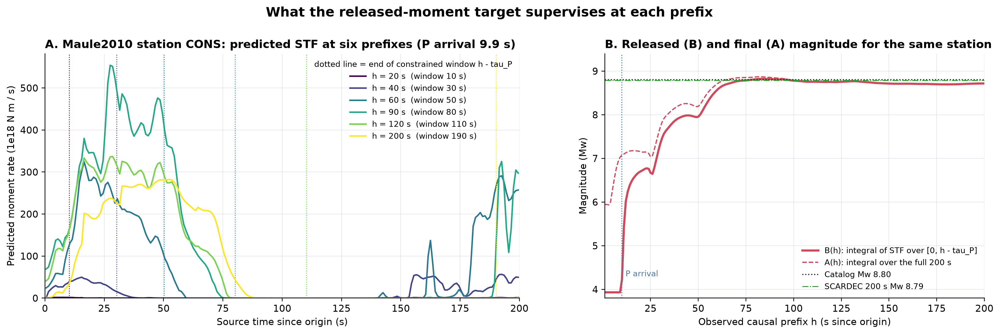

图 4. Maule2010 近台 CONS（P 到时 9.9 s）。A：六个前缀下预测的 STF（彩色）与 **SCARDEC 真实 STF（黑粗线）**，竖虚线是受约束窗口 `h − τ_P` 的末端；
B：同一台站的已释放震级 B(h)（只积分窗口内）、最终震级 A(h)（积分全长 200 s）和 **训练目标 B_ref(h)（同一窗口作用于真实 STF，绿点线）**。
B 从下限（Mw 3.93，对应 1e15 N·m）起步，P 到达后上升并收敛到 SCARDEC 200 s 震级。
注意 A 中 h = 20、40 s 时窗口外（140–200 s）出现的"尾部矩"：那是模型对尚未观测部分的猜测，不受因果标签约束。
C、D：全部 446 个验证台站上预测 STF 与真实 STF 的吻合度随前缀的变化（实线每事件一票；虚线按台站合并，被 Noto 的 397 台主导）。
数值见 [stf_agreement_summary.csv](analysis/stf_agreement_summary.csv)、[逐台站表](analysis/stf_agreement_stations.csv)，
真实 STF 由 `scripts/analysis/phase39_stf_agreement.py` 按回放同一配置重建并存于 `analysis/validation_reference_stf.npz`。

**预测与真实 STF 的吻合度**（吻合度分两个量看：**形状**用窗口内两条曲线的 Pearson 相关 r，**总量**用窗口内已释放震级之差 ΔMw）：

| | 30 s | 60 s | 90 s | 120 s | 160 s | 200 s |
|---|---:|---:|---:|---:|---:|---:|
| CONS 这一台：形状 r | 0.23 | 0.40 | 0.13 | 0.47 | 0.76 | **0.89** |
| CONS 这一台：ΔMw（窗口内） | −0.69 | +0.01 | +0.05 | −0.05 | −0.09 | **−0.08** |
| 验证 6 事件中位：形状 r，NEW-3 | 0.55 | 0.46 | 0.51 | 0.67 | 0.69 | **0.73** |
| 验证 6 事件中位：形状 r，OLD | 0.44 | 0.54 | 0.60 | 0.69 | 0.71 | 0.76 |
| 验证事件级 MAE（窗口内 ΔMw），NEW-3 | 0.27 | 0.17 | 0.16 | 0.19 | 0.25 | **0.09** |
| 验证事件级 MAE（窗口内 ΔMw），OLD | 0.23 | 0.19 | 0.15 | 0.26 | 0.22 | 0.13 |

- **总量吻合得好，形状吻合一般。** 200 s 时 NEW-3 的已释放震矩与真实值的事件级 MAE 是 0.09 Mw（与第 5 节终点 MAE 一致），
  但 STF 形状相关只有 0.73（CONS 单台 0.89 是较好的例子）。图 4A 里可以直接看到：预测 STF 在 20–50 s 有多个尖峰、幅度约为真实的 1.5 倍，
  而真实 STF 在 50 s 附近单峰、100 s 结束；两者积分接近，但"什么时候释放"对不上。
- **早期窗口只对得上量，对不上形。** 30–90 s 时事件级 ΔMw 已经在 0.16–0.27 以内，而形状 r 只有 0.5 左右；按台站合并的 r 在 60 s 甚至是 −0.07
  （Noto 的 397 台在窗口内的预测形状与真实反相）。模型先学会"到现在释放了多少"，再逐渐学会"怎么释放的"。
- **OLD 的形状略好（0.76 vs 0.73），量却更差（0.13 vs 0.09）。** 和第 3 节"新目标放松了对训练事件的记忆"一致：新目标只约束窗口内的积分，形状是副产品。
- 逐事件看 200 s：Parkfield r 0.92、Maule 0.74（全长 0.86）、Noto 0.77、Anchorage 0.72、RatIslands 0.71、SandPoint 0.67；
  ΔMw 中位除 Noto +0.39、RatIslands −0.08 外都在 ±0.06 内。Noto 形状不差、量偏高，再次指向 6a.1 的几何先验而非波形拟合失败。

实现：`src/training/released_moment.py`、`scripts/experiments/run_phase39_causal_released_moment.py`、
`scripts/evaluation/evaluate_phase39_causal_released_moment.py`、`tests/test_phase39_released_moment.py`。

## 2. 运行

全部 seed 73、fold 0、从零训练、200 epoch / 早停 50、划分哈希 `e4807aa1…`、1 010 850 可训练参数、结构未改。

| 编号 | 配置 | 与 NEW-1 的差异 | checkpoint sha256 | 最佳 epoch |
|---|---|---|---|---:|
| OLD | 旧因果 Phase 39 | 目标 = 最终 Mw，截断拉伸 | `4a2540241fcbd918…` | — |
| NEW-1 | `phase39_causal_released_moment.yaml` | 方向 1 基线 | `2206b94b54074609…` | 68 |
| NEW-2 | `…_monotone.yaml` | 旋钮一：单调对项 `relu(B_early − B_late − 0.03)²`，权重 0.5，间隔 10 s | `662714db28cd14e7…` | 96 |
| NEW-3 | `…_scale1p0.yaml` | 旋钮二：反事实缩放下界 ΔMw −0.75 → −1.0 | `56d55b1ad65388ae…` | 83 |
| NEW-3 s42 | `…_scale1p0_seed42.yaml` | 同 NEW-3，只换训练随机种子 42（第 6b 节） | `25dca4bb…` | 148 |
| 5a | `…_scale1p0_balanced.yaml` | NEW-3 + 事件均衡由"反计数加权"改为"等概率重采样"（第 6b 节） | `0cde6daa…` | 93 |
| 5b | `…_scale1p0_farscale.yaml` | NEW-3 + 远台（100–300 km 线性过渡）缩放区间改为 ΔMw [−1.5, 0]（第 6b 节） | `c06ab33f…` | 92 |

旋钮二的动机：训练集 24 事件最小 Mw 6.4，而验证/测试含 5.97、6.02、6.20；缩放是模型见到小事件的唯一途径。
后三行是 09-07 晚间在 NEW-3 结果之后追加的，不属于预注册的"两个旋钮"，只用于复现检查和 Noto 诊断。

## 3. 数据集组成与各集终点效果

固定划分（哈希 `e4807aa1…`，与 [phase39-expanded-fixed-split](../phase39-expanded-fixed-split/README.md) 完全相同）：
39 事件、2 694 条质控后台站记录，按事件互斥分为训练 24 / 验证 6 / 测试 9。

图 5. A 事件数、B 台站记录数、C 各集的震级覆盖（点大小 = 台站数）。训练集没有 M6.4 以下事件，
验证集的 Parkfield 5.97 和测试集的 Napa 6.02、ak014cbigci8 6.20 都在训练下限之外。

下表为 NEW-3 与旧因果模型（OLD）在 **200 s 终点** 的事件中位震级（A，即全长 STF 积分），并给出 Crowell 2013 PGD 作对照。
训练集和验证集是对冻结 checkpoint 的推断回放（不含任何训练或选择）；**测试集 9 事件只列组成，未评估**。
完整数值见 [cohort_event_summary.csv](analysis/cohort_event_summary.csv)。

**训练集（24 事件，1 798 台）** — NEW-3 事件 MAE 0.109，OLD 0.092，Crowell 0.190；NEW-3 22/24 在 ±0.2 内

| 事件 | 目录 Mw | 台站 | NEW-3 | 误差 | OLD | 误差 | Crowell 误差 |
|---|---:|---:|---:|---:|---:|---:|---:|
| nc73821036 | 6.40 | 9 | 6.22 | −0.18 | 6.32 | −0.09 | −0.04 |
| 2013p543824 | 6.50 | 8 | 6.41 | −0.09 | 6.45 | −0.05 | −0.06 |
| Lefkada2015 | 6.50 | 3 | 6.43 | −0.07 | 6.37 | −0.13 | +0.07 |
| 2013p613797 | 6.50 | 10 | 6.39 | −0.11 | 6.48 | −0.02 | +0.18 |
| Eureka2014 | 6.80 | 15 | 6.59 | −0.21 | 6.69 | −0.11 | +0.16 |
| Kilauea2018 | 6.90 | 15 | 6.88 | −0.02 | 6.80 | −0.10 | −0.13 |
| Aegean2014 | 6.90 | 4 | 6.86 | −0.04 | 6.73 | −0.17 | −0.13 |
| Kumamoto2016 | 7.00 | 161 | 6.96 | −0.04 | 6.94 | −0.06 | +0.11 |
| Miyagi2011B | 7.10 | 46 | 7.06 | −0.04 | 7.05 | −0.05 | +0.18 |
| 2021p169083 | 7.20 | 10 | 7.04 | −0.16 | 7.10 | −0.10 | +0.03 |
| ElMayor2010 | 7.20 | 84 | 7.04 | −0.16 | 7.05 | −0.15 | +0.20 |
| Miyagi2011A | 7.30 | 84 | 7.14 | −0.16 | 7.21 | −0.09 | +0.10 |
| us6000ah9t | 7.40 | 5 | 7.33 | −0.07 | 7.28 | −0.12 | −0.31 |
| Nicoya2012 | 7.60 | 9 | 7.55 | −0.05 | 7.47 | −0.13 | −0.29 |
| Melinka2016 | 7.60 | 5 | 7.44 | −0.16 | 7.60 | −0.00 | −0.29 |
| Kaikoura2016 | 7.80 | 32 | 7.65 | −0.15 | 7.66 | −0.14 | +0.24 |
| Simeonof2020 | 7.80 | 19 | 7.68 | −0.12 | 7.68 | −0.12 | −0.04 |
| Nepal2015 | 7.80 | 6 | 7.75 | −0.05 | 7.77 | −0.03 | +0.42 |
| Mentawai2010 | 7.80 | 9 | 7.82 | +0.02 | 7.75 | −0.05 | −0.50 |
| Ibaraki2011 | 7.90 | 507 | 7.77 | −0.13 | 7.79 | −0.11 | −0.27 |
| Tehuantepec2017 | 8.20 | 4 | 8.04 | −0.16 | 8.11 | −0.09 | +0.21 |
| Chignic2021 | 8.20 | 41 | 7.97 | −0.23 | 8.06 | −0.15 | −0.08 |
| Illapel2015 | 8.30 | 24 | 8.16 | −0.14 | 8.15 | −0.15 | −0.24 |
| Tohoku2011 | 9.10 | 688 | 9.03 | −0.07 | 9.09 | −0.01 | −0.28 |

**验证集（6 事件，446 台）** — NEW-3 事件 MAE 0.091，OLD 0.127，Crowell 0.169；NEW-3 5/6 在 ±0.2 内

| 事件 | 目录 Mw | 台站 | NEW-3 | 误差 | OLD | 误差 | Crowell 误差 |
|---|---:|---:|---:|---:|---:|---:|---:|
| Parkfield2004 | 5.97 | 11 | 6.03 | +0.06 | 6.18 | +0.21 | −0.01 |
| Anchorage2018 | 7.10 | 8 | 7.11 | +0.01 | 7.12 | +0.02 | −0.21 |
| Noto2024 | 7.50 | 397 | 7.89 | +0.39 | 7.84 | +0.34 | −0.01 |
| SandPoint2020 | 7.60 | 9 | 7.61 | +0.01 | 7.53 | −0.07 | −0.28 |
| RatIslands2014 | 7.90 | 3 | 7.82 | −0.08 | 7.92 | +0.02 | −0.49 |
| Maule2010 | 8.80 | 18 | 8.80 | −0.00 | 8.90 | +0.10 | −0.01 |

**测试集（9 事件，450 台，未评估）**：Napa2014 6.02（28 台）、ak014cbigci8 6.20（4）、2016p661332 7.10（7）、
Puebla2017 7.10（2）、Ridgecrest2019 7.10（130）、us7000i9bw 7.60（11）、Ecuador2016 7.80（20）、
Tokachi2003 8.16（228）、Iquique2014 8.20（20）。

两点观察：
- NEW-3 在训练集上 23/24 事件略微低估（平均偏差 −0.10），拟合比旧模型松（0.109 vs 0.092），但验证集更好（0.091 vs 0.127）：
  新目标降低了对训练事件的记忆，泛化改善。
- 验证集上 NEW-3 除 Noto 外 5 个事件误差都在 ±0.09 以内；Noto +0.39 是唯一的显著失败，且两个模型一致高估。

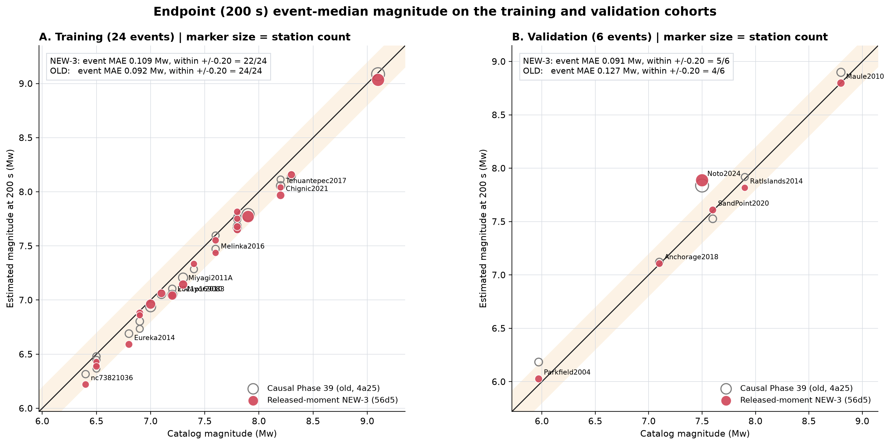

图 6. 200 s 终点事件中位震级对目录震级，A 训练集、B 验证集。实心红 = NEW-3，空心灰 = 旧因果模型，橙带 ±0.2。

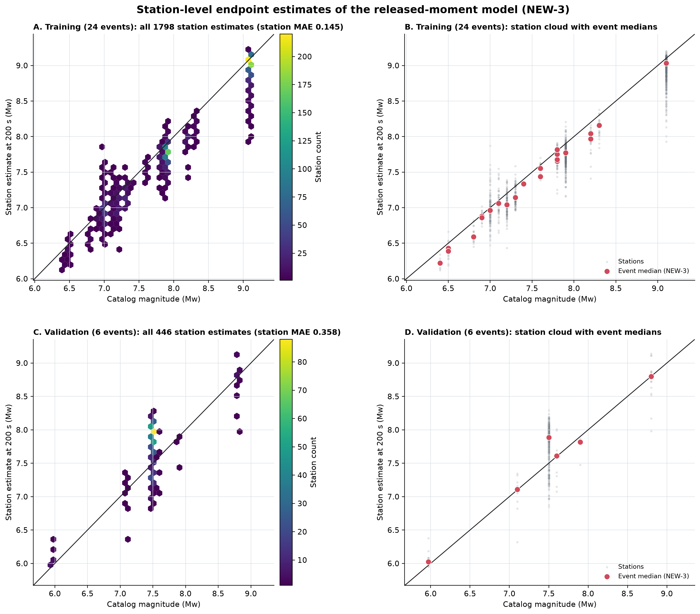

图 7. NEW-3 台站级 200 s 估计。A/C 为台站密度（六边形分箱），B/D 为台站云与事件中位。
验证集台站 MAE 0.358 远大于事件 MAE 0.091，主要来自 Noto 397 台的 +0.4 系统偏移和 Maule 台站间 ±0.5 的离散。

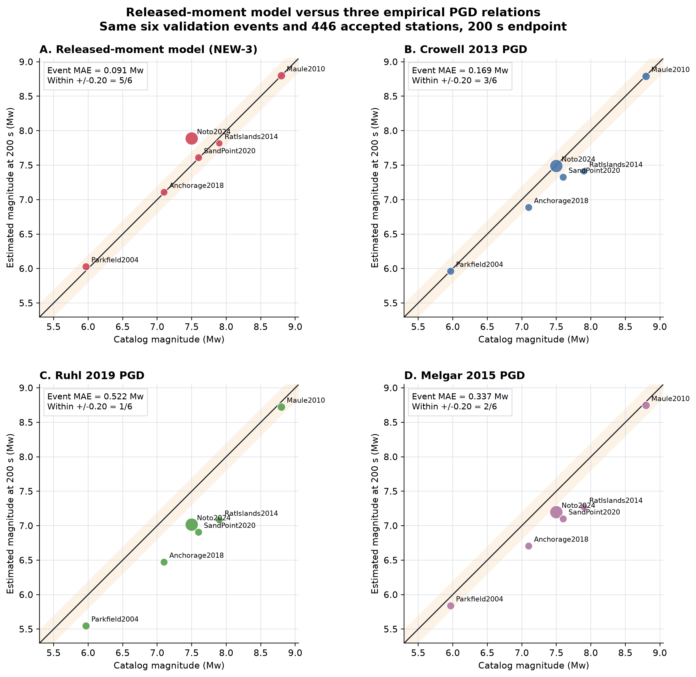

图 8. 同一 6 个验证事件、同一 446 台上，NEW-3 与 Crowell 2013、Ruhl 2019、Melgar 2015 的 200 s 终点估计。

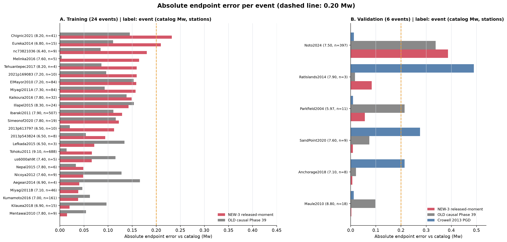

图 9. 逐事件 200 s 绝对误差。A 训练集（NEW-3 与 OLD），B 验证集（加 Crowell）。虚线 0.2 Mw。

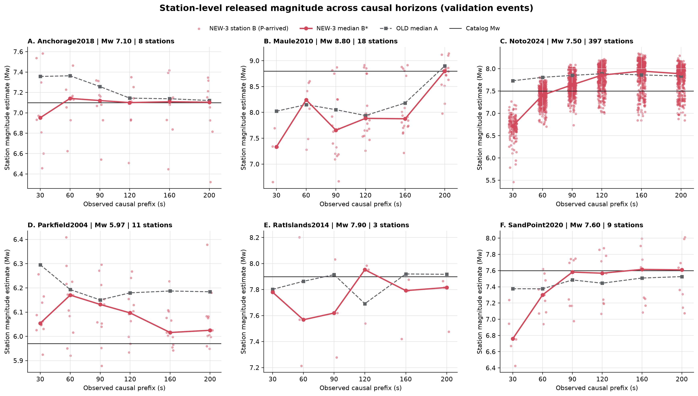

图 10. 验证事件在 30/60/90/120/160/200 s 六个前缀下的台站级已释放震级 B（浅红点，只画 P 已到的台站），
红线为其中位数 B\*，灰虚线为旧模型的中位数 A。Noto 的 397 台在 90 s 后整体高于目录值；
Anchorage、SandPoint 在 60–90 s 后收敛并稳定。

### 3.1 按震源机制看误差

划分没有按断层类型分层（只按事件互斥和震级覆盖）。用数据集自带的 GCMT/USGS `mechanism` 标签统计：

| | 逆冲 | 走滑 | 正断 |
|---|---:|---:|---:|
| 训练 24 | 16（1 510 台） | 7（284 台） | 1（4 台，Tehuantepec） |
| 验证 6 | 2（Noto、Maule） | 3（Parkfield、SandPoint、RatIslands） | 1（Anchorage） |
| 测试 9（未评估） | 4（Tokachi、Iquique、Ecuador、us7000i9bw） | 3（Ridgecrest、Napa、ak014cbigci8） | 2（Puebla、2016p661332） |

训练记录 84% 来自逆冲事件（Tohoku 688 + Ibaraki 507 占大半）；正断层训练里只有 4 台。
模型输入不含机制信息，网络只看波形和几何量。

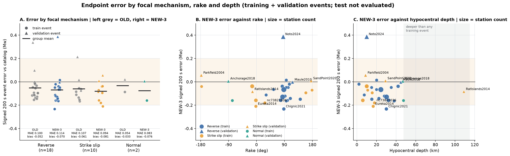

图 11. 200 s 终点有符号误差。A 按机制分组（左灰 OLD，右彩 NEW-3；圆 = 训练事件，三角 = 验证事件，横线 = 组均值）；
B、C 为 NEW-3 误差对 rake 和震源深度（点大小 = 台站数，灰带为比任何训练事件更深的范围）。
数值见 [error_by_mechanism.csv](analysis/error_by_mechanism.csv)。

| 200 s 事件 MAE / 偏差 | 逆冲 | 走滑 | 正断 |
|---|---:|---:|---:|
| 训练 NEW-3 | 0.104 / −0.103 | 0.113 / −0.113 | 0.160 / −0.160（n=1） |
| 训练 OLD | 0.085 / −0.085 | 0.109 / −0.109 | 0.086 / −0.086 |
| 验证 NEW-3 | 0.195 / +0.192 | 0.050 / −0.006 | 0.007 / +0.007（n=1） |
| 验证 OLD | 0.218 / +0.218 | 0.102 / +0.052 | 0.021 / +0.021 |
| 验证 Crowell | 0.012 | 0.258 | 0.214 |

- 训练集三类机制的 NEW-3 误差都在 −0.10 到 −0.16 之间，没有哪一类被系统性地学偏；旧模型同样如此。机制不是当前误差的主要解释变量。
- 验证集逆冲组的 0.195 全部来自 Noto（+0.39），Maule 只有 −0.003；走滑组三个事件都在 ±0.09 内，正断 Anchorage +0.01。
- 唯一没学过的正断层（Anchorage，深 47 km）和唯一的中源事件（RatIslands 109 km，比任何训练事件深 60 km）误差都不大，但各只有 1 个样本，说明"未失败"而非"已验证"。
- Crowell 在逆冲组好、走滑/正断组差，与 PGD 标度律主要由俯冲带逆冲事件拟合一致；NEW-3 的机制依赖性比 PGD 小。
- 测试集 4 逆冲 / 3 走滑 / 2 正断的分布比验证集均衡，机制泛化真正的检验要等测试回放。

## 4. 报告量

- **B\***：已释放震级，只在 P 已到达（`h − τ_P ≥ 1 s`）的台站上取事件中位数。这是与累积 PGD "在有定义处取中位"对等的口径。
- **B**：同上但包含所有台站（未到 P 的台站取下限 3.93），事件中位数会被远台压在下限，仅作参考。
- **A**：由全长 200 s 预测 STF 得到的最终震级；200 s 时 A = B。
- **SCARDEC 标签 B\***：把同一窗口作用于 SCARDEC 参考 STF，即模型能达到的上限形态。

## 5. 结果

### 5.1 事件轨迹

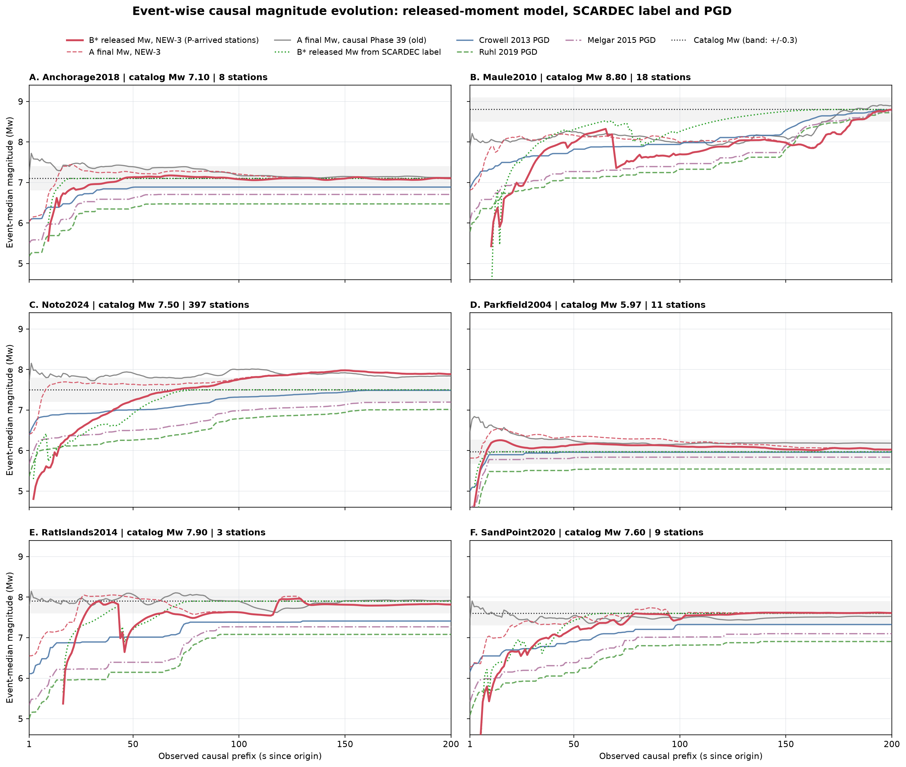

图 1. 验证 6 事件。红实线 NEW-3 的 B\*，红虚线 NEW-3 的 A，灰线旧因果模型的 A，绿点线 SCARDEC 标签的 B\*，
蓝/绿/紫为 Crowell 2013、Ruhl 2019、Melgar 2015 累积 PGD，黑点线目录 Mw（灰带 ±0.3）。

- 旧模型（灰）在所有事件上都是"先高后降"；NEW-3 的 B\* 从下方逼近，1 s 先验从 7.4 降到约 6.3（A），且 1 s 时没有事件高于目录值。
- Parkfield（7 s）、Anchorage（20 s）、SandPoint（60 s）：B\* 稳定进入 ±0.3 的时刻早于 Crowell（8 / 33 / 99 s）；RatIslands 117 s 进入，Crowell 全程未进入。
- Maule（Mw 8.8）：B\* 在 65–70 s 处从 8.32 回落到 7.35（约 1 Mw），之后随 Crowell 一起爬升，181 s 才稳定进入 ±0.3；SCARDEC 标签本身也要到 116 s。
- Noto：四个变体在 90 s 后都高估到 7.73–7.92（+0.23–0.42），只有 NEW-1 在 160 s 进入 ±0.3，是当前主要失败案例；该事件 397 台占验证记录 89%。

### 5.2 四个 checkpoint 对比

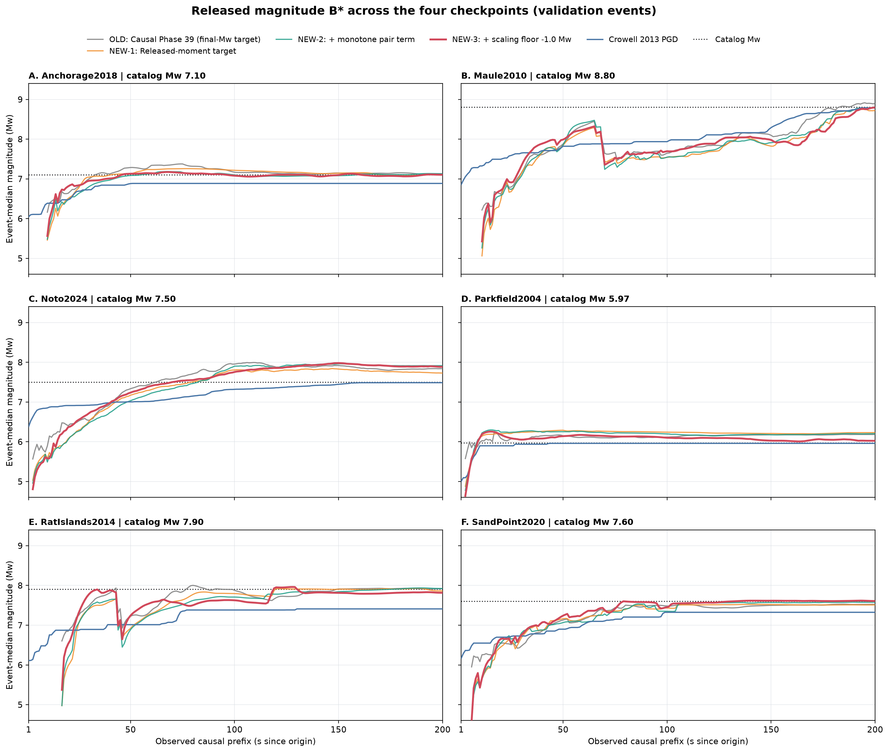

图 2. 四个 checkpoint 的 B\* 事件曲线。三条新曲线形态几乎一致，差别集中在 Parkfield（NEW-3 消除了 +0.2 的高估）和 Noto 的高估幅度。

### 5.3 客观表

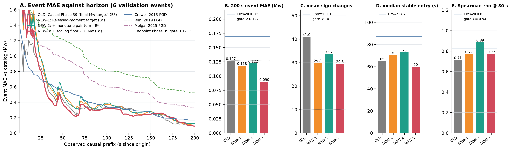

图 3. A：事件 MAE 随观测前缀的变化（B\*）；B–E：四个客观指标，蓝线是 Crowell，黑点线是预注册门。

| 验证集 6 事件 | OLD 4a25 | NEW-1 | NEW-2 单调项 | **NEW-3 缩放 −1.0** | Crowell 2013 |
|---|---:|---:|---:|---:|---:|
| 200 s 事件 MAE（Mw） | 0.1269 | 0.1182 | 0.1223 | **0.0901** | 0.1690 |
| 200 s 事件 RMSE | 0.171 | **0.151** | 0.196 | 0.163 | 0.246 |
| A 在 1 s 的事件均值 / 高于目录的事件数 | 7.44 / 3 | 6.34 / 1 | 6.26 / 1 | 6.32 / **0** | 6.09 / 0 |
| B\* 平均变号次数（1–200 s） | 41.0 | 29.8 | 33.7 | 29.5 | 0 |
| B\* 稳定进入 ±0.3 的事件数 / 中位时刻 | 5 / 65 s | 6 / 70.5 s | 5 / 73 s | 5 / 60 s | 5 / 87 s |
| 早于 Crowell 进入 ±0.3 的事件数 | 3/6 | 3/6 | 3/6 | **4/6** | — |
| B\* 与目录的 Spearman ρ，30 s / 60 s | 0.71 / 0.71 | 0.77 / 0.71 | 0.89 / 0.83 | 0.77 / **0.94** | 0.83 / 0.83 |

参考门：终点 Phase 39 验证 MAE 0.171305；旧因果 Phase 39 0.127016。完整数值见
[validation_objective_by_variant.csv](analysis/validation_objective_by_variant.csv)、
[逐事件表](analysis/validation_objective_per_event_all_variants.csv)。

### 5.4 预注册验证门

| 门 | NEW-1 | NEW-2 | NEW-3 |
|---|:-:|:-:|:-:|
| 200 s 事件 MAE < 0.1713 且 < 0.1270 | 通过 | 通过 | 通过（0.090） |
| A 在 1 s 无事件高于目录值 | 1 事件 | 1 事件 | 通过 |
| B\* 平均变号 < 10 | 29.8 | 33.7 | 29.5 |
| 稳定进入 ±0.3 早于 Crowell ≥ 4/6 | 3/6 | 3/6 | 通过（4/6） |
| B\* 30 s 秩相关 ≥ 旧 A 的 0.94 | 0.77 | 0.89 | 0.77 |

（[validation_gates.csv](analysis/validation_gates.csv)）NEW-3 通过 3/5；变号与 30 s 秩相关两项在全部三个变体上失败。
预注册规则是两个旋钮各试一轮、仍不过则停，因此不做测试集回放。

## 6. 判读

1. 方向 1 达到了它的目的：前缀先验不再是训练集均值，曲线从下限起步、P 到后上升、贴着 SCARDEC 已释放标签收敛；
   终点精度不降反升（0.127 → 0.090，NEW-3）。
2. 旋钮二有效且原因明确：把缩放下界放到 −1.0 后，Parkfield 200 s 由 6.20 回到 6.03，1 s 高估事件归零。这一项值得用第二个 seed 复现。
3. 旋钮一无效：间隔 10 s 的单调对项没有压住相邻秒的抖动（变号 29.8 → 33.7），反而放大了 Noto 的高估（RMSE 0.151 → 0.196）。
4. 两个失败的门是结构性的，不是标签问题。每一秒都是一次独立前向、重新估计一次标量对数震矩，相邻秒之间没有状态约束；
   形状 CDF 诊断也显示 30 s 时预测矩只有约 27%（旧模型 18%）落在受约束窗口内，其余被放到窗口外（图 4A 的尾部矩）。
   要过变号门和早期秩相关门，需要带状态的震矩头或对 B 曲线的因果后处理，这超出了本轮授权范围。
5. Noto 的系统性高估在四个变体上一致存在，与前缀目标无关，应单独排查（台站密度权重 / 近场饱和）。

## 6a. 三个遗留问题的处置（诊断与后处理，均不重训）

### 6a.1 Noto 为什么高估

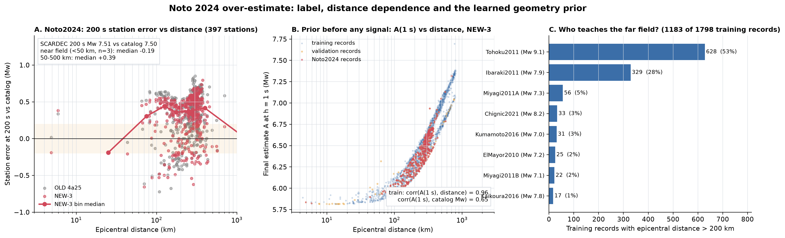

图 13. A：Noto 397 台 200 s 误差对震中距（灰 OLD、红 NEW-3，红线为 NEW-3 分箱中位）；
B：NEW-3 在 h = 1 s（任何信号到达前）给出的最终震级 A，对震中距，训练 + 验证全部记录；
C：训练集中震中距 > 200 km 的记录来自哪些事件。数值见
[noto_station_error_by_distance.csv](analysis/noto_station_error_by_distance.csv)、[prior_A1s_by_distance.csv](analysis/prior_A1s_by_distance.csv)。

三个假设的检验结果：

1. **标签没问题。** Noto 的 SCARDEC 200 s 震级 7.51，目录 7.50。模型不是贴着一个偏高的标签走。
2. **不是近场饱和。** 震中距 < 50 km 的 3 台中位误差 −0.19，无高估；50–500 km 的 394 台中位 +0.39，且在 50–500 km 各分箱内几乎一致（+0.31 到 +0.44）。高估来自远场，不来自近场。
3. **是学到的几何先验。** 图 13B 显示模型在还没看到任何信号时给出的 A(1 s) 几乎是震中距的确定性函数：训练记录上 corr(A(1 s), 距离) = 0.96，
   而 corr(A(1 s), 目录 Mw) 只有 0.65。原因在图 13C：训练集 1 183 条 > 200 km 的记录里，Tohoku（M9.1）占 53%，Ibaraki（M7.9）占 28%——
   "一条在 300 km 外被质控接受的记录"在训练分布里几乎等价于"这是一场 M8–9 的日本地震"。Noto 的 397 台有 278 台在 200 km 外，
   台网几何与 Tohoku/Ibaraki 同源，模型以大地震先验去解释远场波形，60 s 后（破裂已结束）仍持续往 STF 里加矩（图 10C：B\* 从 60 s 的 7.41 升到 160 s 的 7.9）。

处置方向（下一轮训练）：改事件均衡方式削弱 Tohoku + Ibaraki 对远场的垄断；或在几何输入上做距离分层的反事实缩放。
两者都在核心创新内部，不改结构。这两条随后都跑了，结果见第 6b 节。

> 更正（09-08）：本节初稿写的是"`event_balanced_sampling`（代码里已有开关）"，容易让人以为 NEW-3 没有开事件均衡。
> 实际上 NEW-3 继承的父配置里 `event_balanced_sampling: true, event_balance_estimator: inverse_count_full_data` 一直是开着的，
> 即**每个事件在损失里已经等权**（按 1/台站数加权）。所以 Tohoku 的 688 台并没有在损失里占 66% 的权重；
> 远场先验来自"远场记录几乎只出现在大地震里"这一条件分布，而不是权重分配。这解释了第 6b 节中换抽样方式为什么无效。

### 6a.2 逐秒抖动：因果后处理

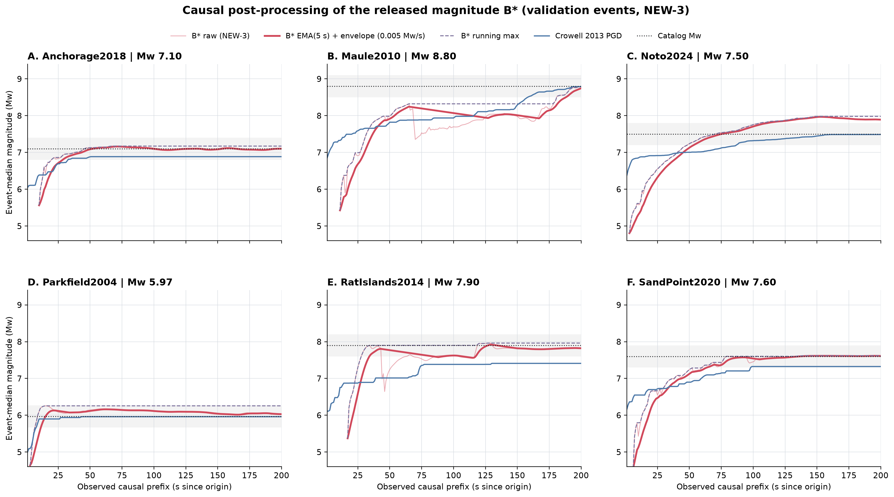

图 12. NEW-3 的 B\* 事件曲线：浅红为原始，粗红为 EMA（τ = 5 s）后再加因果包络（允许每秒最多下降 0.005 Mw），
紫虚线为纯 running max，蓝为 Crowell。生成脚本 `scripts/analysis/phase39_released_moment_postprocess.py`，
数值见 [postprocess_objective.csv](analysis/postprocess_objective.csv)。

| NEW-3 验证集 | 200 s MAE | 平均变号 | 最大变号 | 稳定进入 ±0.3 中位 | 早于 Crowell |
|---|---:|---:|---:|---:|---:|
| 原始 B\* | 0.090 | 29.5 | 42 | 60 s | 4/6 |
| running max | 0.154 | 0 | 0 | 28 s | 4/6 |
| 包络（0.005 Mw/s） | 0.090 | 23.2 | 32 | 60 s | 4/6 |
| **EMA 5 s + 包络** | 0.100 | **8.3** | 13 | 64 s | 3/6 |

- 纯 running max（Crowell 累积 PGD 的做法）把变号压到 0，但会锁死早期高估：RatIslands 40 s 的 7.95、Parkfield 60 s 的 6.17 再也降不下来，MAE 从 0.090 恶化到 0.154。已释放震矩"不能减少"的物理先验对**估计值**并不成立，因为估计值本身会修正。
- 只加包络（允许缓慢下降）几乎不减少变号：抖动是上升段上的小锯齿，不是回落。
- EMA 5 s + 包络把平均变号压到 8.3（过预注册的 < 10），代价是 5 s 左右的滞后：200 s MAE 0.090 → 0.100（Maule 200 s 仍在上升，滞后直接体现为误差），
  Parkfield 稳定进入从 7 s 推到 12 s，输给 Crowell 的 8 s，"早于 Crowell"从 4/6 掉到 3/6。τ 从 2 到 12 s 的扫描显示变号与滞后严格此消彼长，没有免费午餐。
- 这证实了抖动是结构性的：滤波能压掉它，但只能用延迟换。要不付延迟代价，只能在网络里加状态（路 C）。

### 6a.3 早期排序：报告量用错了对象

预注册把"30 s 秩相关 ≥ 旧模型 A 的 0.94"定在 B\* 上。但 B\* 在 30 s 是**已释放**震矩：Maule 破裂持续约 100 s，30 s 时 B\* 低于 Noto 是物理上正确的，
却会拉低与最终目录 Mw 的秩相关。旧模型 A 的 0.94 恰恰来自它对最终值的先验猜测——这正是方向 1 要去掉的东西。

同一个网络的 A（最终震级猜测）在 30 s 的秩相关：OLD 0.94，NEW-1 0.77，NEW-2 0.94，**NEW-3 0.94**，与旧模型持平。
所以 NEW-3 的早期排序能力并没有丢，只是不在 B\* 里。两个量应分工：早期用 A 排序，后期用 B\* 定值。

### 6a.4 修订后的门（验证集）

修订：变号门作用在 EMA 5 s + 包络后的 B\*，早期秩相关门作用在 A；其余不变。
[validation_gates_revised.csv](analysis/validation_gates_revised.csv)

| 门 | OLD | NEW-1 | NEW-2 | NEW-3 |
|---|:-:|:-:|:-:|:-:|
| 200 s 事件 MAE < 0.1270 | 0.1269 | 0.118 | 0.122 | **0.090** |
| A 在 1 s 无事件高于目录 | 3 | 1 | 1 | **0** |
| 滤波后 B\* 平均变号 < 10 | 10.3 | 8.2 | 9.3 | **8.3** |
| 滤波后 B\* 早于 Crowell ≥ 4/6 | 4 | 3 | 2 | 3 |
| A 的 30 s 秩相关 ≥ 0.94 | 0.943 | 0.771 | 0.943 | **0.943** |
| 通过数 | 3/5 | 2/5 | 3/5 | **4/5** |

NEW-3 剩下一项没过：滤波滞后让 Parkfield 输给 Crowell 4 s。这是滤波与"早"之间的直接权衡，不是模型缺陷。
**按修订门 4/5 仍不满足"全部通过"**，测试集回放的条件依然没有达成；修订门本身是在看过验证结果之后定的，这一点必须写明，其效力低于预注册门。

## 6b. 追加实验：换种子复现，以及两个针对 Noto 的采样旋钮

09-07 晚间在 NEW-3 配方上串行跑了三次训练（每次只改一项，都以 NEW-3 配置为父，测试集不碰）：

- **NEW-3 s42**：配方、划分、超参完全同 NEW-3，只把训练随机种子 73 换成 42。目的是看 0.090 这个数有多少运气成分。
- **5a 事件重采样**：事件均衡方式从"反计数加权"（NEW-3 的做法：损失里每条记录乘 1/该事件台站数）改为"等概率重采样"
  （每个 batch 先等概率抽事件、再抽该事件的台站）。目的是削弱 Tohoku/Ibaraki 远场记录的出现频率。
- **5b 远台缩小**：反事实缩放的 ΔMw 区间按震中距线性过渡——100 km 以内仍用 NEW-3 的 [−1.0, +0.5]，300 km 以外改为 [−1.5, 0]。
  目的是让训练集里"300 km 外的 Tohoku 记录"也能被缩成"300 km 外的 M7.6 记录"，直接对抗 6a.1 诊断出的几何先验。
  代码：`src/training/released_moment.py::sample_distance_stratified_delta_mw`，有单元测试。

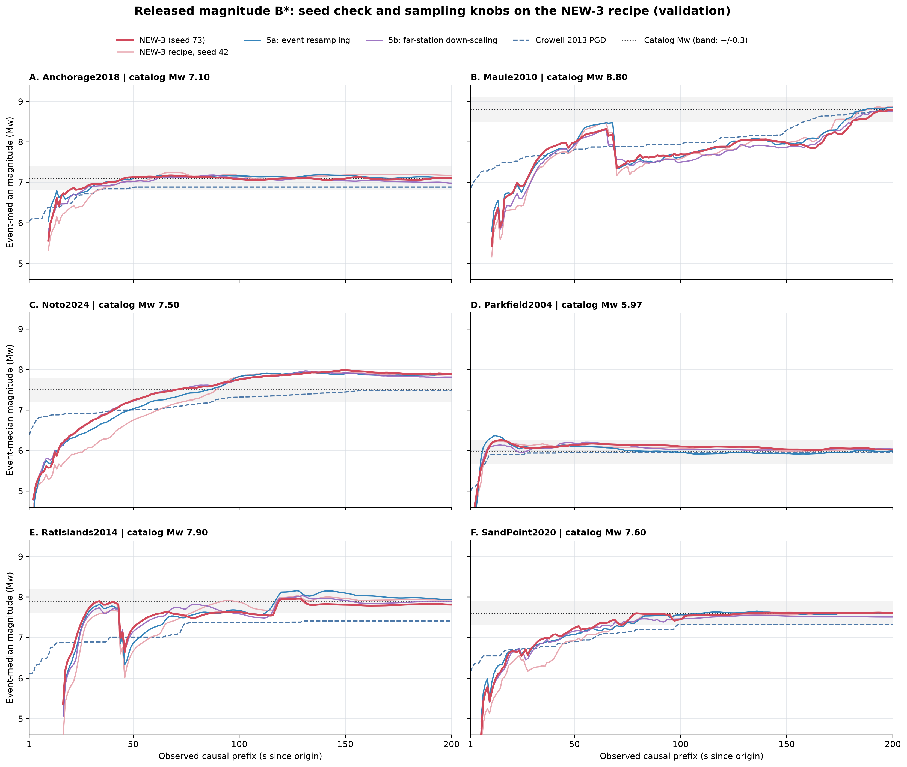

图 14. 四个 NEW-3 配方 checkpoint 的 B\* 曲线（粗红 NEW-3；浅红换种子；蓝 5a；紫 5b），蓝虚线 Crowell。
四条曲线几乎重合，Noto（C）在 90 s 后全部停在 7.8–7.9。

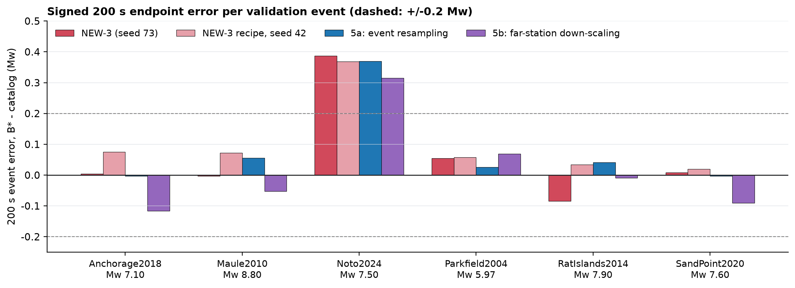

图 15. 同四个 checkpoint 的 200 s 有符号误差，虚线 ±0.2。数值见
[followup_objective_by_variant.csv](analysis/followup_objective_by_variant.csv)、[followup_objective_per_event.csv](analysis/followup_objective_per_event.csv)。

| 验证集 6 事件 | NEW-3（seed 73） | NEW-3 s42 | 5a 重采样 | 5b 远台缩小 |
|---|---:|---:|---:|---:|
| 200 s 事件 MAE（Mw） | **0.090** | 0.105 | 0.083 | 0.109 |
| 200 s 事件 RMSE | 0.163 | 0.159 | 0.154 | **0.146** |
| 200 s 事件偏差 | +0.062 | +0.104 | +0.081 | **+0.019** |
| Noto 误差 | +0.39 | +0.37 | +0.37 | **+0.31** |
| Anchorage / SandPoint 误差 | +0.01 / +0.01 | +0.08 / +0.02 | 0.00 / 0.00 | −0.12 / −0.09 |
| A 在 1 s 高于目录的事件数 | 0 | 0 | 0 | 0 |
| B\* 平均变号次数 | 29.5 | 27.3 | 30.7 | 30.2 |
| A 的 30 s 秩相关 | 0.94 | 0.60 | 0.94 | 0.83 |
| B\* 稳定进入 ±0.3 事件数 / 中位时刻 | 5 / 60 s | 5 / 71 s | 5 / 74 s | 5 / 69 s |

读法：

1. **换种子：MAE 0.090 → 0.105，30 s 秩相关 0.94 → 0.60。** 种子之间的波动约 0.015 Mw，这就是本报告所有"变体之间差 0.01 级"结论的噪声底。
   0.090 这个数不是碰运气（换种子仍优于 OLD 的 0.127 和 Crowell 的 0.169，1 s 高估仍为 0），但 NEW-3 与 NEW-1/NEW-2 之间的差距（0.118/0.122 vs 0.090）只略大于噪声，
   "旋钮二有效"应降级为"旋钮二在两个种子上都没有变差"。早期排序（30 s 秩相关）对种子敏感，不是稳健性质。
2. **5a 无效。** Noto 0.39 → 0.37，其余事件变化都在种子噪声内；MAE 0.083 比 NEW-3 好 0.007，小于种子波动，**不能宣称改进**。
   无效的原因见 6a.1 的更正：NEW-3 的损失里事件本来就等权，把加权换成重采样只改了 batch 组成，没有改"远场记录只来自大地震"这个事实。
3. **5b 有方向性效果但代价大。** Noto 降到 +0.31（−0.08），整体偏差从 +0.06 降到 +0.02，RMSE 最好；
   但把近场为主的 Anchorage、SandPoint 推成 −0.12、−0.09，MAE 反而最差。远台缩小是把"远场 ⇒ 大震"的先验整体往下压，压的不只是 Noto。
4. **三次实验共同说明：** Noto 的高估是训练集里"中等震级 + 远场记录"这一格子空着造成的，采样和缩放旋钮无法凭空造出这一格。
   真正的解法在数据层（补 M6.5–7.5 有远场记录的事件）或推理层（按距离做后校准），不在这两个旋钮上。抖动（27–31 次）如预期完全不受影响。

这三个 checkpoint 都**不**替代 NEW-3 作为本页主结果；NEW-3 仍是唯一按预注册流程产生的候选。

## 7. 边界

- 训练集结果是对训练事件的回放，只用于诊断拟合程度；训练过程中测试集未被加载（各 run 的 `summary.json` 中 `held_out_test_loader_iterated = false`）。测试集只在第 9 节被冻结的 NEW-3 评估过一次。
- 单 fold（0）。NEW-3 配方有两个种子（73、42，MAE 0.090 / 0.105）；NEW-1、NEW-2 仍是单种子。种子波动约 0.015 Mw，小于此的变体间差异不应解读。
- 缩放下界 −1.0 只对 fold 0 的验证事件验证过；训练集最小 M6.4，缩放到 M5.4 是外推。
- 6 个验证事件里 Noto 一个事件占 397/446 台，台站级指标几乎由它决定；事件级指标每个事件只算一票。

## 8. 文件

- `figures/01–11_*.png|pdf`：由 `scripts/plotting/plot_phase39_causal_released_moment.py` 从冻结回放生成；`12_*` 由 `scripts/analysis/phase39_released_moment_postprocess.py`、`13_*` 由 `scripts/analysis/phase39_noto_diagnostic.py`、`14–15_*` 由 `scripts/analysis/phase39_released_moment_followup.py` 生成。全部只读回放结果，不做推断。
- `analysis/replay_summary_*.json`：验证回放的完整摘要（含 checkpoint、配置哈希、按方法的客观量）；`replay_summary_{seed42,balanced,farscale}.json` 与对应 `event_trajectories_*.csv` 为第 6b 节三次追加实验。
- `analysis/followup_objective_*.csv`：第 6b 节四个 checkpoint 的客观量与逐事件 200 s 误差。
- `analysis/validation_reference_stf.npz`、`stf_agreement_*.csv`：446 个验证台站的 SCARDEC 真实 STF（按回放同一配置重建，不含模型推断）及其与 NEW-3 / OLD 预测 STF 在各前缀窗口内的形状相关与 ΔMw（图 4A–D）。
- `figures/16–17_*`、`analysis/test_*`、`replay_summary_test_*.json`、`event_trajectories_test_*.csv`：第 9 节测试集一次性回放（NEW-3 与 OLD），由 `scripts/analysis/phase39_released_moment_test_report.py` 生成。回放目录 `runs/phase39-causal-released-moment-scale1p0-seed73-20260907-v1-replay-test`、`runs/phase39-causal-4a25-released-replay-test-20260908`。

## 9. 测试集一次性评估（9 事件，450 台）

**决定与冻结。** 2026-09-08 14:55，NEW-3（seed 73，checkpoint `56d55b1ad65388ae…`，best epoch 83）被定为最终候选。
此前它在验证集上经过 4 个模型 + 3 次追加实验 + 1 次事后修订门的比较，预注册 5 门只过 3 门。这次测试是**对预注册协议的正式终止**，
不是过门后的奖励；测试之后不再对任何模型做调整。旧因果模型 OLD 在 2026-08-31 已经按上一阶段协议测过一次（事件 MAE 0.350，A 口径），
这里用同一评估器重放一遍只是为了给出同口径的 B\*/A 对照，不构成新的窥视。

评估器、划分哈希（`e4807aa1…`）、前缀呈现（零填充）、下限（1e15 N·m）与验证阶段完全相同。

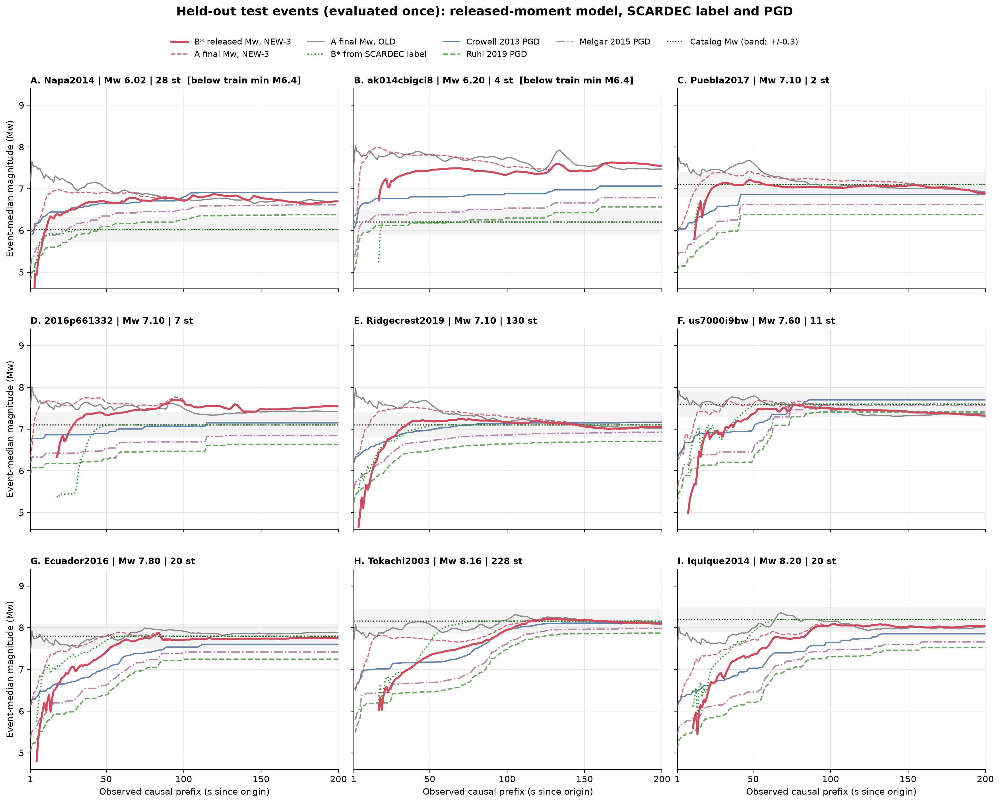

图 16. 9 个测试事件按目录震级排列。图例同图 1：红实线 NEW-3 的 B\*，红虚线 NEW-3 的 A，灰线 OLD 的 A，绿点线 SCARDEC 标签的 B\*，
蓝/绿/紫 Crowell、Ruhl、Melgar，黑点线目录 Mw（灰带 ±0.3）。A、B 两个事件低于训练集最小震级 6.4。

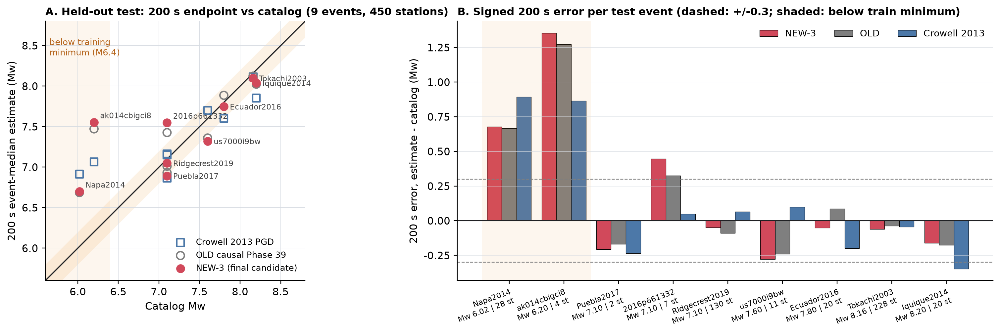

图 17. A：200 s 终点对目录震级（实心红 NEW-3、空心灰 OLD、空心蓝方 Crowell，橙带 = 训练下限以外）；B：逐事件有符号误差。
数值见 [test_event_summary.csv](analysis/test_event_summary.csv)、[test_objective_by_series.csv](analysis/test_objective_by_series.csv)。

| 测试事件 | 目录 Mw | 台站 | NEW-3 200 s | 误差 | OLD 误差 | Crowell 误差 | NEW-3 稳定进入 ±0.3 | Crowell 稳定进入 |
|---|---:|---:|---:|---:|---:|---:|---:|---:|
| Napa2014 ‡ | 6.02 | 28 | 6.70 | **+0.68** | +0.67 | +0.90 | 未进入 | 未进入 |
| ak014cbigci8 ‡ | 6.20 | 4 | 7.55 | **+1.35** | +1.27 | +0.86 | 未进入 | 未进入 |
| Puebla2017 | 7.10 | 2 | 6.89 | −0.21 | −0.17 | −0.24 | **21 s** | 42 s |
| 2016p661332 | 7.10 | 7 | 7.55 | **+0.45** | +0.33 | +0.05 | 未进入 | 10 s |
| Ridgecrest2019 | 7.10 | 130 | 7.05 | −0.05 | −0.09 | +0.07 | 26 s | 26 s |
| us7000i9bw | 7.60 | 11 | 7.32 | −0.28 | −0.24 | +0.10 | **48 s** | 62 s |
| Ecuador2016 | 7.80 | 20 | 7.75 | −0.05 | +0.09 | −0.20 | **52 s** | 88 s |
| Tokachi2003 | 8.16 | 228 | 8.10 | −0.06 | −0.04 | −0.05 | 96 s | 95 s |
| Iquique2014 | 8.20 | 20 | 8.04 | −0.16 | −0.18 | −0.35 | **87 s** | 未进入 |

‡ 低于训练集最小震级 6.4。

| 测试集 9 事件 | NEW-3 B\* | OLD B\* | Crowell 2013 | Melgar 2015 | Ruhl 2019 |
|---|---:|---:|---:|---:|---:|
| 200 s 事件 MAE（Mw） | 0.366 | 0.340 | **0.311** | 0.357 | 0.445 |
| 200 s 事件 RMSE | 0.542 | 0.506 | 0.445 | **0.407** | 0.475 |
| 200 s 事件偏差 | +0.185 | +0.182 | +0.127 | −0.095 | −0.284 |
| 训练震级范围内 7 事件 MAE（诊断用，非主指标） | 0.180 | 0.160 | **0.149** | 0.290 | 0.469 |
| A 在 1 s 高于目录的事件数 | **0**（A 均值 6.23） | 5（A 均值 7.47） | 0 | 0 | 0 |
| B\* 平均变号次数 | 37.4 | 39.8 | 0 | 0 | 0 |
| 稳定进入 ±0.3 的事件数 / 中位时刻 | 6 / 50 s | 6 / 56.5 s | 6 / 52 s | 4 / 94.5 s | 2 / 127.5 s |
| 早于 Crowell 稳定进入（两者都进入的 5 事件中：早 / 平 / 晚） | 3 / 1 / 1 | 3 / 0 / 2 | — | — | — |

两个模型都在 Iquique 上稳定进入（NEW-3 87 s，OLD 68 s）而 Crowell 全程未进入。NEW-3 比 Crowell 早的是 Puebla（21 vs 42 s）、us7000i9bw（48 vs 62）、Ecuador（52 vs 88）；Ridgecrest 持平（26 s）；Tokachi 晚 1 s（96 vs 95）。

**读法（按重要性排序）：**

1. **终点精度没有带到测试集。** 验证集上 NEW-3 比 OLD 好 0.037（0.090 vs 0.127），测试集上反而差 0.026（0.366 vs 0.340），也不如 Crowell（0.311）。
   6 个验证事件不足以分辨 0.03 量级的差异——第 6b 节已测出种子噪声约 0.015，验证集上的"提升"有一半在噪声内。论文里**不能**宣称终点精度优于 PGD。
2. **三个模型（NEW-3、OLD、上一阶段的终点模型 0.350）栽在同样的三个事件。** Napa 6.02 和 ak014cbigci8 6.20 低于训练集最小震级 6.4，
   反事实缩放到 −1.0 也没救回来（NEW-3 +0.68 / +1.35，OLD +0.67 / +1.27）；ak014cbigci8 只有 4 台，SCARDEC 标签本身也只到 6.2。
   2016p661332（新西兰，7 台，正断层）+0.45，Crowell 只有 +0.05。这三个事件贡献了 9 事件 MAE 的 75%。剩下 6 个事件 NEW-3 全在 ±0.28 内、3 个在 ±0.07 内。
3. **Noto 型的远场高估在 Tokachi 上没有重演。** Tokachi 2003（228 台、大量远台、逆冲、M8.16）NEW-3 −0.06。所以 6a.1 的几何先验不是"远台多就高估"，
   而是"远台多 **且** 真实震级不够大"时才高估——Tokachi 本身就是 M8 级，先验和真值一致。这缩小了 Noto 问题的范围：它只伤害 M7–7.5 带有大台网的事件。
4. **曲线形态的主张在测试集上成立。** 1 秒零高估（OLD 5/9）；A 的 1 秒均值 6.23（OLD 7.47）；B\* 从下方逼近。"多快稳定"上 NEW-3 与 OLD 相当：都在 3/5 事件上早于 Crowell，NEW-3 中位进入 50 s、OLD 56.5 s、Crowell 52 s。
   形态改善没有以牺牲速度为代价，但也没有让速度更快。这是方向 1 真正交付的东西：形态，而非速度或精度。
5. **抖动仍在**（37 次，OLD 40 次），早期秩相关在 9 事件上无意义（B\* 30 s 为 −0.27，A 为 0.18；Crowell 0.45）。与验证阶段结论一致。

**对论文的含义。** 可以主张的是：改前缀目标让因果震级曲线获得 PGD 式的单调逼近形态、消除了早期高估，
且不损失终点精度与稳定速度（0.366 vs OLD 0.340，中位进入 50 vs 56.5 s，差异都在 9 事件的噪声内）。**不能**主张终点精度优于 PGD 或旧模型。
两个训练范围外的小地震和一个 7 台事件是明确的失效模式，应作为 limitation 与 6a.1 的远场先验一起写。
测试集只评估了这一次；本页之后若再出现任何在测试集上更好的数字，都应视为无效。
- `analysis/event_trajectories_*.csv`：每个变体、每种方法、每秒的事件中位震级（验证集四个变体 + 训练集 NEW-3/OLD）。
- `analysis/cohort_event_summary.csv`：训练/验证各事件 200 s 终点估计与误差，测试集只有组成。
- `figure_manifest.json`：所有文件的 sha256。
