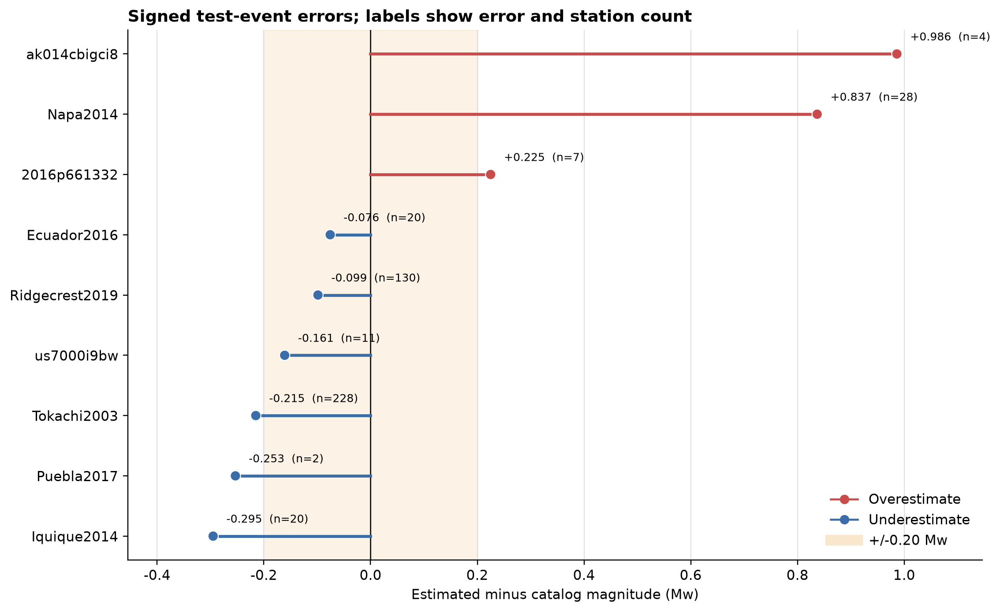
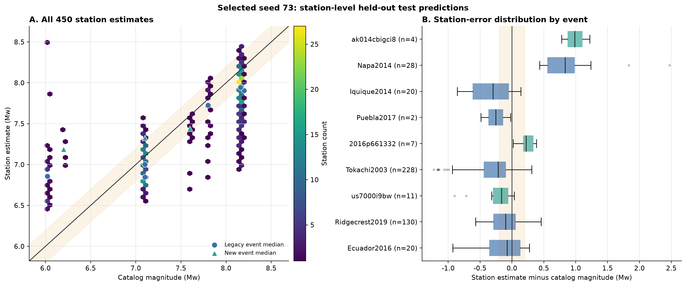
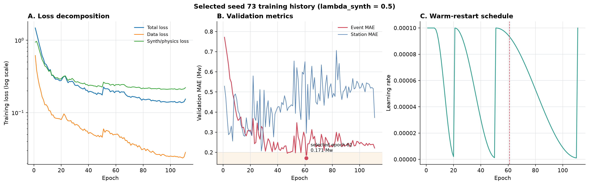

# Phase 39 Expanded Dataset: Fixed-Split Evaluation

This page publishes the validation-selected, one-time held-out test result for
the expanded Phase 39 dataset. The model retains the synthesized-waveform loss
with `lambda_synth = 0.5`.

## Headline Result

| Metric | Result |
|---|---:|
| Train / validation / test events | 24 / 6 / 9 |
| Accepted station records | 1,798 / 446 / 450 |
| Selected seed | 73 |
| Fixed-validation event MAE | **0.171305 Mw** |
| Held-out test event MAE | **0.349643 Mw** |
| Held-out test event RMSE | 0.466958 Mw |
| Held-out test station MAE | 0.314650 Mw |
| Held-out test station RMSE | 0.436691 Mw |

Seeds 17, 42, and 73 were trained independently. The seed and checkpoint were
selected only by the six fixed validation events. The nine-event test cohort
was evaluated once after seed 73 had been selected; test results were not
averaged across seeds and were not used for model selection.

[PDF](figures/en/01_split_overview.pdf) |
[Fixed split manifest](fixed_split_manifest.json)

## Validation-Only Seed Selection

[PDF](figures/en/02_seed_validation_selection.pdf) |
[Seed selection table](analysis/seed_selection.csv)

Seed 73 reached the lowest validation event MAE, `0.171305 Mw`,
at epoch 61. This validation number is not the independent test result.

## Held-Out Test Events

[PDF](figures/en/03_test_event_scatter.pdf) |
[Event prediction table](selected_test_event_predictions.csv)

[PDF](figures/en/04_test_event_signed_errors.pdf) |
[Event error analysis](analysis/test_event_error_analysis.csv)

The six legacy test events have MAE `0.295774 Mw`; the three newly
added test events have MAE `0.457381 Mw`. The two largest failures
are Napa2014 and `ak014cbigci8`. Excluding them only for diagnosis, the remaining
seven-event MAE is `0.189102 Mw`; this is not the headline metric.

## Station-Level Test Results

[PDF](figures/en/05_test_station_predictions.pdf) |
[Station predictions](selected_test_station_predictions.csv) |
[Per-event station summary](analysis/test_event_station_summary.csv)

## Selected Training Run

[PDF](figures/en/06_selected_seed_training.pdf) |
[Seed 73 training log](analysis/training_logs/seed_73.csv)

## Interpretation

The selected checkpoint performs well on the fixed validation cohort but does
not maintain the same error on the independent test events. The gap is dominated
by Napa2014 (`+0.836831 Mw`) and `ak014cbigci8` (`+0.986244 Mw`), showing that
the current synth-constrained model remains sensitive to event distribution and
sparse M6-class cases.

This is an endpoint magnitude experiment. It is not a causal, second-by-second
prefix experiment.

## Reproducibility

- Synthesized-waveform loss weight: `lambda_synth = 0.5`
- Split assignment SHA-256: `e4807aa1e6b5b389caf23974f62ff9da6b8add7f7887ec23a59d5d35a455eba7`
- Selected checkpoint SHA-256: `5905ccaabcbcfc151d6f2dfa8aea277725d409fb62bd16c437ac5288bcafb4fe`
- Test policy: evaluate the validation-selected seed once
- Large NPZ and checkpoint files are intentionally not committed

Published evidence:

- [Machine-readable summary](summary.json)
- [Publication manifest](publication_manifest.json)
- [Selection record](selection.json)
- [Formal protocol](protocol.json)

Reproduction code:

- [Fixed-split runner](../../../scripts/experiments/run_phase39_expanded_fixed_split.py)
- [Plotting and publication script](../../../scripts/plotting/plot_phase39_expanded_fixed_split.py)
- [Expanded-data configuration](../../../configs/experiments/phase39_expanded_grouped_cv.yaml)

## 中文摘要

本实验固定使用 24 个训练事件、6 个验证事件和 9 个独立测试事件。三个随机
种子只根据固定验证集选择，最终 seed 73 的验证事件 MAE 为
`0.171305 Mw`。选模结束后只评估一次测试集，
九事件测试 MAE 为 `0.349643 Mw`，450 个台站的 MAE 为
`0.314650 Mw`。

测试误差主要由 Napa2014 和 `ak014cbigci8` 拉高，因此目前不能用验证集的
`0.1713 Mw` 代替独立测试结果。正式测试结论仍然是九事件 MAE
`0.349643 Mw`。
