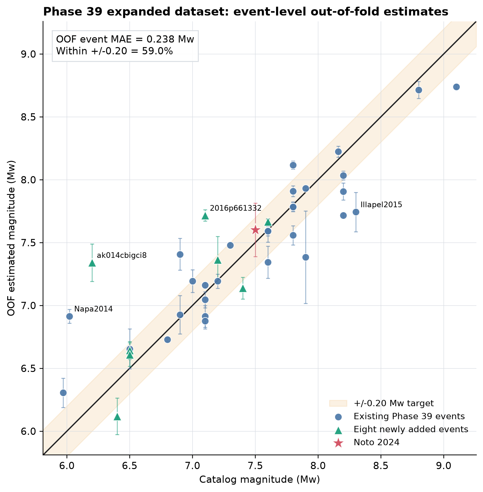
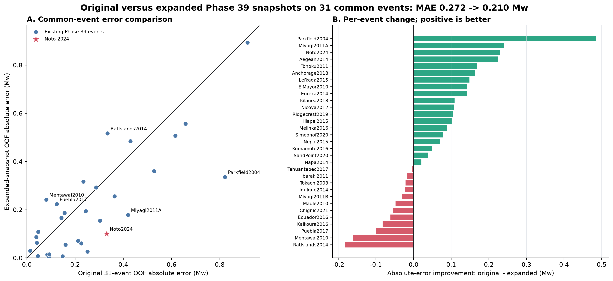
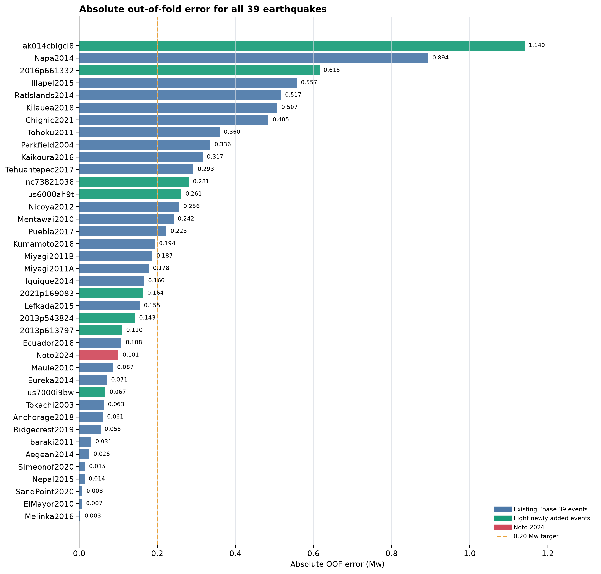
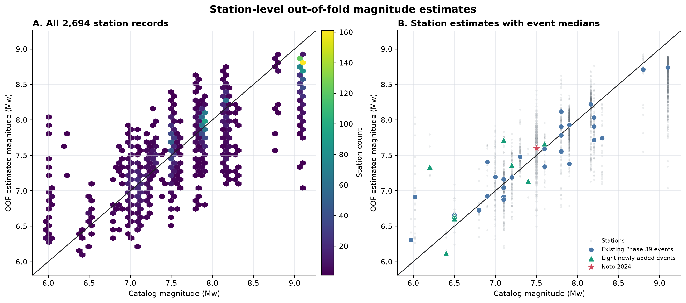
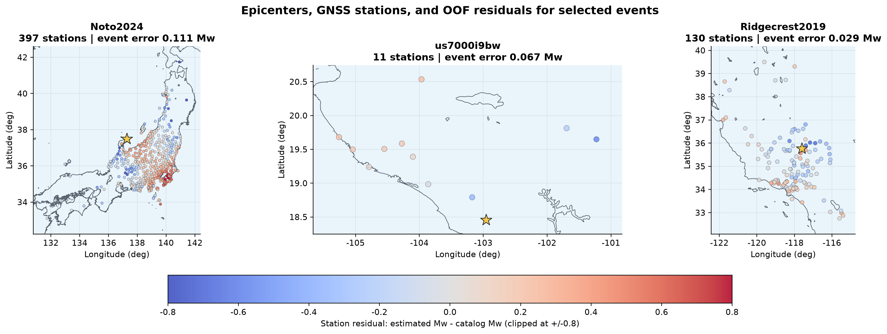
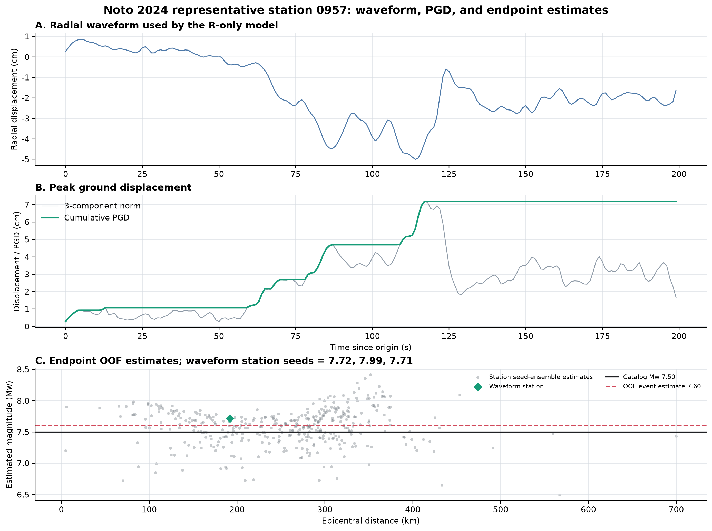
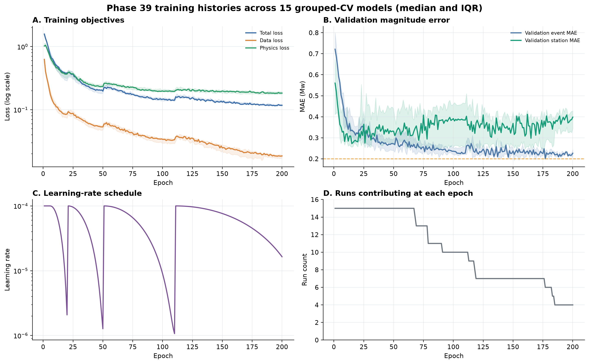

# Phase 39 Expanded Dataset: 39-Event Grouped Cross-Validation

This page publishes the complete out-of-fold (OOF) result package for the
expanded Phase 39 dataset. 中文说明见下半部分。

## Headline Result

| Metric | Result |
|---|---:|
| Events / accepted station records | 39 / 2,694 |
| Validation protocol | 5 event-grouped folds x 3 seeds |
| Phase 39 event MAE | **0.238383 Mw** |
| Phase 39 event RMSE | 0.342076 Mw |
| Events within +/-0.20 Mw | 23/39 (58.97%) |
| Station MAE | 0.292775 Mw |
| Station RMSE | 0.385785 Mw |

The model retains the Phase 39 synthesized-waveform constraint:

- `lambda_synth = 0.5`;
- `radiation_coefficient_contract = glehman_scalar`;
- `synth_polarity_mode = global_invariant`;
- radial-only 200 s input and moment-rate/STF output.

Every reported event is held out from training in its fold. The final estimate
is the median across seeds 17, 42, and 73. This is endpoint grouped-CV evidence;
it is not a second-by-second causal-prefix result.

[PDF](figures/en/01_oof_event_scatter.pdf) |
[Chinese figure](figures/zh/01_oof_event_scatter.png)

## What Changed After Dataset Expansion

For the 31 events shared by the original and expanded snapshots, the same
three-seed median OOF metric improves from `0.272349` to `0.210169 Mw`.
Nineteen events improve and twelve degrade. This comparison measures the whole
snapshot change, including eight new training events and approved station
additions; it does not isolate one causal factor.

[PDF](figures/en/08_original_vs_expanded_snapshot.pdf) |
[Chinese figure](figures/zh/08_original_vs_expanded_snapshot.png) |
[Per-event comparison CSV](analysis/original_vs_expanded_common_events.csv)

## Main Findings

- The 30 original non-Noto events have MAE `0.213822 Mw`.
- Noto 2024 has OOF prediction `Mw 7.600599`, absolute error `0.100599 Mw`,
  and seed standard deviation `0.212300 Mw`.
- The eight newly added events have MAE `0.347710 Mw`; four of eight are within
  `+/-0.20 Mw`.
- The principal new-event failures are `ak014cbigci8` (`1.140290 Mw`) and
  `2016p661332` (`0.615406 Mw`).
- The best new event is `us7000i9bw`, with `0.067253 Mw` absolute error.

[PDF](figures/en/03_event_absolute_errors.pdf) |
[Chinese figure](figures/zh/03_event_absolute_errors.png) |
[Event analysis CSV](analysis/event_error_analysis.csv)

## Station Results, Maps, and Waveform Example

[PDF](figures/en/02_oof_station_scatter.pdf) |
[Chinese figure](figures/zh/02_oof_station_scatter.png)

[PDF](figures/en/06_selected_event_maps.pdf) |
[Chinese figure](figures/zh/06_selected_event_maps.png)

[PDF](figures/en/07_noto_waveform_and_predictions.pdf) |
[Chinese figure](figures/zh/07_noto_waveform_and_predictions.png)

## Training Stability

[PDF](figures/en/05_training_curves.pdf) |
[Chinese figure](figures/zh/05_training_curves.png) |
[Fold/seed metrics](analysis/fold_seed_metrics.csv) |
[Training-curve summary](analysis/training_curve_summary.csv)

## Reproducibility

- Dataset NPZ SHA-256:
  `934dd65a9f704ef49e89fd9b241fb408372075439ce3b78038c06f86119bf5bc`
- Original source NPZ SHA-256:
  `2e1fa4c12fc1eb03ffc8bf9235491f0886d4b0d360ebcb3486baca4d948cfd6a`
- Fold assignment SHA-256:
  `614153f55bd8e1208f6ea2d8b5b20cbe23c32902a3a67d0a1028675f82cc1f6d`
- The large NPZ and 15 checkpoint files are intentionally not committed.

Published tables and metadata:

- [Machine-readable summary](summary.json)
- [Publication manifest](publication_manifest.json)
- [Event fold assignments](event_folds.json)
- [All-seed event OOF predictions](oof_event_predictions_all_seeds.csv)
- [Seed-ensemble event OOF predictions](oof_event_predictions_seed_ensemble.csv)
- [Seed-ensemble station OOF predictions](oof_station_predictions_seed_ensemble.csv)
- [Complete analysis summary](analysis/analysis_summary.json)

Reproduction code:

- [Expanded dataset builder](../../../scripts/data/build_phase39_expanded_dataset.py)
- [Training configuration](../../../configs/experiments/phase39_expanded_grouped_cv.yaml)
- [Grouped-CV runner](../../../scripts/experiments/run_phase39_expanded_grouped_cv.py)
- [Bilingual plotting script](../../../scripts/plotting/plot_phase39_expanded_grouped_cv.py)
- [Focused dataset tests](../../../tests/test_phase39_expanded_dataset_builder.py)

## 中文摘要

本结果使用 39 个地震事件和 2,694 条合格台站记录，执行严格的事件分组
五折交叉验证，并训练三个随机种子，共 15 个模型。所有事件结果均为折外预测，
最终采用三个种子的中位数。

完整 39 事件的事件级 MAE 为 `0.238383 Mw`，台站级 MAE 为
`0.292775 Mw`。在与原数据集共同的 31 个事件上，MAE 从 `0.272349`
下降到 `0.210169 Mw`，其中 19 个事件改善、12 个事件变差。能登地震的
绝对误差下降到 `0.100599 Mw`。

目前未达到 `0.20/0.17 Mw` 总体目标，主要原因不是能登，而是新增少台站
事件中的两个异常值：`ak014cbigci8` 误差为 `1.140290 Mw`，
`2016p661332` 误差为 `0.615406 Mw`。因此下一步应优先检查这两个事件的
震源机制、STF 匹配、台站几何和波形质量，而不是继续盲目增加模型复杂度。
